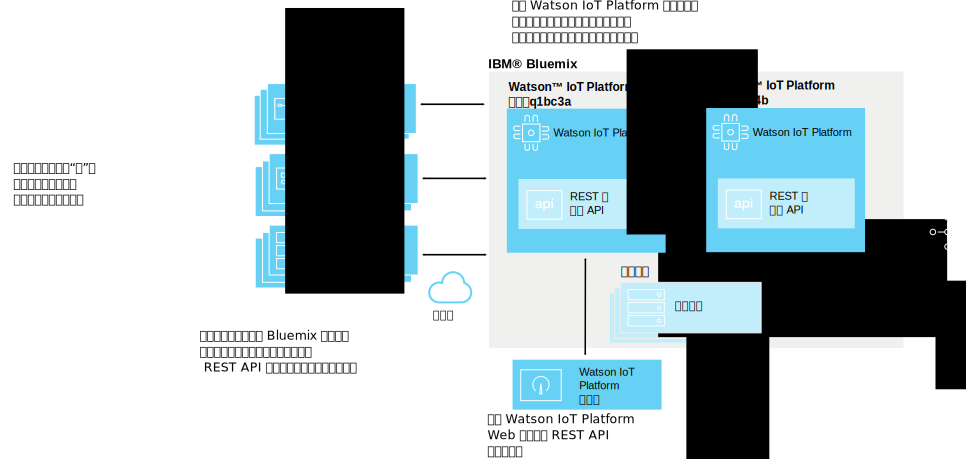
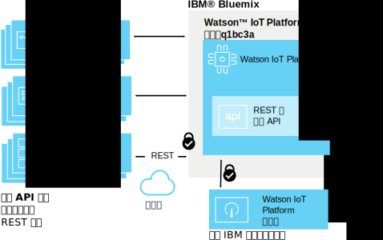
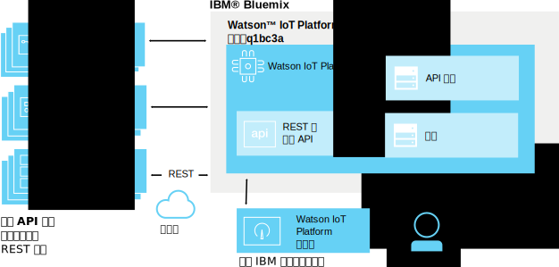
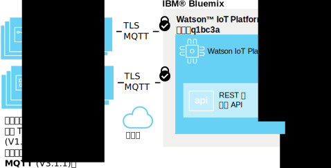
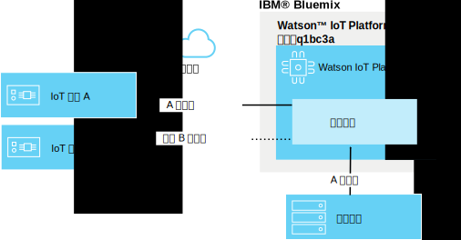
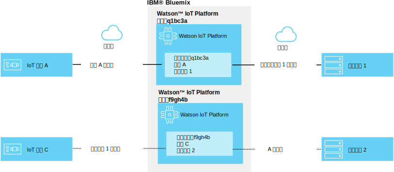

---

copyright:
  years: 2016, 2017
lastupdated: "2017-02-03"

---

{:new_window: target="blank"}
{:shortdesc: .shortdesc}
{:screen: .screen}
{:codeblock: .codeblock}
{:pre: .pre}

# {{site.data.keyword.iot_short_notm}} 安全
{: #sec-index}

作为基于云的服务，{{site.data.keyword.iot_full}} 嵌入了安全性作为其体系结构的重要方面。
{: shortdesc}

以下文档回答了有关如何保护组织数据的一些常见问题，重点介绍了以下具体方面：

* 合规性：用于为安全性设置基准的外部标准。
* 认证：确保正尝试访问您组织信息的用户、设备或应用程序的身份。
* 授权：确保用户、设备和应用程序有权访问您组织的信息。
* 加密：确保数据仅可由授权方读取，无法进行拦截。

## {{site.data.keyword.iot_short_notm}} 和 {{site.data.keyword.Bluemix_notm}}
{: #iot-bluemix-sec}

{{site.data.keyword.iot_short_notm}} 在 {{site.data.keyword.Bluemix_notm}} 平台内运行，因此依赖于 {{site.data.keyword.Bluemix_notm}} 和 {{site.data.keyword.BluSoftlayer_full}} 来进行访问和连接。对 {{site.data.keyword.Bluemix_notm}} 和 {{site.data.keyword.BluSoftlayer}} 的依赖性使得 {{site.data.keyword.Bluemix_notm}} 和 {{site.data.keyword.BluSoftlayer}} 安全性和可靠性对于 {{site.data.keyword.iot_short_notm}} 的用户至关重要

有关 {{site.data.keyword.Bluemix_notm}} 的安全性的更多详细信息，请参阅 [{{site.data.keyword.Bluemix_notm}} 平台安全 ](https://console.ng.bluemix.net/docs/security/index.html#platform-security){: new_window}。

## {{site.data.keyword.iot_short_notm}} 安全合规性
{: #compliance}  
   
{{site.data.keyword.iot_short_notm}} 已通过国际标准化组织 (ISO) 27001 标准的认证，该标准定义了信息安全管理过程的最佳做法。ISO 27001 标准根据不同组织的需求规定了应如何建立、实施和记录信息安全管理系统 (ISMS)，以及应如何实施安全性控制。ISO 27000 系列标准中包含了一个确定风险规模和评估资产价值的过程，旨在保护书面、口头和电子信息的机密性、完整性和可用性。

{{site.data.keyword.iot_short_notm}} 经第三方安全公司审计，满足 ISO 27001 的所有要求：{{site.data.keyword.iot_short_notm}} ISO 27001:2013 Certificate of Registration。

## {{site.data.keyword.iot_short_notm}} 术语
{: #terminology}

## 如何保护您组织中 IoT 信息管理的安全？
{: #secure-org}

基于浏览器的 GUI 和 REST API 受 HTTPS 保护且具有 DigiCert 签署的证书，因此您可放心，自己是连接到真实的 {{site.data.keyword.iot_short_notm}}。对基于 Web GUI 的访问权通过 IBM 标识或 {{site.data.keyword.Bluemix_notm}} {{site.data.keyword.ssoshort}} 进行认证。使用 REST API 需要通过 GUI 生成的 API 密钥，您可将其用于对组织执行认证的 REST API 调用。

## 我们如何确保设备和应用程序凭证的安全？
{: #secure-credentials}

注册设备或生成 API 密钥后，认证令牌将使用加密盐 (Salt) 并散列化。这表示您组织的凭证永远不能从系统恢复，即使发生 {{site.data.keyword.iot_short_notm}} 出现损坏的这种罕见情况也是如此。

设备凭证和 API 密钥在遭到破坏的情况下可单独进行撤销。

## 如何确保设备安全地连接到 {{site.data.keyword.iot_short_notm}}？
{: #secure-device-connection}

连接的设备使用 clientId 以及向平台添加设备时生成的认证令牌的组合。MQTT V3.1.1 用于在很多平台和语言之间实现简单的互操作性。{{site.data.keyword.iot_short_notm}} 支持通过 TLS V1.2 连接。

有关 TLS 和密码套件需求的更多信息，请参阅`与 Watson IoT Platform 的应用程序、设备和网关连接`文档中的 [TLS 需求 ](https://console.ng.bluemix.net/docs/services/IoT/reference/security/connect_devices_apps_gw.html#tls_requirements){: new_window} 部分。

## 如何阻止 IoT 设备之间出现数据泄漏？
{: #prevent-leak-devices}

已拷入安全消息传递模式。认证后，设备仅有权发布和预订受限的主题空间：

* '/iot-2/evt/<event_id>/fmt/<format_string>'
* '/iot-2/cmd/<command_id>/fmt/<format_string>'

所有设备都使用同一主题空间。客户机提供的认证凭证指示 {{site.data.keyword.iot_short_notm}} 会将此主题空间限定到哪个设备。这防止设备能模仿其他的设备。

假冒其他设备的唯一方式是获取该设备的遭到破坏的安全凭证。

应用程序可针对组织中的所有设备预订和发布事件及命令主题。应用程序可同时分析很多设备中的数据，还可模拟或代理设备，以及构成全双工通信环的补充端。

## 如何阻止组织之间出现 IoT 数据泄漏？
{: #prevent-leak-org}

设备和应用程序进行操作所在的主题空间的作用域在单个组织内。认证后，{{site.data.keyword.iot_short_notm}} 根据客户机认证使用组织标识转换主题结构，从而使一个组织无法访问另一个组织中的数据。

# 相关链接
{: #rellinks}
## 相关链接
{: #general}
* [{{site.data.keyword.iot_short_notm}} 入门](https://console.ng.bluemix.net/docs/services/IoT/index.html)
* [{{site.data.keyword.Bluemix_notm}} 安全 ](https://console.ng.bluemix.net/docs/security/index.html#security "外部链接图标"){:new_window}
* [{{site.data.keyword.Bluemix_notm}} 平台安全 ](https://console.ng.bluemix.net/docs/security/index.html#platform-security "外部链接图标"){:new_window}
* [{{site.data.keyword.Bluemix_notm}} 合规性](https://console.ng.bluemix.net/docs/security/index.html#compliance){:new_window}
* [{{site.data.keyword.BluSoftlayer}} 安全 ](http://www.softlayer.com/security "外部链接图标"){:new_window}
* [{{site.data.keyword.BluSoftlayer}} 合规性 ](http://www.softlayer.com/compliance "外部链接图标"){:new_window}
