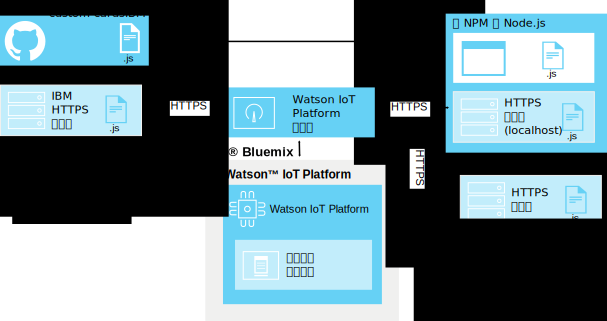

---

copyright:
  years: 2016, 2017
lastupdated: "2016-10-13"

---

{:new_window: target="\_blank"}
{:shortdesc: .shortdesc}
{:screen: .screen}
{:codeblock: .codeblock}
{:pre: .pre}

# 自訂卡片
{: #custom_cards}

除了 {{site.data.keyword.iot_full}} 所提供的一般卡片之外，還可以使用自訂卡片來視覺化「物聯網」資料。
{:shortdesc}

## 架構
{: #architecture}  

自訂卡片是由您所開發，並且使用您自己的自訂卡片 HTTP 伺服器儲存庫進行部署。因為使用者瀏覽器會顯示及處理 {{site.data.keyword.iot_short_notm}} 儀表板，所以此伺服器是透過使用者瀏覽器進行存取。{{site.data.keyword.iot_short_notm}} 會透過自訂卡片延伸規格來管理瀏覽器連線，但本身未連接至自訂卡片伺服器。

執行 {{site.data.keyword.iot_short_notm}} 儀表板的瀏覽器會直接從自訂卡片伺服器擷取所有必要資源。自訂卡片會提供在「新增卡片」對話框中，並顯示在使用者已配置的使用者建立的板中。

為了使用卡片伺服器來啟用集中化版本控制，自訂卡片程式碼不會快取在用戶端上。如果自訂卡片無法再使用，或者無法連接卡片伺服器，則會使用位置保留元來保持一致的儀表板佈置。

**提示：**若要在未設定您自己的開發環境的情況下測試自訂卡片特性，您可以連接至 IBM 所提供的範例自訂卡片伺服器，網址為：`https://customcards.mybluemix.net`

若要建置卡片，您必須設定以 node.js 為基礎的本端開發環境，並從 IBM 所提供的自訂卡片 GitHub 儲存庫中匯入範例卡片。在您建立卡片之後，可以將卡片套件部署至安全的 (HTTPS) Web 伺服器，然後將 {{site.data.keyword.iot_short_notm}} 自訂卡片延伸規格鏈結至其中。   

**提示：**您可以使用內建 node.js Web 伺服器進行卡片的起始測試及疑難排解，但您應該使用安全且管理良好的 Web 伺服器進行卡片的任何正式作業部署。

 

## 安全
{: #security}

對於您選擇部署在自訂卡片伺服器的卡片中的 JavaScript 程式碼並沒有限制。自訂卡片中的 Javascript 程式碼可以存取瀏覽器中保留的所有資訊，就像儀表板中執行的任何其他卡片一樣。請確定由正確的自訂卡片伺服器將程式碼提供給瀏覽器，以顯示及處理自訂卡片。

卡片會在 {{site.data.keyword.iot_short_notm}} 瀏覽器階段作業中如所撰寫般確切執行其程式碼。此外，在未將認證提供給自訂卡片伺服器的情況下，建立自訂卡片伺服器連線。使用者的瀏覽器可以連接至任何已配置的自訂卡片伺服器。

請務必僅配置已知且安全的自訂卡片伺服器，以將自訂卡片提供給使用者的儀表板。   

如需如何保護自訂卡片伺服器安全的相關資訊，請參閱[自訂卡片安全](../reference/security/custom_cards_server.html)。

下列步驟會引導您完成下列處理程序：連接至測試卡片伺服器、在您自己的卡片伺服器上部署範例卡片，最後建立您自己的卡片並在伺服器上進行部署。

## 步驟 1：將 {{site.data.keyword.iot_short_notm}} 連接至範例卡片伺服器。
{: #connect-to-sample}  

若要使用 {{site.data.keyword.iot_short_notm}} 測試自訂卡片特性，您可以連接至範例自訂卡片伺服器。範例伺服器包含一組一般卡片，這些也可以作為建立您專屬卡片的範本。

若要連接至範例自訂卡片伺服器，請執行下列動作：
1. 以管理使用者身分登入 {{site.data.keyword.iot_short_notm}} 儀表板。
2. 啟用實驗性特性。  
自訂卡片目前提供為實驗性特性。  
  
**重要事項：**必須根據瀏覽器階段作業來啟用實驗性自訂卡片延伸規格。在 {{site.data.keyword.iot_short_notm}} 組織中，不會廣域地共用自訂卡片連線及卡片套件。
 1. 移至**設定**。
 2. 在「實驗性特性」區段中，驗證已啟用**啟動實驗性特性**。
2. 連接至範例伺服器。
 2. 移至**延伸規格**。
 3. 按一下**新增延伸規格**，然後選取**自訂卡片**延伸規格。
 4. 在**自訂卡片**磚中，按一下**設定**。
 5. 在「配置自訂卡片」區段中，按一下**新增**，然後在伺服器欄位中輸入範例卡片伺服器的安全 (HTTPS) URL。  
如果您要連接至自己的伺服器，請輸入該伺服器的 URL。  
    
**提示：**IBM 範例卡片伺服器的 URL 是：`https://customcards.mybluemix.net`  
 6. 按一下**擷取憑證**以連接至自訂卡片伺服器，然後擷取伺服器的安全憑證資訊。  
   
 **重要事項：**使用憑證資訊，來驗證您要連接至想要的已知及安全自訂卡片伺服器。
 4. 按一下**完成**，以新增伺服器連線。
5. 建立根據範例卡片的新卡片。
 1. 在 {{site.data.keyword.iot_short_notm}} 儀表板中，移至**板**。
 2. 按一下**建立新板**。  
完成「建立新板」對話框。如需相關資訊，請參閱[建立板及卡片](../data_visualization.html#visualizing_data)。
 3. 開啟新板。
 4. 按一下**新增卡片**。  
 5. 向下捲動至**自訂卡片**，然後選取其中一張範例卡片。  
完成卡片建立處理程序。如需相關資訊，請參閱[建立板及卡片](../data_visualization.html#visualizing_data)。  

 您的新自訂卡片現在已在新板中。  
 

恭喜，您已連接至自訂卡片伺服器，並已將自訂卡片新增至其中一個板。下一步是設定您自己的卡片伺服器，並使用 HelloWorld 範例卡片來建立您的第一張卡片。

## 步驟 2：設定卡片伺服器並部署 HelloWorld 範例卡片。
{: #create-hello-world}

若要準備自訂卡片開發，您可以設定本端自訂卡片開發環境，然後測試部署 HelloWorld 範例卡片。

若要建立自訂卡片伺服器並部署 IBM 範例卡片，請遵循 [custom-cards 儲存庫](https://github.com/ibm-watson-iot/custom-cards/blob/master/README.md) Readme 中的詳細指示。

這個處理程序包含下列高階步驟：
1. 確定本端開發環境的 Node.js 具有 npm node 套件管理程式。  
如需安裝 Node.js 的相關資訊（包括下載鏈結），請參閱：https://nodejs.org
2. 設定 HTTP 伺服器來管理自訂卡片套件。    
  - 提供伺服器上自訂卡片內容的目錄不需要認證即可存取。
  - 伺服器必須使用 HTTPS 通訊協定。
  - 伺服器必須支援「跨原點資源共用 (CORS)」連線。  
  
**提示：**為了讓測試及概念驗證運作，您可以使用配置成符合這些需求的內建範例 node.js 伺服器。
3. 建立您自己的儲存庫。分出及複製範例自訂卡片儲存庫，網址為：https://github.com/ibm-watson-iot/custom-cards
4. 建立您自己的模組及卡片架構。自訂卡片是使用模組進行分組。設定新的 HelloWorld 卡片模組。
5. 參照新的卡片。您的自訂卡片套件可能會包含多個模組。您必須在主要套件檔中參照新的模組。
6. 登錄模組。若要讓您的卡片可在 {{site.data.keyword.iot_short_notm}} 組織的板中使用，您必須在 `DashboardConfig.json` 檔案中新增卡片配置詳細資料。
7. 建置卡片套件。使用 Gulp 以設定自動化建置引擎。
8. 將卡片套件部署至卡片伺服器。  
您必須先將卡片套件部署至自訂卡片 HTTP 伺服器，才能在 {{site.data.keyword.iot_short_notm}} 中使用卡片。  
  
**提示：**您可以將卡片套件重新部署至卡片伺服器，以即時新增卡片或移除已作廢的卡片。
9. 將卡片伺服器鏈結至 {{site.data.keyword.iot_short_notm}}。將新部署的自訂卡片伺服器鏈結至 {{site.data.keyword.iot_short_notm}}。  
  
**提示：**因為您的自訂卡片伺服器可能是範例卡片伺服器的完整抄本，所以可能會在環境中看到重複的卡片。請移除範例卡片伺服器連線，只在自訂卡片伺服器中看到卡片。
 1. 移至**延伸規格**。
 2. 在**自訂卡片**磚中，按一下齒輪圖示來更新配置。
 4. 在「配置自訂卡片」區段中，按一下**新增**，然後在伺服器欄位中輸入自訂卡片伺服器的安全 (HTTPS) URL。  
  
**重要事項：**驗證您要連接至想要的已知及安全自訂卡片伺服器。
4. 按一下**完成**，以新增伺服器連線。
10. HelloWorld 自訂卡片現在可以與板搭配使用。

太好了！您已順利設定卡片伺服器，並已部署您的第一張範例卡片。恭喜！不過，自訂卡片的整個構想是要讓您完全以想要的方式來設定卡片及板。現在您可以開始修改範例，以建立您自己的卡片。

## 步驟 3：建立及部署您自己的自訂卡片。
{: #create-your-own-cards}
在您配置及驗證 HelloWorld 卡片之後，即可展開自訂卡片，並建立您自己的卡片。

範例自訂卡片儲存庫包含下列範例卡片：
- HelloWorld  
提供基本 Hello World 範例的簡式卡片。
- 空白  
包含卡片基礎架構的空白卡片。當您從頭開始建置卡片時，請使用此卡片作為範本。
- Webcam  
簡式 Web 攝影機卡片。請配置具有 webcam URL 的卡片，並設定重新整理頻率。
- iFrame  
可用來在板中內嵌任何安全 (HTTPS) 網頁的基本 iFrame 卡片。

下列高階步驟會建立新的卡片：

**提示：**如需詳細步驟，請參閱範例自訂卡片儲存庫中的[建立自訂卡片 Readme](https://github.com/ibm-watson-iot/custom-cards/blob/master/README.md)。
1. 建立您自己的卡片模組。
 1. 使用其中一個範例卡片模組作為模組的範本。
 2. 更新新模組檔名及檔案內容中模組名稱的所有實例。  
例如，將 `HelloWorld` 取代為所有檔名及檔案內容實例中的模組名稱。
2. 在 Modules.jsx 檔案中參照新模組。
3. 在 DashboardConfig.json 檔案中登錄新模組。
4. 更新自訂卡片程式碼，以符合您的卡片需求。
4. 建置卡片套件。  
根據您的設定，建置處理程序可能是使用 gulp 自動進行，也可能是必須手動觸發建置。
3. 部署新的卡片。  
如果您要使用外部自訂卡片伺服器，則現在必須將套件部署至伺服器。  

您已建立第一張自訂卡片，並且已將它部署至自訂卡片伺服器。卡片現在可用於 {{site.data.keyword.iot_short_notm}} 組織中。
