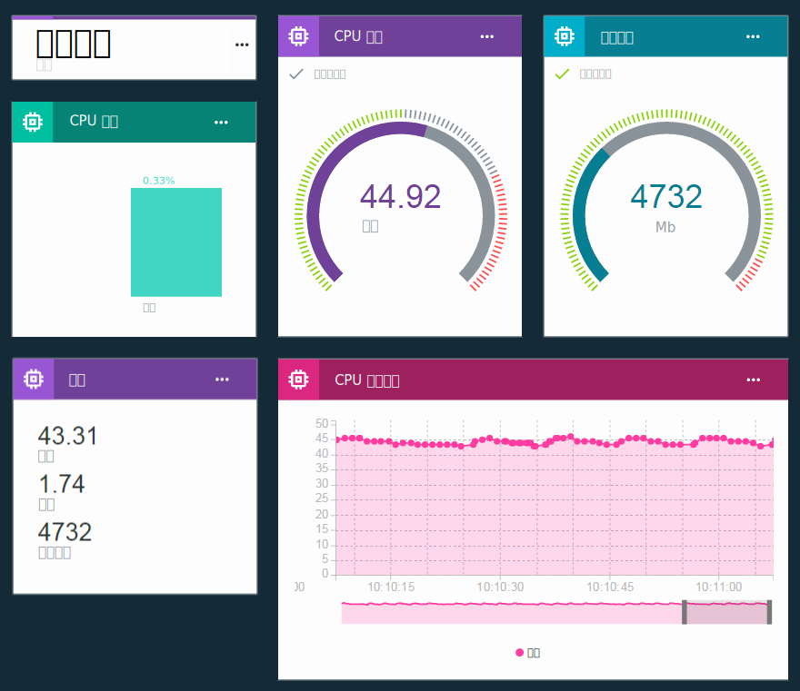

---

copyright:
  years: 2016, 2017
lastupdated: "2017-03-13"

---

{:new_window: target="\_blank"}
{:shortdesc: .shortdesc}
{:screen: .screen}
{:codeblock: .codeblock}
{:pre: .pre}

# 使用板及卡片視覺化即時資料
{: #boards_and_cards}

建立板及卡片，以建立及共用可即時視覺化裝置資料的專屬儀表板。
{:shortdesc}

您可以使用板及卡片，透過圖形方式視覺化一個以上裝置的資料集值，來提供快速概觀以及加強對資料的瞭解。建立板及新增卡片，用來將資料顯示為原始數字、即時圖形、量規及其他項目。將成員新增至板，以與組織中的其他使用者共用。排列卡片並新增註解文字分隔符號，以對呈現方式進行細部調整。  

您也可以[建立您自己的自訂卡片](custom_cards/custom-cards.html)，以擴充 IBM 提供的一組預設卡片。

## 預設板
{: #default_boards}
{{site.data.keyword.iot_full}} 儀表板具有下列預設板：

|板名稱 | 說明 |  
|:---|:---|  
|用法概觀  | 顯示組織的用法統計資料。列出裝置類型及所使用的資料。
|以規則為主的分析 | 顯示您組織的規則。其他卡片會列出已觸發的警示、關聯的裝置、裝置內容及警示資訊。 |  
|以裝置為主的分析 | 顯示連接至您組織的裝置。其他卡片會顯示所選取裝置的警示、所選取裝置的資訊、裝置內容及警示資訊。 |
|風險與安全管理 | 顯示彙總整體安全狀態的卡片。系統操作員和安全分析師可以檢視相容性的詳細資料、裝置的連線狀態、連線失敗的原因，以及透過黑名單或白名單來封鎖或容許的裝置。使用者可以從「連線相容性」卡片往下探查至關於非相容裝置的詳細報告，並可將該報告匯出至 Excel。 |

您可以新增、更新及移除卡片來更新這些板。

**提示：**若要將預設板重設為其原始狀態，您可以將其刪除。然後，使用原始卡片重建此板。

## 建立板及卡片
{: #visualizing_data}

{{site.data.keyword.iot_short_notm}} 提供內建儀表板，用來顯示裝置所傳回的即時資料。「概觀」頁面預設會顯示 {{site.data.keyword.iot_short_notm}} 組織的用量資訊（例如所使用的資料及儲存空間）。若要在流入時看到即時裝置資料，請將裝置特有卡片新增至此頁面。

若要將裝置特有卡片新增至板，請執行下列動作：
1. 在 {{site.data.keyword.iot_short_notm}} 儀表板中，選取**板**。
2. 選取您具有編輯權限的板，或建立新板。
3. 在板中，按一下**新增卡片**。
2. 在「編輯一般視覺化卡片」方框中，向下捲動至「裝置」區段。
3. 選取視覺化類型。  
**提示：**選取**一般視覺化**作為基本配置。您稍後可以變更卡片類型。按一下**顯示更多**，以取得完整卡片類型清單。
4.	選取一個以上的卡片資料來源，然後按**下一步**，以新增一個以上資料集。
 1.	提供資料集的識別性名稱。
 2. 選取包含所要顯示之資料點的事件。
 3.	選取代表資料點的內容。
 4.	設定資料點的類型、單位、精準度、最小值及最大值。  
完成之後，即可按一下**新建資料集**來新增更多資料集，或按**下一步**。
5.	選取視覺化。  
選取您要使用之視覺化的類型及大小。部分卡片類型會有更多的設定。
<dl>
<dt>用法</dt>
<dd>
<table>
<thead>
<tr>
<th>類型</th>
<th>顯示的資料</th>
</tr>
</thead>
<tbody>
<tr>
<td>裝置類型</td>
<td>該圓餅圖顯示每個裝置類型的裝置數目。</td>
</tr><tr>
<td>傳送的資料</td>
<td>組織已傳送資料的用法統計資料。</td>
</tr>
</tbody>
</table>
</dd>
<dt>基本</dt>
<dd>
<table>
<thead>
<tr>
<th>類型</th>
<th>顯示的資料</th>
</tr>
</thead>
<tbody>
<tr>
<td>分隔字元</td>
<td>在板上建構及分組卡片的水平分隔字元。</td>
</tr>
</tbody>
</table>
</dd>
<dt>裝置</dt>
<dd><table>
<thead>
<tr>
<th>類型</th>
<th>顯示的資料</th>
</tr>
</thead>
<tbody>
<tr>
<td>一般視覺化</td>
<td>一個以上資料集的值。 **提示：**若要在小型表格中查看三個資料點值，請選擇大型小組件大小。</td>
</tr>
<tr>
<td>即時圖表</td>
<td>即時捲動圖表中的一個以上資料集。使用「設定」功能表，以設定資料範圍與保留、圖形外觀與操作方式以及其他項目。</td>
</tr>
<tr>
<td>長條圖</td>
<td>所標示長條中的資料集值。使用「設定」功能表，以切換水平或垂直長條方向。</td>
</tr>
<tr>
<td>環圈圖</td>
<td>以圓形呈現的兩個以上資料集。</td>
</tr>
<tr>
<td>值</td>
<td>一個以上資料集的原始值。</td>
</tr>
<tr>
<td>量規</td>
<td>顯示為量規之資料集的值。您可以配置資料集的良好、普通及嚴重值的顯示臨界值。使用「設定」功能表，以選擇性地設定低、中及高資料範圍的量規臨界值。</td>
</tr>
</tbody>
</table>
</dd>
<dt>分析</dt>
<dd>
<table>
<thead>
<tr>
<th>類型</th>
<th>顯示的資料</th>
</tr>
</thead>
<tbody>
<tr>
<td>裝置資訊</td>
<td>顯示單一裝置的基本資訊。</td>
</tr>
<tr>
<td>警示資訊</td>
<td>顯示單一警示的基本資訊。</td>
</tr>
<tr>
<td>裝置清單</td>
<td>監視多個裝置的清單。</td>
</tr>
<tr>
<td>警示</td>
<td>裝置的警示清單。</td>
</tr>
<tr>
<td>規則</td>
<td>具有警示的規則清單。</td>
</tr>
<tr>
<td>裝置內容</td>
<td>顯示一個以上裝置的特定內容。</td>
</tr>
<tr>
<td>所有裝置內容</td>
<td>顯示一個以上裝置的所有內容。</td>
</tr>
<tr>
<td>裝置地圖</td>
<td>顯示清單中多個裝置的位置。</td>
</tr>
</tbody>
</table>
</dd>
</dl>

6. 指定卡片的資料來源。  
根據您選取的卡片類型，卡片上顯示的資料可能是來自裝置或另一張卡片。選取特定裝置、裝置清單或警示清單卡片作為資料來源，然後按**下一步**。
7. 僅限裝置類型卡片：新增要顯示在卡片中的一個以上資料集。   
 1. 按一下**連接資料集**，以新增要顯示在卡片中的內容。
 2. 提供資料集的名稱。
 3. 輸入或選取要顯示其內容的事件。
 4. 輸入或選取要顯示的內容。
 5. 指定內容的類型，以及選擇性地設定內容的單位、精準度、最小值及最大值。  
 6. 按**下一步**。
7. 選取呈現大小。   
對於特定卡片類型，您可以按一下**設定**，以配置其他視覺化詳細資料。按**下一步**。
7. 提供卡片的標題及說明，以及選擇性地選取色系，然後按一下**提交**以建立卡片。
7.	最後，將新卡片拖曳至適當位置，以將其定位在板上。  

太好了！您現在可以看到裝置的即時資料！

如需如何顯示即時裝置資料的逐步指示，請參閱[在新 Watson IoT 儀表板中配置板及卡片 ](https://developer.ibm.com/recipes/tutorials/configuring-the-cards-in-the-new-watson-iot-dashboard/){: new_window} 秘訣。
