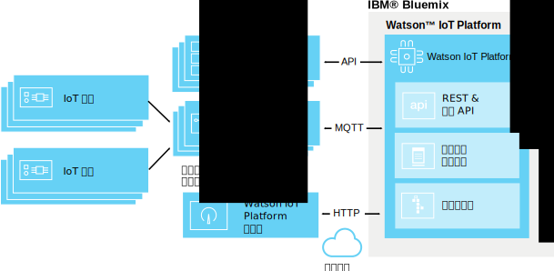

---

copyright:
  years: 2016, 2017
lastupdated: "2017-02-17"

---

{:new_window: target="\_blank"}
{:shortdesc: .shortdesc}
{:screen: .screen}
{:codeblock: .codeblock}
{:pre: .pre}

# 邊緣分析
{: #edge_analytics}

使用邊緣分析，您可以將雲端中的分析規則觸發程序移至啟用邊緣分析功能的閘道，如此即可透過在接近裝置之處進行分析處理，顯著減少傳送至雲端的裝置資料流量。
{:shortdesk}

裝置可將其資料傳送至啟用邊緣分析功能的閘道，在這裡，邊緣分析規則會剖析資料。根據您的規則及其動作，重要資料及警示可能會傳送至 {{site.data.keyword.iot_full}}、在閘道上觸發警示，或寫入閘道本端的文字檔。

下圖說明 {{site.data.keyword.iot_full}} 邊緣分析環境的一般架構。

## 開始之前
{: #byb}

在開始建立邊緣規則及動作之前，請：
- 確定您的閘道已連接至 {{site.data.keyword.iot_short}}，而且裝置資料正在傳送中。如需相關資訊，請參閱[連接閘道](gateways/dashboard.html)。
- 在您的閘道上安裝「邊緣分析代理程式 (EAA)」。如需相關資訊，請參閱[安裝邊緣分析代理程式](gateways/dashboard.html#edge)。  **提示：**啟用 EAA 功能的閘道會以閘道裝置訊息的形式提供 EAA 診斷資料。如需相關資訊，請參閱[邊緣分析代理程式診斷度量](#eaa_metrics)。
- 確定您要在規則中用來作為條件的裝置內容，已對映至綱目。如需相關資訊，請參閱[連接裝置](iotplatform_task.html)及[建立綱目](im_schemas.html)。
- 檢閱「邊緣分析」秘訣  
在「秘訣」入口網站中，有一些秘訣會說明執行「IBM 邊緣分析」所需的步驟。秘訣清楚地說明如何在以 Apache Edgent 為建置基礎的裝置上安裝及配置「IBM 邊緣分析代理程式」，來執行接近 IoT 資料來源的分析。
 - [開始在 IBM Watson IoT Platform 中使用邊緣分析 ](https://developer.ibm.com/recipes/tutorials/getting-started-with-edge-analytics-in-watson-iot-platform/){: new_window} 秘訣是此系列的開頭。此秘訣說明如何在「筆記型電腦系統及 Raspberry Pi 3 裝置」上設定 Cisco DSA Platform、安裝及配置「IBM 邊緣分析代理程式」來連接至 {{site.data.keyword.iot_short}}、安裝「系統 DS 鏈結」並將它配置成連接至 {{site.data.keyword.iot_short}} 上的「邊緣閘道」以作為連接的裝置、在「邊緣閘道」上定義及啟動「邊緣規則」，以及從 {{site.data.keyword.iot_short}} 管理「邊緣規則」。
 - 若要說明「邊緣分析」的進階使用，[在 IBM Watson IoT Platform 中使用邊緣分析處理警示及裝置動作 ](https://developer.ibm.com/recipes/tutorials/handling-alerts-and-device-actions-with-edge-analytics-in-ibm-watson-iot-platform/){: new_window} 秘訣示範如何建置自己的「DS 鏈結」，以將資料從連接的 Arduino Uno 裝置傳送至 Raspberry Pi 3 裝置。此秘訣也會示範資料過濾，以及將本端裝置動作處理為「邊緣規則」警示。

## 管理邊緣規則及動作  
{: #managing_rules}

邊緣規則是使用下列項目進行管理：
- **規則**儀表板用來為您的裝置與閘道建立及編輯雲端與邊緣規則和動作。
- **邊緣規則閘道**板用來啟動、取消啟動、更新及移除閘道上的邊緣規則。若要存取「邊緣規則閘道」板，請從「規則」儀表板中，對您要管理的邊緣規則按一下**管理規則**。如需相關資訊，請參閱[啟動、取消啟動及管理閘道的邊緣規則](#manage)。

若要取得已針對閘道連接裝置所觸發之邊緣規則及警示的概觀，請使用下列板：

|板名稱 | 說明 |  
 |:---|:---|  
  |以規則為主的分析 | 顯示您組織的規則，包括邊緣規則。其他卡片會列出轉遞的邊緣警示、關聯的裝置、裝置內容及轉遞的邊緣警示資訊。 |  
 |以裝置為主的分析 | 顯示連接至您組織的裝置。其他卡片會顯示所選取邊緣裝置轉遞的警示、所選取裝置的資訊、裝置內容及轉遞的警示資訊。 |

如需預設分析板的相關資訊，請參閱[使用板及卡片視覺化即時資料](data_visualization.html#default_boards)。

## 建立邊緣規則
{: #rules}

邊緣規則是條件型決策點，用來比對即時裝置資料與預先定義的臨界值或其他內容資料，以在符合條件時觸發邊緣動作。

**重要事項：**您必須先建立裝置類型的綱目，才能建立裝置類型的規則。如需相關資訊，請參閱[建立裝置類型綱目](im_schemas.html)。

若要建立規則，請執行下列動作：
1. 在 {{site.data.keyword.iot_short}} 儀表板中，移至**規則**。
2. 按一下**建立邊緣規則**、指定規則名稱、提供說明、選取要套用規則的邊緣裝置類型，然後按**下一步**。  
3. 設定規則邏輯。  
新增一個以上的 IF 條件，用來作為規則的觸發程式。  
您可以在平行列中新增條件，將它們套用為 OR 條件，或者在循序欄中新增條件，將它們套用為 AND 條件。
  
**附註：**若要能夠選取一個裝置內容作為規則的輸入，內容必須對映至綱目。如需相關資訊，請參閱[建立綱目](im_schemas.html)。  
  

**重要事項：**若要觸發一個條件，而該條件會比較兩個內容，或觸發兩個以上使用 AND 循序結合的內容條件，則觸發資料點必須包含在相同的裝置訊息中。如果在多則訊息中收到資料，則不會觸發條件或循序條件。  
  

**範例：**   
如果參數值大於指定值，簡單的規則可能會觸發警示：  
`temp>80`  
在達到臨界值的組合時，可能會觸發較複雜的規則：  
`temp>60 AND capacity>50`   

4. 配置規則的條件式觸發需求。  
若要控制一段時間針對規則所觸發的警示及動作數目，您可以配置規則的條件式觸發需求。  
  
**重要事項：**條件式觸發會對規則中的任何條件採取動作。例如，如果規則有五個使用 OR 設定的不同平行條件，則每一個符合的條件都會列入條件式觸發計數的計算中。若要設定規則的條件式觸發，請執行下列動作：
 1. 在規則編輯器中，按一下預設的**每次符合條件時觸發**鏈結，以開啟「設定頻率需求」對話框。
 2. 選取並配置您要在規則中使用的條件式觸發程式。
 <ul>
 <li>每次符合條件時觸發</li>
 <li>在 M 個*時間單位*內符合條件 N 次時觸發</li>
 </ul>  
如需條件式觸發程式的其他詳細說明，請參閱雲端分析一節中的[條件式規則觸發](cloud_analytics.html#conditional "條件式觸發概觀")。
5. 建立或選取在符合規則條件時發生的一個以上動作。  
如需邊緣動作的相關資訊，請參閱[建立邊緣動作](#edge_actions "建立邊緣動作")。   
範例：動作可以是將裝置資料傳送至雲端，或將警示寫入至本端檔案。
3. **選用項目：**選取規則的警示優先順序。  
優先順序是用來分類**規則型分析**板中所顯示的警示。預設優先順序是「低」。
6. 當規則符合您的要求時，請按一下**儲存**。

即會建立您的規則，並新增至瀏覽儀表板。您現在可以從開啟的**邊緣規則閘道**板[啟動](#manage)規則。

## 建立邊緣動作
{: #edge_actions}

您可以直接在規則編輯器中建立動作，或在「動作」標籤中建立動作，然後在建立規則時選取動作。

若要在「動作」標籤上建立動作，請執行下列動作：
1. 在 {{site.data.keyword.iot_short}} 儀表板中，移至**規則**。
2. 在「規則」儀表板中，選取**動作**標籤。
2. 按一下**建立動作**、指定動作名稱及說明，並選取動作類型，然後按**下一步**。  
邊緣分析支援兩個動作類型：
<dl>
<dt>將事件轉遞至雲端</dt>  
<dd>裝置事件會傳送至 {{site.data.keyword.iot_short}}，在這裡它可以用於板及卡片中，以及符合雲端分析規則。如需相關資訊，請參閱[與雲端分析整合](#integrate_with_cloud_analytics)。    
**提示：**使用將事件轉遞至雲端動作，可以減少傳送至雲端的裝置資料量，因為已直接在閘道裝置過濾掉較不重要的資料。</dd>
<dt>警示</dt>  
<dd>警示是在閘道裝置上建立的。</dd>
</dl>
3. 為您所選取的動作類型提供必要的參數。  
<dl>
<dt>將事件轉遞至雲端</dt>  
<dd>選取要轉遞至雲端的事件資料，並提供要在訊息中使用的事件名稱。 
**提示：**當設定板及卡片時，以及當建立雲端分析規則時，您可以使用事件及內容。 
您可以：
 <ul>
 <li>包含所有裝置內容及虛擬內容
 <li>僅包含綱目定義的內容及虛擬內容  
 </ul>
 </dd>
<dt>警示</dt>  
<dd>指定一則警示訊息，並為警示至少選取一個目的地。
 <ul>
 <li>轉遞至雲端  
 警示會轉遞至 {{site.data.keyword.iot_short}}，在這裡它會顯示在「以規則為主的分析」及「以裝置為主的分析」板中。
 <li>發佈至閘道分配管理系統  
 警示會發佈至閘道分配管理系統。分配管理系統配置決定如何向使用者顯示警示。
 <li>儲存至本端文字檔  
 警示會附加至閘道伺服器上的本端 *IBMEdgeAnalyticsAlerts.csv* 文字檔。
 </ul>
 </dd>
</dl>
4. 按一下**確定**，以建立新的動作。

此動作現在會出現在規則編輯器中。

## 啟動、取消啟動及管理閘道的邊緣規則
{: #manage}

對於要觸發動作的規則，您必須先在一個以上的閘道上啟動它。您可以使用**邊緣規則閘道**板，來啟動、取消啟動、更新及移除閘道上的邊緣規則。

若要啟動邊緣規則，請執行下列動作：
1. 從「規則」儀表板中，對您要管理的邊緣規則按一下**管理規則**按鈕。  
在開啟的**邊緣規則閘道**板中，您會看到一個清單，列出所有已連接之啟用 EAA 功能的閘道。未上傳及啟動規則之閘道的規則狀態為*無*。
2. 尋找您要在其上啟動規則的閘道，然後在「選取作業」直欄中，選取功能表中的**啟動**。  
邊緣規則即會上傳至閘道。當上傳完成且規則作用中時，「規則」狀態會變更為**作用中**。  

現在規則作用在閘道上，因此當符合規則條件時，配置的動作即會觸發。

**提示：**若要管理多個閘道上的規則，您可以選取「閘道」直欄標頭旁的「全選」方框。清除您不想要包含的所有閘道，然後從同名直欄頂端的**選取作業**功能表挑選作業。

除了啟動規則之外，您還可以在閘道上執行下列規則管理作業：

作業 | 說明
--- | ---
啟動 | 在選取的閘道上，上傳及啟動規則。規則狀態會設為*作用中*。
取消啟動 | 在選取的閘道上，取消啟動規則。規則仍會留在閘道上，必要的話，可以重新啟動規則。規則狀態會設為*非作用中*。
更新 | 將更新的規則版本上傳至選取的閘道。如果閘道的規則狀態為*作用中（較舊）*，請使用此作業帶來最新的閘道。規則狀態會設為*作用中*。
移除 | 從選取的閘道中移除規則。閘道的規則狀態會回復為*無*。

## 與雲端分析整合
{: #integrate_with_cloud_analytics}

使用在啟用 EAA 功能的閘道上執行的邊緣規則觸發動作，可以過濾流至雲端的資料，並將閘道產生的警示轉遞至雲端，以便與 {{site.data.keyword.iot_short}} 板及卡片搭配使用。  

您也可以使用 {{site.data.keyword.iot_short}}，對從閘道傳送至雲端的裝置資料執行雲端分析。如果您在邊緣規則中使用 `Forward event to cloud` 動作，則建立的訊息可以用來作為雲端分析規則的輸入，就彷彿提供已觸發邊緣規則之資料的裝置，已直接連接至 {{site.data.keyword.iot_short}} 一般。

如需如何建立雲端分析規則及動作的相關資訊，請參閱[雲端分析](cloud_analytics.html)。

## 邊緣分析代理程式診斷度量
{: #eaa_metrics}

已連接之啟用 EAA 功能的閘道會傳送診斷資訊，作為事件類型 `gateway_xv-monitor-event` 的裝置訊息。  **提示：**您可以使用[雲端分析](cloud_analytics.html)規則，根據啟用 EAA 功能的閘道所傳回的診斷值來配置警示動作，例如傳送電子郵件通知。例如，您可以建立一個規則，在 `SystemLoad` 超出特定臨界值時警示您。

若要查看閘道狀態的相關資訊，請執行下列動作：
1. 在 {{site.data.keyword.iot_short}} 儀表板中，選取功能表資訊看板中的**裝置**。
2. 按一下您的閘道裝置，以開啟裝置詳細資料頁面。
3. 存取閘道診斷資訊：  
 - 參閱**最近事件**一節，以取得閘道所傳送的最近訊息清單。
 - 參閱**診斷日誌**一節，以取得任何閘道警告及其他診斷訊息。
 - 參閱**感應器資訊**一節，從閘道取得詳細診斷資訊。下表說明可能包含在閘道裝置訊息中的不同內容。

內容 | 說明
 --- | ---
 `MsgInCount` |已傳送至「邊緣分析代理程式 (EAA)」的訊息數目。
`MsgInRate` | 前一分鐘內傳送至 EAA 的每秒預估訊息數。  
 `LastHeartBeat` | 前次產生活動訊號訊息時的毫秒時間戳記。最少每 10 秒會產生一則活動訊號訊息。
 `CurrentTimestamp` | 產生現行監視訊息時的毫秒時間戳記。
 `IsAlive` | 如果 `LastHeartBeat` 與 `CurrentTimestamp` 之間的差異大於 20 秒，則此內容為 0。
`BytesOutCount` | EAA 傳送至 {{site.data.keyword.iot_short}} 的訊息位元組數。
`BytesOutRate` | 前一分鐘內由 EAA 傳送至 {{site.data.keyword.iot_short}} 的每秒預估訊息位元組數。
 `BytesInCount` | {{site.data.keyword.iot_short}} 傳送至 EAA 的訊息位元組數。
`BytesInRate` | 前一分鐘內由 {{site.data.keyword.iot_short}} 傳送至 EAA 的每秒預估訊息位元組數。
 `RuleBytesInCount` |傳送至 EAA 規則引擎核心的訊息位元組數。  **附註：**如果未對裝置類型設定規則，則該裝置類型的訊息不會傳送至規則引擎核心。
`RuleBytesInRate` | 前一分鐘內傳送至 EAA 規則引擎核心的每秒預估訊息位元組數。
 `MsgOutCount` | EAA 傳送至 {{site.data.keyword.iot_short}} 的訊息數目。
`MsgOutRate` | 前一分鐘內由 EAA 傳送至 {{site.data.keyword.iot_short}} 的每秒預估訊息位元組數。
 `MsgReducePercent` | 送入訊息與送出訊息之間的百分比差異。 下列公式用於計算：`(msgIn - msgOut) / msgIn`
`BytesReducePercent` | 送入位元組與送出位元組之間的百分比差異。 下列公式用於計算：`(bytesIn - bytesOut) / bytesIn`
`MsgRateReduce` | 送入訊息速率與送出訊息速率之間的百分比差異。 下列公式用於計算：`(msgInRate - msgOutRate) / msgInRate`
`BytesRateReduce` | 送入訊息位元組與送出訊息位元組之間的百分比差異。 下列公式用於計算：`(bytesInRate - bytesOutRate) / bytesInRate`
`SystemLoad` | 執行 EAA 之系統的現行系統負載。**附註：**只有在 EAA 執行所在系統上可以使用 `mpstat` 指令時，才會傳送 CPU 速率。否則，傳送前 1 分鐘的系統負載平均值。 「系統負載平均值是下列兩個數目的總和：為了可用處理器而置入佇列之可執行實體的數目，以及一段時間內在平均可用處理器上執行之可執行實體的數目。計算負載平均值的方式是作業系統特有的，但通常是衰减的時間相依平均值。如果沒有可用的負載平均值，則會傳回負值。」- javadoc for *ManagementFactory.getOperatingSystemMXBean*。
 `FreeMemory` | 執行 EAA 之「Java™ 虛擬機器 (JVM)」的可用記憶體位元組數。
 `MemoryUsed` | EAA 所使用之 JVM 記憶體的位元組數。
`InQueueSize` | 置入佇列以供 EAA 處理之訊息的數目。
`RuleNumber` | 規則引擎核心中已定義的規則數目。
`ProcessorNumber` | 用於除錯。規則引擎核心中已定義的處理器數目。 **附註：**處理器是規則引擎核心中的最小執行單位。
`DataPointsInWindow` | 時間範圍內緩衝的資料點總數。資料點的位元組大小視其資料類型而有所不同。例如，浮點/整數資料點大小為 8 個位元組，而字串資料點大小視其長度而有所不同。在大部分情況下，您可以使用下列公式，預估時間範圍的記憶體用量：`DataPointsInWindow * 8`。
## 邊緣分析社群
{: #eaa_community}

您可以從 [IBM 邊緣分析社群頁面](https://www.ibm.com/developerworks/community/groups/service/html/communitystart?communityUuid=3df173af-0c21-4b9c-9fd1-e8e5561ef460&ftHelpTip=true)下載「邊緣分析 SDK」。SDK 包括 SDK JAR 檔案、javadoc、範例程式碼、秘訣鏈結及 README 檔。在社群中，您也可以觀看視訊來開始進行「邊緣分析」，而且可以使用社群討論區來提出問題。
