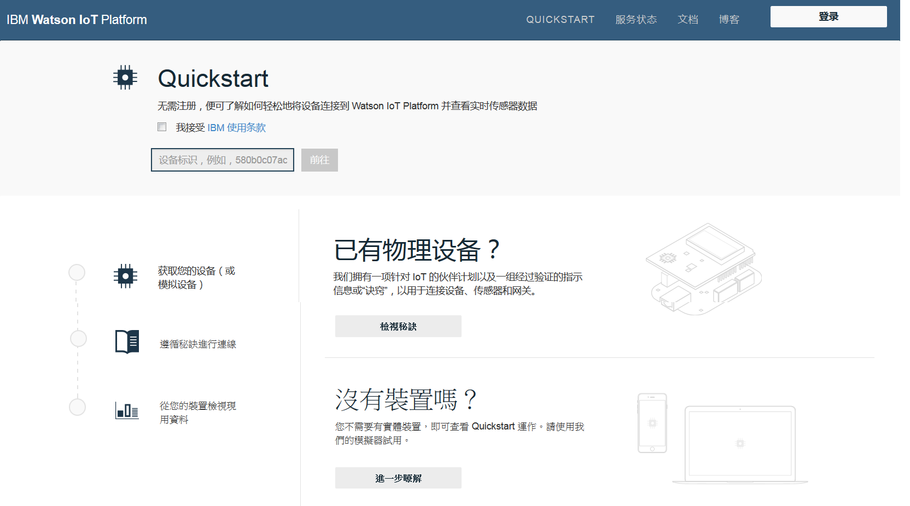
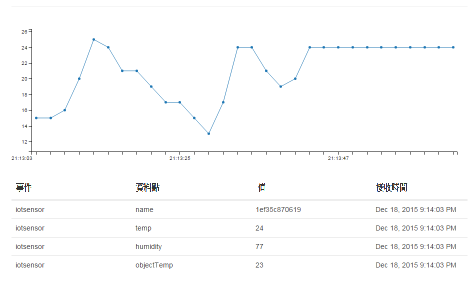

---

copyright:
  years: 2015, 2016, 2017
lastupdated: "2016-09-19"

---

{:new_window: target="_blank"}
{:shortdesc: .shortdesc}
{:screen: .screen}
{:codeblock: .codeblock}
{:pre: .pre}

# Quickstart

[Quickstart](https://quickstart.internetofthings.ibmcloud.com/#/) 是一個開放式沙盤推演，可用來快速將您的裝置連接至 {{site.data.keyword.iot_full}}。如果您的裝置支援 MQTT 傳訊通訊協定，就可以輕鬆地連接至 Quickstart。

如需說明如何將不同裝置連接至 Quickstart 服務的範例、秘訣及指導教學，請造訪 [developerWorks Recipes](https://developer.ibm.com/recipes/)，例如：

- [OpenBlocks IoT BX1G](https://developer.ibm.com/recipes/tutorials/openblocks-iot-bx1g-for-iot-foundation-quickstart/)
- [Reactive Blocks](https://developer.ibm.com/recipes/tutorials/reactive-blocks-and-java-to-iot-foundation-part-1-quickstart/)


**重要事項：**如果您的 {{site.data.keyword.iot_short_notm}} 實例使用 Quickstart 服務，則不支援可擴充的應用程式。

## 模擬裝置

除了 Quickstart 秘訣和指導教學，您還可以使用行動裝置的瀏覽器型模擬裝置，將具有 Web 瀏覽器的任何裝置連接至 Quickstart 服務。若要從行動電話或平板電腦啟動連接至 {{site.data.keyword.iot_short}} 的瀏覽器型模擬裝置，請開啟下列 URL：

```
http://quickstart.internetofthings.ibmcloud.com/iotsensor
```

當您連接至行動裝置上的模擬裝置 URL 時，連接至 {{site.data.keyword.iot_short}} 且以瀏覽器為基礎的模擬裝置就會啟動。請使用下列使用者介面控制項來管理感應器：

- 溫度
- 濕度
- 物件溫度


## 資料視覺化

若要查看行動裝置產生的資料，請確定模擬裝置在行動裝置上執行，然後啟動 Quickstart 應用程式。輸入裝置的 12 字元裝置 ID（顯示在使用者介面右上角）。



隨著您在模擬裝置中調整感應器值，您會看到裝置產生的資料在 Quickstart 應用程式中即時視覺化，如下列畫面擷取所概述：




## Mosquitto 示範

[Mosquitto](http://mosquitto.org/) 是一種跨平台開放程式碼 MQTT 用戶端，可用來實驗 {{site.data.keyword.iot_short}} 服務。安裝 Mosquitto 用戶端之後，請選擇唯一的應用程式 ID 和裝置 ID。如果應用程式和裝置 ID 並非唯一，測試連線可能會與正在完成相同 Quickstart 測試程序的另一位使用者產生衝突。

*appId*、*type_id*、*device_type* 和 *device_id* 值不得超過 36 個字元，而且只能包含下列字元：
- 英數字元（a-z 、A-Z、0-9）
- 橫線 ( - )
- 底線 ( _ )
- 句點 ( . )

定義應用程式 ID 和裝置 ID 之後，使用 `mosquitto_sub` 來建立代表您應用程式的連線。請使用下列 `<applicationId>` = myApplicationId 和 `<deviceId>` = myDeviceId 範例：
```
    [user@host ~]$ mosquitto_sub -h quickstart.messaging.internetofthings.ibmcloud.com -p 1883 -i "a:quickstart:myApplicationId" -t iot-2/type/mosquitto/id/myDeviceId/evt/helloworld/fmt/json

```

您可以在前一個程序執行時，建立您的裝置。在這個範例中，連接 `mosquitto` 類型的裝置，然後使用 `mosquitto_pub` 將兩個事件傳送至服務，如下列程式碼所概述：

```
    [user@host ~]$ mosquitto_pub -h quickstart.messaging.internetofthings.ibmcloud.com -p 1883 -i "d:quickstart:mosquitto:myDeviceId" -t iot-2/evt/helloworld/fmt/json -m "{\"helloworld\": 1}"
    [user@host ~]$ mosquitto_pub -h quickstart.messaging.internetofthings.ibmcloud.com -p 1883 -i "d:quickstart:mosquitto:myDeviceId" -t iot-2/evt/helloworld/fmt/json -m "{\"helloworld\": 2}"
```
當您查看應用程式終端機時，會顯示您剛才發佈的兩個事件，如下列輸出範例所概述：

```
   [user@host ~]$ mosquitto_sub -h quickstart.messaging.internetofthings.ibmcloud.com -p 1883 -i "a:quickstart:myApplicationId" -t iot-2/type/mosquitto/id/myDeviceId/evt/helloworld/fmt/json
    {"helloworld": 1}
    {"helloworld": 2}
```

就這麼簡單。完成 Quickstart 範例程序之後，您已經：
- 透過 MQTT 順利將裝置和應用應用程式連接至 {{site.data.keyword.iot_short}}
- 將裝置中的事件傳送至服務
- 在應用程式中接收事件


## 相關鏈結

- [Quickstart](https://quickstart.internetofthings.ibmcloud.com)
- [DeveloperWorks 秘訣](https://developer.ibm.com/recipes)
- [OpenBlocks IoT BX1G](https://developer.ibm.com/recipes/tutorials/openblocks-iot-bx1g-for-iot-foundation-quickstart/)
- [Reactive Blocks](https://developer.ibm.com/recipes/tutorials/reactive-blocks-and-java-to-iot-foundation-part-1-quickstart/)
- [Quickstart 應用程式](http://quickstart.internetofthings.ibmcloud.com)
- [Mosquitto](http://mosquitto.org/)
