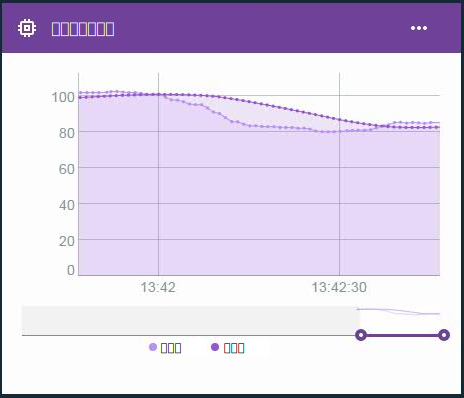

---

copyright:
  years: 2016, 2017
lastupdated: "2016-12-12"

---

{:new_window: target="blank"}
{:shortdesc: .shortdesc}
{:screen:.screen}
{:codeblock:.codeblock}
{:pre: .pre}

# 邊緣虛擬內容的進階計算
{: #im_vir_calculations}

使用預製邊緣分析公式來延伸基本虛擬內容計算。
{:shortdesc}

**重要事項：**如果所選取內容的資料來自連接至已安裝「邊緣分析代理程式」之閘道的裝置，則進階計算只會傳回內容資料點。邊緣規則可以直接使用此虛擬內容。若要透過雲端規則來使用內容，邊緣規則必須使用「轉遞至雲端」動作以將資料點傳送至雲端。如需相關資訊，請參閱[安裝邊緣分析代理程式](gateways/dashboard.html#edge)。

範例：使用折線圖卡中的進階虛擬資料點，來視覺化已移除資料暴增的資料趨勢。  
 

## 進階公式
{: #advanced}

進階計算選項包括下列公式：

**提示：**對於部分公式，您可以選擇期間長度或要併入的資料點數目。如果您知道資料是依一致的頻率流動，則時間範圍可能是不錯的選擇。如果偶爾或不規則地收集資料，則最好可能使用資料點數目，因為時間範圍很難預測。

<table>
<thead>
<tr>
<th>公式</th>
<th>說明</th>
<th>用法</th>
</tr>
</thead>
<tbody>
<tr>
<td>平均值</td>
<td>傳回某些最近資料點或某最近期間內之內容的平均值。  
輸入：
<ul>
<li>內容<li>期間長度或資料點數目，其形式為大於 0 的整數。</ul></td>
 <td>AVG 公式提供經常移動的某時間範圍的資料點平均值。   透過規則使用平均值公式，以避免根據包含隔離暴增的雜訊資料觸發假警示。  使用折線圖卡，來視覺化已移除資料暴增的資料趨勢。  
</td>
</tr>
<tr>
<td>移動 Z-score</td>
<td>傳回該資料點與某些最近資料點或某最近期間內之資料點平均值的差異（標準差單位）。  
輸入：
<ul>
<li>內容<li>期間長度或資料點數目，其形式為大於 0 的整數。</ul></td>
<td>資料點的「移動 Z-Score」指出資料點值相對於其最近平均值的異常範圍。較高的絕對 Z-score 值表示現行資料點值大於先前的平均資料點值。
  透過規則使用「移動 Z-Score」公式，以在資料點值與最近平均值不同時（而不是在資料點超出特定值時）觸發快速變更警示。
  使用折線圖卡，藉由繪製標準差頻率及大小來視覺化資料變動。
</td>
</tr>
<tr>
<td>指數平滑</td>
<td>傳回某些可用已收集資料點之內容的平均值，而較舊的內容值是以小於較新值的指數方式進行加權。加權是透過平滑因數所控制，而較大值表示最近值的加權較高，而較舊值的加權較低。  
您也可以選擇性地使用斜率因數，針對資料中的任何趨勢進行調整。指數平滑值反應資料變更的速度會比移動平均值快。  
輸入：
<ul>
<li>內容<li>平滑因數，以大於 0 且小於 1 的數字表示。  
<li>選用項目：斜率，以大於 0 且小於 1 的數字表示。 
 **提示：**如果您不確定收集的資料是否有趨勢，請從使用斜率 .5 開始。根據您的結果，您可能要調整因數。
 </ul></td>  
 <td>將指數平滑套用至資料點會產生平均值，而在計算平均值而不是定義期間長度時，較舊值的加權會較小。相反地，設定較高的平滑因數，即可限制距離值的加權。
  透過規則使用指數平滑公式，以使用所有可用資料而非子集來避免根據包含隔離暴增的雜訊資料觸發假警示。
  使用折線圖卡，來視覺化已移除資料暴增的資料趨勢。</td>
</tr>
<tr>
<td>箱式平滑</td>
<td>根據大約在目前資料點置中的某範圍資料點，傳回內容的平均值。  
箱式平滑使用在目前處理的資料點前後配置的某些資料點值，來決定其平滑值。計算時，箱式平滑會平均地加權所有資料點值。  
輸入：
<ul>
<li>內容<li>前後資料點數目（半形），其形式為大於 0 的整數。
</ul></td>
<td>將箱式平滑套用至資料點會傳回經常移動及在感興趣資料點置中的某時間範圍的資料點平均值。  **重要事項：**根據資料頻率及半形值，所傳回資料點的延遲會較多或較少。例如，如果半形設為 `5`，而且資料頻率是每秒一則訊息，則傳回的虛擬資料點會延遲五秒。  透過規則使用箱式平滑公式，以避免根據包含隔離暴增的雜訊資料觸發假警示。**重要事項：**建立規則時，請注意資料點延遲。  使用折線圖卡，來視覺化已移除資料暴增的資料趨勢。</td>
</tr>
<tr>
<td>高斯平滑</td>
<td>根據大約在目前資料點置中的某範圍資料點，傳回內容的平均值，其中離現行資料點較遠的內容值是以小於較近值的指數方式進行加權。  
輸入：
<ul>
<li>內容<li>前後資料點數目（半形），其形式為大於 0 的整數。
</ul></td>
<td>將高斯平滑套用至資料點會傳回經常移動及在感興趣資料點置中的某時間範圍的資料點加權平均值。計算平均值時，離感興趣資料點較遠的資料點的加權較小。  **重要事項：**根據資料頻率及半形值，所傳回資料點的延遲會較多或較少。例如，如果半形設為 `5`，而且資料頻率是每秒一則訊息，則傳回的虛擬資料點會延遲五秒。  透過規則使用高斯平滑公式，以避免根據包含隔離暴增的雜訊資料觸發假警示。**重要事項：**建立規則時，請注意資料點延遲。  使用折線圖卡，來視覺化已移除資料暴增的資料趨勢。</td>
</tr>
</tbody>
</table>  
