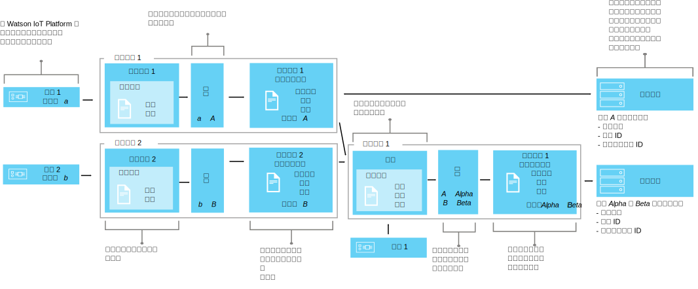

---

copyright:
years: 2016, 2017
lastupdated: "2017-04-25"

---

{:new_window: target="\_blank"}
{:shortdesc: .shortdesc}
{:screen: .screen}
{:codeblock: .codeblock}
{:pre: .pre}

# 使用介面來對映裝置資料（測試版）
{: #im_index}

應用程式介面可擴充[裝置類型](#resources)概念來更妥善地控制流過 {{site.data.keyword.iot_short_notm}} 的資料，以及提供 IoT 視圖的不限制裝置視圖。
{:shortdesc}

**重要事項：**介面對映特性是測試版特性。進行中的測試版更新以及最終版本可能會包含與現行版本不相容的變更。除非是最終版本，否則強烈建議不要在正式作業應用程式中使用測試版特性。若要接收其他資訊，以及提供對此測試版的意見，您可以[登錄資訊管理測試版程式 ](https://www.ibm.com/software/support/trial/cst/forms/nomination.wss?id=7050){:new_window}。

## 概觀
{: #overview}

使用應用程式介面來建立裝置及事物的共用抽象化，以改善重複使用和維護，以及管理 IoT 生態系統的複雜性，同時隔離應用程式與資料變更。應用程式介面已與裝置與 {{site.data.keyword.iot_short_notm}} 進行通訊的訊息資料變異取消連結。

透過應用程式介面，應用程式可以存取裝置及事物的現行狀態。狀態包含應用程式介面所定義的一組狀態內容。裝置傳送狀態變更事件時，這些內容的最新值會儲存在 {{site.data.keyword.iot_short_notm}} 中，而且使用 HTTP API 即可在要求時供應用程式使用。

使用應用程式介面，您可以：
- 將狀態內容對映至事件訊息資料
- 定義您喜好的資料結構
- 定義裝置狀態的多個表示法或視圖
- 訂閱裝置狀態，或隨時透過 HTTP API 進行查詢

應用程式介面的一些常見使用案例包括：
- 提供一致的介面，讓應用程式開發人員透過 REST 類似方式來存取事件驅動的裝置資料。
- 正規化不同廠牌或型號之裝置的資料，而這些裝置會以不同的格式來發佈資料。
- 合併來自數個不同裝置類型的事件資料，以建立任何給定 IoT 事物的模型。
- 修改及轉換資料格式，使其符合您的應用程式模型。  

如需介面 API 文件（測試版），請參閱 [{{site.data.keyword.iot_short_notm}} HTTP REST API ](https://docs.internetofthings.ibmcloud.com/apis/swagger/v0002-beta/info-mgmt-beta.html){: new_window}。   

## 範例
{: #examples}
下列介面範例說明兩個可能的解決方案。

### 範例 1：將異質溫度感應器對映至應用程式介面
{: #device-type-example}
在此範例中，所建立的應用程式介面會以某種格式提供同質溫度狀態資料，而不論實際裝置事件訊息有效負載格式為何。TemperatureSensor1 會將 `{ "t" : 34.5 }` 的攝氏溫度讀數發佈至 {{site.data.keyword.iot_short_notm}}。TemperatureSensor2 會發佈華氏溫度讀數 `{ "temp" : 72.55 }`。溫度讀數會發佈為個別事件。

如需可說明此範例的詳細完整情境，請參閱[應用程式介面情境 1](im_index_scenario.html)。

在執行應用程式介面資料流程時，您可以對送入的資料執行計算，以將這些讀數正規化為一致形式來進行處理。這表示您不需要撰寫應用程式，即可瞭解或轉換不同的溫標。應用程式會接收單一正規化狀態，並使用 **temperature** 狀態內容，而非裝置特定 **t** 及 **temp** 內容。

### 範例 2：將多個氣候裝置對映至一個事物類型應用程式介面
{: #thing-type-example}  
在此範例中，我們會以不同濕度計裝置的形式新增一組濕度感應器，來展開裝置類型範例。使用事物類型應用程式介面，即可順暢地將不同裝置類型的資料合併成一個代表某會議室內所有裝置及感應器的應用程式介面。應用程式現在可以連接至會議室事物應用程式介面，來取得針對某會議室收集到的氣候資料。

如需可說明此範例的詳細完整情境，請參閱[應用程式介面情境 2](im_index_scenario_thing.html)。

溫度感應器 1 及濕度感應器 3 會發佈在會議室 R1 收集到的環境資料。溫度及濕度感應器資料分別對映至兩個裝置類型應用程式介面，而根據前一個範例，一個是用於溫度計裝置類型，一個則是用於濕度計裝置類型。我們現在要建立稱為 Room 的事物類型，並實例化兩個會議室事物實例（R1 及 R2）。

我們現在可以設定包括溫度計及濕度計應用程式介面的組合，然後將正確的環境感應器對映至每一個會議室實例（例如，D1 及 D3 對映至 R1）。一般使用者應用程式現在可以要求特定會議室事物 ID 的狀態，以及取得會議室溫度及濕度狀態，而不需要知道基礎裝置架構。

## 定義及資源
{: #resources}

下列各圖說明在使用應用程式介面時，{{site.data.keyword.iot_short_notm}} 上裝置與應用程式之間的邏輯對映。

### 概念

概念                        | 說明       
------------- | ------------- | -------------  
事件 | 事件是裝置用來將資料發佈至 {{site.data.keyword.iot_short_notm}} 的機制。裝置會控制事件的內容，並指派名稱給它傳送的每個事件。內容 | 帶有裝置事件有效負載一部分的資料。
狀態 | 已對映狀態內容的最新值。
組合                         | 定義與事物類型相關聯之應用程式介面的邏輯建構。組合是透過事物類型綱目所指定。   

### 資訊管理資源
您可以使用 REST API 來管理資源。如需 REST API 的相關資訊，請參閱 [{{site.data.keyword.iot_short_notm}} HTTP REST API](https://docs.internetofthings.ibmcloud.com/swagger/info-mgmt-beta.html) 文件。

類型資源                        | 說明       
------------- | ------------- | -------------  
事件類型                         | 程式化建構，可將實體介面連接至事件綱目。 **重要事項：**若為測試版，所有要在應用程式介面中使用的入埠事件都必須為 JSON 格式。   
裝置類型                         |  程式化建構，可讓您將共用性質或行為的裝置群組在一起。在介面對映中，裝置類型會擴充成包括裝置的一個實體介面以及一個以上用來擷取裝置狀態的應用程式介面。 如需相關資訊，請參閱[裝置機型](../reference/device_model.html#id_and_device_types)主題中的「ID 及裝置類型」小節。
事物類型                         | 程式化建構，可代表一或多個不同裝置類型及（或）事物類型的集合。 **重要事項：**測試版支援三個層次的事物類型應用程式介面巢狀處理。
綱目資源                         |  程式化建構，可定義裝置類型實體介面、事物類型組合及送出應用程式介面的資料結構。會使用下列 [JSON 綱目 ](http://json-schema.org/){:new_window}：<ul><li>*事件綱目* 定義裝置發佈至 {{site.data.keyword.iot_short_notm}} 之事件的結構。每一個事件綱目都定義一個入埠事件的結構，並且與一種事件類型相關聯。<li>*事物類型綱目* 定義事物類型作為輸入來源的應用程式介面。每一個事物類型綱目都會定義一個以上事物類型應用程式介面的結構。<li>*應用程式介面綱目* 定義 {{site.data.keyword.iot_short_notm}} 上所儲存之[裝置狀態](#key_concepts)的結構。</ul>.

介面資源                        | 說明       
------------- | ------------- | -------------  
應用程式介面 | 程式化建構，您的應用程式可連接或訂閱以查看裝置或事物的狀態。應用程式介面是透過形成儲存為裝置或事物狀態之狀態資料結構的應用程式介面綱目所定義。會更新狀態，以回應入埠狀態事件。與裝置類型相關聯的應用程式介面可以有一個實體介面當成輸入。與事物類型相關聯的應用程式介面可以有一個以上的應用程式介面當成輸入。

實例資源                        | 說明       
------------- | ------------- | -------------  
裝置                         | 程式化建構，可代表向 {{site.data.keyword.iot_short_notm}} 登錄並以事件形式傳送 IoT 資料的資產、系統或元件。  
事物                         | 程式化建構，可邏輯地代表事物類型的唯一實例。事物實例所提供的用途與裝置類型的已登錄裝置相同。

支援資源                        | 說明       
------------- | ------------- | -------------  
實體介面                         | 程式化建構，可定義事件類型，以及與單一裝置類型相關聯的相關聯裝置內容。實體介面是透過事件綱目所定義。   
對映                         | 程式化建構，可定義如何將與入埠事件相關聯的內容對映至應用程式介面上所定義的內容。 **重要事項：**至少一個應用程式介面必須先與裝置類型相關聯，才能定義任何對映。

## 高階工作流程
{: #workflow}

使用下列步驟，可協助您使用介面來配置開始對映裝置資料所需的資源。

如需 API 的詳細資料，請參閱 [{{site.data.keyword.iot_short_notm}} HTTP REST API ](https://docs.internetofthings.ibmcloud.com/swagger/info-mgmt-beta.html){:new_window} 文件。

**提示：**如需每一個步驟的其他詳細資訊，請參閱範例情境，或使用鏈結直接移至範例情境中的特定步驟。[範例情境 1](im_index_scenario.html#scenario) 會逐步執行如何建立異質溫度計裝置之裝置類型應用程式介面的步驟，[範例情境 2](im_index_scenario_thing.html#scenario) 則是進一步進行建置，方法是說明如何建置應用程式介面，以讓您使用合併為會議室類型事物之兩個不同氣候裝置類型的資料。

根據建立與裝置類型還是事物類型相關聯的應用程式介面，建立及使用應用程式介面的處理程序會有些不同。

### 開始之前
若要建立與裝置類型相關聯的應用程式介面，您必須有[至少一個向 {{site.data.keyword.iot_short_notm}}](im_index_scenario.html#step14) 登錄並傳送含狀態內容之事件的裝置。  
若要建立與事物類型相關聯的應用程式介面，您必須有至少一個與所建立裝置類型相關聯的應用程式介面。

### 步驟

1. 	定義送入的狀態內容。  
請先定義要讓應用程式介面可供應用程式使用的送入狀態內容。  
根據所建立的應用程式介面，執行下列兩項之一：
<dl>
<dt>裝置類型：建立實體介面。</dt>
<dd>
<ol>
<li>[建立事件綱目檔](im_index_scenario.html#step1)。事件綱目檔是定義入埠事件結構及格式的本端 .JSON 檔案。<li>[建立事件類型的事件綱目資源](im_index_scenario.html#step2)。事件綱目資源是 {{site.data.keyword.iot_short_notm}} 所使用的程式化建構。
<li>[建立參照事件綱目的事件類型](im_index_scenario.html#step3)。{{site.data.keyword.iot_short_notm}} 使用事件類型，以將一個以上的事件綱目資源對映至實體介面。
<li>[建立實體介面](im_index_scenario.html#step7)。
<li>[將事件類型新增至實體介面](im_index_scenario.html#step8)。
<li>[將實體介面新增至裝置類型](im_index_scenario.html#step9)。
</ol>
</dd>
<dt>事物類型：定義組合。</dt>
<dd>
<ol>
<li>[建立組合綱目檔](im_index_scenario_thing.html#crt_composition_file)。  
事物類型組合綱目檔是定義事物類型組合的本端 .JSON 檔案，方法是指向現有應用程式介面。
<li>[建立組合綱目資源](im_index_scenario_thing.html#crt_composition_resource)。  
請將本端 .JSON 檔案上傳至 {{site.data.keyword.iot_short_notm}}。
<li>[建立事物類型](im_index_scenario_thing.html#crt_thing_type)。 事物類型所提供的用途與裝置類型相同，在於它代表事物的類別。
</ol>
</dd>
</dl>
4. 	建立應用程式介面。
 1. 	建立[裝置類型](im_index_scenario.html#step4)或[事物類型](im_index_scenario_thing.html#crt_ai_schema_file)的應用程式介面綱目檔。  
應用程式介面綱目檔是定義裝置狀態以供應用程式使用的本端 .JSON 檔案。
 2. 	建立[裝置類型](im_index_scenario.html#step5)或[事物類型](im_index_scenario_thing.html#crt_ai_schema_resource)的應用程式介面綱目資源。
 3.	建立[裝置類型](im_index_scenario.html#step6)或[事物類型](im_index_scenario_thing.html#crt_thing_ai)的應用程式介面。
 4.	將應用程式介面新增至[裝置類型](im_index_scenario.html#step10)或[事物類型](im_index_scenario_thing.html#add_thing_ai)。
5. 	定義[裝置類型](im_index_scenario.html#step11)或[事物類型](im_index_scenario_thing.html#define_Thing_type_mappings)的對映。   
對映可將入埠內容對映至應用程式介面中的內容。
6. 	部署與[裝置類型](im_index_scenario.html#step15)或[事物類型](im_index_scenario_thing.html#deploy_Thing_config)相關聯的配置。
7. 	**事物類型：**[建立事物類型實例](im_index_scenario_thing.html#create_Thing_instances)。
8. 	確認[裝置](im_index_scenario.html#step13)或[事物](im_index_scenario_thing.html#verify_Thing_state)更新的狀態。  
請確認訂閱顯示已更新的裝置資料，或使用 REST-call 傳回已更新的裝置資料。
