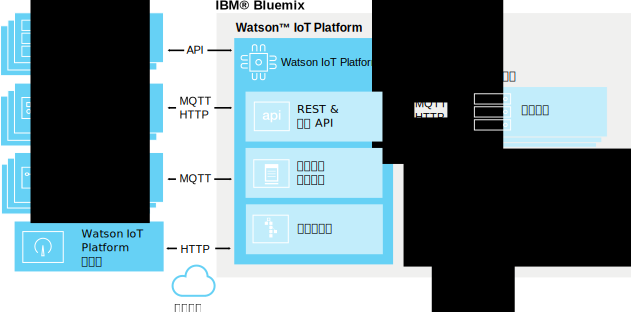

---

copyright:
  years: 2016, 2017
lastupdated: "2017-03-13"

---

{:new_window: target="\_blank"}
{:shortdesc: .shortdesc}
{:screen: .screen}
{:codeblock: .codeblock}
{:pre: .pre}

# 關於 {{site.data.keyword.iot_short_notm}}
{: #about_iotplatform}

{{site.data.keyword.iot_full}} 提供對 IoT 裝置和資料的強大應用程式存取權，可協助您快速組合分析應用程式、視覺化儀表板及行動 IoT 應用程式。
{:shortdesc}

{{site.data.keyword.iot_short_notm}} 可讓您執行強大的裝置管理作業、儲存與存取裝置資料，以及連接各種裝置和閘道裝置。{{site.data.keyword.iot_short_notm}} 使用 MQTT 和傳輸層安全 (TLS)，在您的裝置之間提供安全通訊。

## {{site.data.keyword.iot_short_notm}} 的架構
{: #watsoniotplatform_architecture}

**重要事項：**合併的分析特性來自 {{site.data.keyword.iotrtinsights_full}} 服務。如果您的 {{site.data.keyword.iot_short_notm}} 組織用來作為現有 {{site.data.keyword.iotrtinsights_short}} 實例的資料來源，則除非移轉現有 {{site.data.keyword.iotrtinsights_short}} 實例，否則不會啟用「雲端和邊緣分析」。在移轉完成之前，請繼續使用 {{site.data.keyword.iotrtinsights_short}} 儀表板來因應分析的需求。如需相關資訊，請參閱 IBM developerWorks 上的 [IBM Watson IoT Platform 部落格 ](https://developer.ibm.com/iotplatform/2016/04/28/iot-real-time-insights-and-watson-iot-platform-a-match-made-in-heaven/){: new_window}，以及您的現有 {{site.data.keyword.iotrtinsights_short}} 實例儀表板。  

{{site.data.keyword.iot_short_notm}} 使用 {{site.data.keyword.iot_short_notm}} API 和 {{site.data.keyword.iot_short_notm}} 傳訊通訊協定來與您的應用程式和裝置通訊。{{site.data.keyword.iot_short_notm}} 儀表板作為前端使用者介面來連接，以簡化平台內部的作業。裝置資料可供儲存或搭配分析解決方案來使用。

## {{site.data.keyword.iot_short_notm}} 中的重要概念
{: #watsoniotplatform_importantconcepts}

### 組織

當您向 {{site.data.keyword.iot_short_notm}} 登錄時，會提供您一個組織 ID。組織 ID 是您帳戶的唯一 6 個字元 ID。組織可確保只有您的裝置和應用程式可存取您的資料。登錄之後，裝置和 API 金鑰會連結至單一組織。當應用程式使用 API 金鑰來連接服務時，將會登錄至與所使用之 API 金鑰相關聯的組織。

基於安全考量，無法進行跨組織通訊。若要在兩個組織之間傳輸資料，唯一的方法是在每個組織中各建立一個應用程式，用來與另一個組織中的應用程式通訊。

### 裝置

裝置具有網際網路連線，並且可將資料推送至雲端。不過，裝置無法直接與其他裝置通訊，而是要接受應用程式的指令，並且將事件傳送至應用程式。{{site.data.keyword.iot_short_notm}} 中的裝置會以唯一的鑑別記號來識別。裝置必須先登錄，才能連接至 {{site.data.keyword.iot_short_notm}}。

{{site.data.keyword.iot_short_notm}} 可辨識兩種類別的裝置：**受管理裝置**及**未受管理裝置**。

**受管理裝置**定義為包含裝置管理代理程式的裝置。裝置管理代理程式是一套邏輯，可讓裝置使用「裝置管理通訊協定」來與 {{site.data.keyword.iot_short_notm}} Device Management 服務互動。受管理裝置可以執行裝置管理作業，包括位置更新、韌體下載與更新、重新開機及重設為原廠設定。

**未受管理裝置**是不含裝置管理代理程式的所有裝置。未受管理裝置可以連接至 {{site.data.keyword.iot_short_notm}}，然後傳送及接收事件和指令，但無法傳送裝置管理要求，或執行裝置管理作業。

### 閘道

閘道是特殊化裝置，結合了應用程式與裝置的功能，因而能夠作為其他裝置的存取點。無法直接連接至網際網路的裝置，可以先連接至閘道裝置來存取 {{site.data.keyword.iot_short_notm}} 服務。

閘道必須先登錄，才能連接至服務。

### 應用程式

應用程式具有網際網路連線，可與裝置中的資料互動，並控制那些裝置的行為。應用程式使用 API 金鑰及唯一的應用程式 ID，讓 {{site.data.keyword.iot_short_notm}} 可識別自己。不同於裝置，個別應用程式不需要先登錄，就可以連接至 {{site.data.keyword.iot_short_notm}}。不過，應用程式必須使用先前已登錄的有效 API 金鑰。

### 事件

事件是裝置用來將資料發佈至 {{site.data.keyword.iot_short_notm}} 的機制。裝置會控制其訊息的內容，並且為所傳送的每一個事件指定名稱。{{site.data.keyword.iot_short_notm}} 會使用所接收之每一個事件附加的認證，來判定傳送事件的裝置為何。此架構可防止裝置假冒其他裝置。

應用程式可以即時處理事件，並查看事件的來源，以及事件所包含的資料。應用程式必須加以配置，以定義其訂閱的裝置及事件。

### 指令

指令是應用程式與裝置通訊的機制。只有應用程式可以傳送指令，而且指令會傳送至特定裝置。裝置必須判定在收到任何給定指令時所要採取的動作。裝置可以設計為接聽任何指令，或訂閱指定的指令清單。
