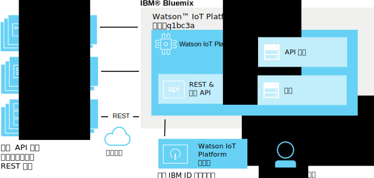
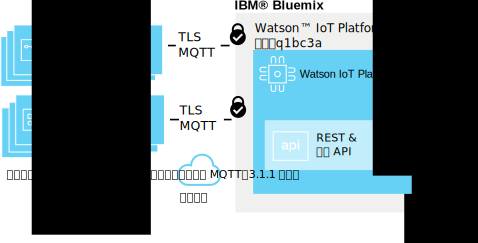
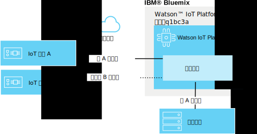

---

copyright:
  years: 2016, 2017
lastupdated: "2017-03-17"

---

{:new_window: target="blank"}
{:shortdesc: .shortdesc}
{:screen: .screen}
{:codeblock: .codeblock}
{:pre: .pre}

# {{site.data.keyword.iot_short_notm}} 安全
{: #sec-index}

作為雲端代管的服務，在 {{site.data.keyword.iot_full}} 的架構中，內含的安全性是非常重要的一環。
{: shortdesc}

下列文件回答一些有關如何保護組織資料的常見問題，主要集中在下列特定領域：

* 規範：設定安全基準的外部標準。
* 鑑別：確保嘗試存取組織資訊之使用者、裝置或應用程式的身分。
* 授權：確保使用者、裝置及應用程式有權限存取您組織的資訊。
* 加密：確保只有授權參與者能夠讀取資料，而且資料不會被截取。

## {{site.data.keyword.iot_short_notm}} 與 {{site.data.keyword.Bluemix_notm}}
{: #iot-bluemix-sec}

{{site.data.keyword.iot_short_notm}} 在 {{site.data.keyword.Bluemix_notm}} 平台內執行，因此需同時仰賴 {{site.data.keyword.Bluemix_notm}} 及 {{site.data.keyword.BluSoftlayer_full}} 來進行存取及連線。對 {{site.data.keyword.Bluemix_notm}} 及 {{site.data.keyword.BluSoftlayer}} 的依賴，使得 {{site.data.keyword.Bluemix_notm}} 及 {{site.data.keyword.BluSoftlayer}} 的安全和可靠性對 {{site.data.keyword.iot_short_notm}} 使用者而言非常重要。

如需 {{site.data.keyword.Bluemix_notm}} 安全的詳細資料，請參閱 [{{site.data.keyword.Bluemix_notm}} 平台安全](index.html#platform-security)。

## {{site.data.keyword.iot_short_notm}} 安全規範
{: #compliance}  
   
{{site.data.keyword.iot_short_notm}} 經「國際標準組織」(ISO) 27001 標準認證，此標準定義了資訊安全管理程序的最佳作法。ISO 27001 標準根據個別組織的需要，指定建立、實作和記錄「資訊安全管理系統」(ISMS) 的需求，以及實作安全控制措施的需求。ISO 27000 系列標準包含標定風險和資產評估的程序，目標是要保護書面、口述和電子資訊的機密性、完整性和可用性。

{{site.data.keyword.iot_short_notm}} 是由第三方安全公司審核，符合 ISO 27001 的所有需求：{{site.data.keyword.iot_short_notm}} ISO 27001:2013 登錄憑證。

## {{site.data.keyword.iot_short_notm}} 術語
{: #terminology}

## 我們如何保護您組織內的 IoT 資訊管理？
{: #secure-org}

以瀏覽器為基礎的 GUI 和 REST API 前面會使用 HTTPS，且具有 DigiCert 簽署的憑證，因此您可以放心您是連接到真正的 {{site.data.keyword.iot_short_notm}}。若要存取 Web 型 GUI，需以您的 IBM ID 或 {{site.data.keyword.Bluemix_notm}} {{site.data.keyword.ssoshort}} 來鑑別。若要使用 REST API，需要透過 GUI 產生的 API 金鑰，您可以用它來對您的組織進行鑑別的 REST API 呼叫。

## 我們如何保護您的裝置和應用程式認證？
{: #secure-credentials}

當登錄裝置或產生 API 金鑰時，鑑別記號以隨機雜湊方式產生。這表示，即使 {{site.data.keyword.iot_short_notm}} 遭到入侵（雖然不太可能發生這種事），也絕對無法從我們的系統回復您組織的認證。

裝置認證和 API 金鑰如已受損，可以個別予以撤銷。

## 我們如何確保您的裝置安全地連接至 {{site.data.keyword.iot_short_notm}}？
{: #secure-device-connection}

連接裝置時，會使用用戶端 ID，或使用將裝置新增至平台時，所產生的鑑別記號，或是兩者皆使用。使用 MQTT，可讓您跨許多平台和語言進行簡單的交互作業。{{site.data.keyword.iot_short_notm}} 支援傳輸層安全 (TLS) 1.2 版連線功能。

如需傳輸層安全 (TLS) 及密碼組合需求的相關資訊，請參閱 `Watson IoT Platform 的應用程式、裝置及閘道連線`文件中的[傳輸層安全 (TLS) 需求](connect_devices_apps_gw.html#tls_requirements)小節。

您可以使用憑證和安全原則來加強裝置連線安全。安全原則可以設為容許未加密的連線，以僅強制施行傳輸層安全 (TLS) 連線，讓裝置能夠以用戶端憑證來鑑別。黑名單可用來指定不容許連接的裝置，而白名單可用來容許要連接的特定裝置。如需加強安全的相關資訊，請參閱[風險與安全管理](RM_security.html)。

## 我們如何防止 IoT 裝置之間的資料洩漏？
{: #prevent-leak-devices}

內置安全傳訊型樣。裝置經鑑別之後，只有權發佈及訂閱有限的主題空間：

* '/iot-2/evt/<event_id>/fmt/<format_string>'
* '/iot-2/cmd/<command_id>/fmt/<format_string>'

所有裝置都使用相同的主題空間。用戶端提供的鑑別認證會指定 {{site.data.keyword.iot_short_notm}} 要將此主題空間限定在哪個裝置範圍。這可防止裝置假冒另一個裝置。

假冒另一個裝置的唯一方式是取得該裝置已洩露的安全認證。

應用程式可以針對組織中的所有裝置，訂閱及發佈事件和指令主題。應用程式可以同時分析來自許多裝置的資料，也可以模擬或 Proxy 裝置，以及補足全雙工通訊迴圈。

## 我們如何防止組織之間的 IoT 資料洩漏？
{: #prevent-leak-org}

裝置和應用程式操作所在的主題空間限定在單一組織內。鑑別之後，{{site.data.keyword.iot_short_notm}} 會根據用戶端鑑別，使用組織 ID 來轉換主題結構，讓某個組織能夠存取另一個組織的資料。

# 相關鏈結
{: #rellinks}
## 相關鏈結
{: #general}
* [開始使用 {{site.data.keyword.iot_short_notm}}](https://console.ng.bluemix.net/docs/services/IoT/index.html)
* [{{site.data.keyword.Bluemix_notm}} 安全 ](https://console.ng.bluemix.net/docs/security/index.html#security){:new_window}
* [{{site.data.keyword.Bluemix_notm}} 平台安全 ](https://console.ng.bluemix.net/docs/security/index.html#platform-security){:new_window}
* [{{site.data.keyword.Bluemix_notm}} 規範](https://console.ng.bluemix.net/docs/security/index.html#compliance){:new_window}
* [{{site.data.keyword.BluSoftlayer}} 安全 ](http://www.softlayer.com/security){:new_window}
* [{{site.data.keyword.BluSoftlayer}} 規範 ](http://www.softlayer.com/compliance){:new_window}
