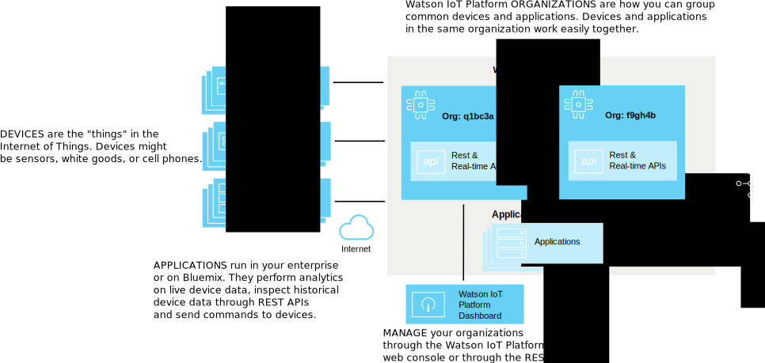
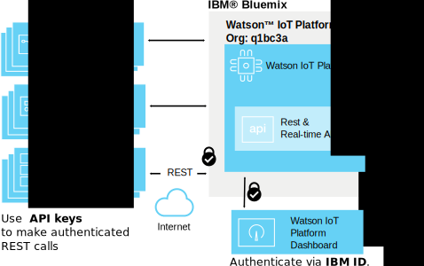
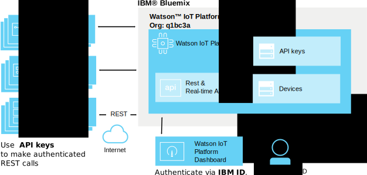
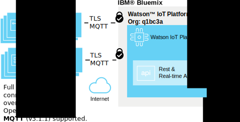
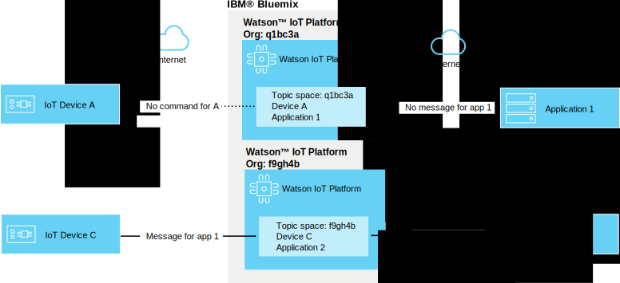

---

copyright:
  years: 2016, 2017
lastupdated: "2017-02-03"

---

{:new_window: target="blank"}
{:shortdesc: .shortdesc}
{:screen: .screen}
{:codeblock: .codeblock}
{:pre: .pre}

# {{site.data.keyword.iot_short_notm}} security
{: #sec-index}

As a cloud-hosted service the {{site.data.keyword.iot_full}} embeds security as an important aspect of its architecture.
{: shortdesc}

The following document answers some common questions about how your organization's data is protected, focusing on specific areas:

* Compliance: external standards which set benchmarks for security.
* Authentication: assuring the identity of users, devices or applications that are attempting to access your organization's information.
* Authorization: assuring that users, devices and applications have permission to access your organization's information.
* Encryption: assuring that data is only readable by authorized parties only and cannot be intercepted.

## {{site.data.keyword.iot_short_notm}} and {{site.data.keyword.Bluemix_notm}}
{: #iot-bluemix-sec}

{{site.data.keyword.iot_short_notm}} runs within {{site.data.keyword.Bluemix_notm}} platform and so relies upon both {{site.data.keyword.Bluemix_notm}} and {{site.data.keyword.BluSoftlayer_full}} for access and connectivity. The reliance upon {{site.data.keyword.Bluemix_notm}} and {{site.data.keyword.BluSoftlayer}} makes {{site.data.keyword.Bluemix_notm}} and {{site.data.keyword.BluSoftlayer}} security and reliability important to users of {{site.data.keyword.iot_short_notm}}

For more details about the security of the {{site.data.keyword.Bluemix_notm}}, see [{{site.data.keyword.Bluemix_notm}} platform security ](https://console.ng.bluemix.net/docs/security/index.html#platform-security){: new_window}.

## {{site.data.keyword.iot_short_notm}} Security compliance
{: #compliance}  
   
{{site.data.keyword.iot_short_notm}} is certified under the International Organization for Standardization (ISO) 27001 standard, which defines the best practices for information security management processes. The ISO 27001 standard specifies the requirements for establishing, implementing, and documenting Information Security Management Systems (ISMS) and the requirements for implementing security controls, according to the needs of individual organizations. The ISO 27000 family of standards incorporates a process of scaling risk and valuation of assets, with the goal of safeguarding the confidentiality, integrity, and availability of the written, oral, and electronic information.

{{site.data.keyword.iot_short_notm}} is audited by a third-party security firm and meets all of the requirements for ISO 27001: {{site.data.keyword.iot_short_notm}} ISO 27001:2013 Certificate of Registration.

## {{site.data.keyword.iot_short_notm}} Terminology
{: #terminology}

## How do we secure IoT information management within your organization?
{: #secure-org}

The browser-based GUI and REST APIs are fronted by HTTPS, with a certificate signed by DigiCert, so you can trust that you're connecting to the genuine {{site.data.keyword.iot_short_notm}}. Access to the web-based GUI is authenticated by your IBMid or {{site.data.keyword.Bluemix_notm}} {{site.data.keyword.ssoshort}}. Using the REST API requires an API key, generated through the GUI, you can use this to make authenticated REST API calls against your organization.

## How do we secure your device and application credentials?
{: #secure-credentials}

When devices are registered or API keys are generated, the authentication token is salted and hashed. This means your organization's credentials can never be recovered from our systems - even in the unlikely event that the {{site.data.keyword.iot_short_notm}} is compromised.

Device credentials and API keys can be individually revoked if they are compromised.

## How do we ensure your devices connect securely to the {{site.data.keyword.iot_short_notm}}?
{: #secure-device-connection}

Devices connected use a combination of clientId and the authentication token that is generated when adding the devices to your platform. MQTT v3.1.1 is used to allow simple interoperability across many platforms and languages. The {{site.data.keyword.iot_short_notm}} supports connectivity over TLS v1.2.

For more information about TLS and cipher suite requirements, see the [TLS requirements ](https://console.ng.bluemix.net/docs/services/IoT/reference/security/connect_devices_apps_gw.html#tls_requirements){: new_window} section in the `Application, device, and gateway connections to Watson IoT Platform` documentation.

## How do we prevent data leaking between IoT devices?
{: #prevent-leak-devices}

Secure messaging patterns are baked in. Once authenticated, devices are only authorized to publish and subscribe to a restricted topic space:

* '/iot-2/evt/<event_id>/fmt/<format_string>'
* '/iot-2/cmd/<command_id>/fmt/<format_string>'

All devices work with the same topic space. The authentication credentials provided by the client dictate to which device this topic space will be scoped by the {{site.data.keyword.iot_short_notm}}.  This prevents devices from being able to impersonate another device.

The only way to impersonate another device is by obtaining compromised security credentials for the device.

Applications can subscribe and publish on both the event and command topics for all devices in the organization. Applications can analyze data from many devices simultaneously, and can also simulate or proxy devices in addition to forming the complementary side of a full duplex communication loop.

## How do we prevent IoT data leaking between organizations?
{: #prevent-leak-org}

The topic space in which devices and applications operate is scoped within a single organization. When authenticated, the {{site.data.keyword.iot_short_notm}} transforms the topic structure using an organization ID based on the client authentication, making it impossible for data from one organization to be accessed from another.

# Related Links
{: #rellinks}
## Related Links
{: #general}
* [Getting started with {{site.data.keyword.iot_short_notm}}](https://console.ng.bluemix.net/docs/services/IoT/index.html)
* [{{site.data.keyword.Bluemix_notm}} security ](https://console.ng.bluemix.net/docs/security/index.html#security){:new_window}
* [{{site.data.keyword.Bluemix_notm}} platform security ](https://console.ng.bluemix.net/docs/security/index.html#platform-security){:new_window}
* [{{site.data.keyword.Bluemix_notm}} compliance](https://console.ng.bluemix.net/docs/security/index.html#compliance){:new_window}
* [{{site.data.keyword.BluSoftlayer}} security ](http://www.softlayer.com/security){:new_window}
* [{{site.data.keyword.BluSoftlayer}} compliance ](http://www.softlayer.com/compliance){:new_window}
