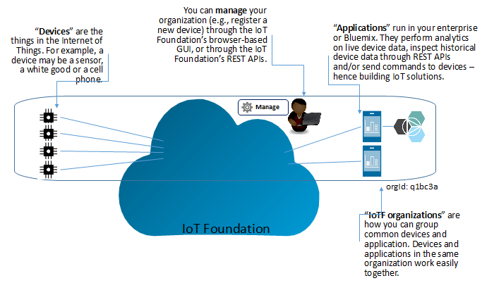
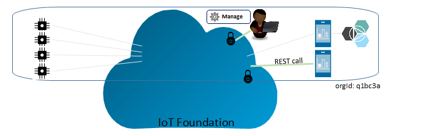
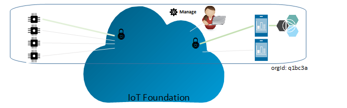
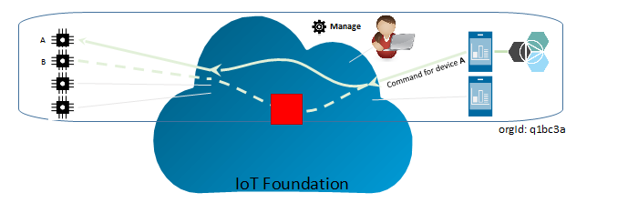
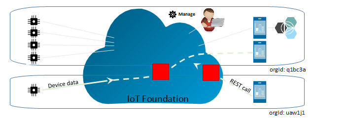

---

copyright:
  years: 2015, 2016

---

{:new_window: target="_blank"}
{:shortdesc: .shortdesc}
{:screen: .screen}
{:codeblock: .codeblock}
{:pre: .pre}

# Securing the {{site.data.keyword.iot_short_notm}}
{: #sec-index}

The {{site.data.keyword.iot_full}} is a fully managed, cloud-hosted service that makes it simple to derive value from Internet of Things (IoT) devices.

The following document aims to answer common questions about how your organization's data is protected. Focusing on specific areas:

* Authentication: assuring the identity of users, devices or applications that are attempting to access your organization's information.
* Authorization: assuring that users, devices and applications have permission to access your organization's information.
* Encryption: assuring that data is only readable by authorized parties only and cannot be intercepted.

## Terminology
{: #terminology}

## How do we secure management of your organization?
{: #secure-org}

The browser-based GUI and REST APIs are fronted by HTTPS, with a certificate signed by DigiCert enabling you to trust that you're connecting to
the genuine {{site.data.keyword.iot_short_notm}}.

* GUI: authenticated via your IBM ID.
* REST API: once you create an API key through the GUI, you can use this
  to make authenticated REST calls against your organization.

## How do we secure your device and application credentials?
{: #secure-credentials}

When devices are registered or API keys are generated, the authentication token is salted and hashed. This means your organization's credentials can never be
recovered from our systems - even in the unlikely event that the {{site.data.keyword.iot_short_notm}} is compromised.

Device credentials and API keys can be individually revoked if they are compromised.

## How do we ensure your devices connect securely to the {{site.data.keyword.iot_short_notm}}?
{: #secure-device-connection}

* Devices connect through a unique combination of clientId and authentication token that only you know.
* Full support for connectivity over TLS (v1.2) is provided.
* Open standards are used (MQTT v3.1.1) to allow easy interop across many platforms and languages.

## How do we prevent data leaking between devices?
{: #prevent-leak-devices}

Secure messaging patterns are baked in. Once authenticated, devices are only authorized to publish and subscribe to a restricted topic space:

* /iot-2/evt/+/fmt/+
* /iot-2/cmd/+

All devices work with the same topic space. The authentication credentials provided by the client connecting dictate to which device this topic space
will be scoped by the {{site.data.keyword.iot_short_notm}}.  This prevents devices from being able to impersonate another device.

The only way to impersonate another device is by obtaining compromised security credentials for the device.

Applications can subscribe and publish on both the event and command topics for all devices in the organization. Applications can analyse data from many devices simultaneously, and can also simulate or proxy devices in addition to forming the complementary side of a full duplex communication loop.

## How do we prevent data leaking between organizations?
{: #prevent-leak-org}

The topic space in which devices and applications operate is scoped within a single organization. When authenticated, the {{site.data.keyword.iot_short_notm}}
transforms the topic structure using an organization ID based on the client authentication, making it impossible for data from one organization to be
accessed from another.

