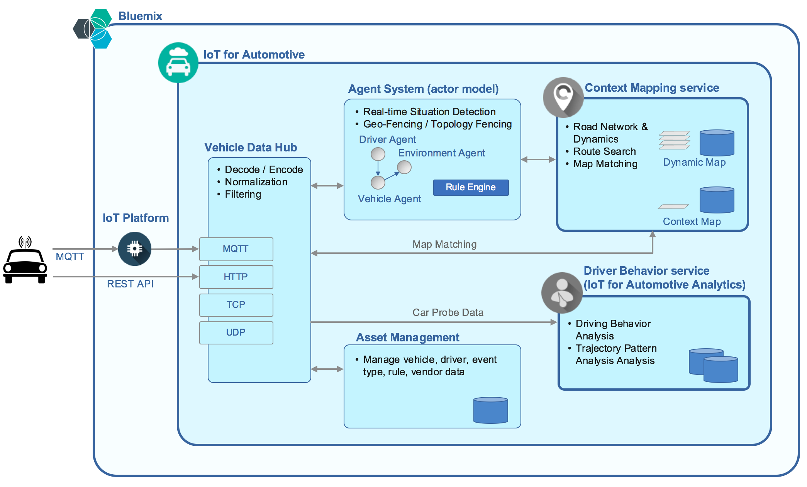

---

copyright:
  years: 2016, 2017
lastupdated: "2017-03-08"

---

{:new_window: target="_blank"}
{:shortdesc: .shortdesc}

# About IoT for Automotive (Experimental)
{: #iotautomotive_overview}

{{site.data.keyword.iot4auto_full}} is a {{site.data.keyword.Bluemix_notm}} service that links drivers and vehicles to the surrounding environment to improve the mobility experience.

By using the {{site.data.keyword.iot4auto_short}} service, you can retrieve, manage, and analyze car probe data from connected vehicles and use the data to build smart automotive solutions that optimize fleet operations.

The analytics of {{site.data.keyword.iot4auto_short}} provide powerful and actionable insights into driver behavior, vehicle location, and other automotive-related activities and events of interest.
{:shortdesc}

## Architecture
{: #architecture}
{{site.data.keyword.iot4auto_short}} is a foundational real-time infrastructure platform for automotive applications and connected vehicle devices. The service is also designed to support the emerging autonomous driving capabilities of the future.

## Components and services
{: #components}

{{site.data.keyword.iot4auto_short}} provides the Vehicle Data Hub component and the following automotive services, which are also separately available for you to deploy in the {{site.data.keyword.Bluemix_notm}} catalog:

|Service|Description|
|:---|:---|
|[Driver Behavior](../IotDriverInsights/index.html)| A service that can analyze the driver behavior and identify trajectory patterns of a journey from the car probe and context data that is retrieved from a connected vehicle.
|[Context Mapping](../IotMapInsights/index.html)| A service that provides geospatial functions, such as map matching and shortest path search for road networks.
*Table 1. {{site.data.keyword.iot4auto_short}} services*

## Vehicle Data Hub
{: #hub}

The Vehicle Data Hub (VDH) component collects and manages large volumes of data from connected vehicles and automotive devices by using a range of protocols and formats. The VDH retrieves, processes, and stores car probe data for use with other analytical services and data flows, for example, Context Mapping and Driver Behavior.

## Features
{: #features}

{{site.data.keyword.iot4auto_short}} supports the following features and functions for solutions that provide car probe data from connected vehicle devices:

### Data retrieval from {{site.data.keyword.iot4auto_short}} devices

- Supports the following protocols and data models:
   - TPEG
   - ITS
   - ISO automotive standards

- Supports the following message formats:
   - MQTT
   - HTTPS
   - UDP
   - TCP

- Supports other non-vehicle devices and sensors

### Data normalization and storage

- Identifies and filters anomaly data
- Maps, converts, and formats data to the standard data model for analysis
- Puts data in one of the following data stores according to the volume, latency, and usage of the application or service:
   -  Hadoop data store for big data analysis
   -  Agent data store for real-time analysis

### Geospatial map based service

- Real-time map matching
- Event service
- Dynamic event injection from vehicles and external sources
- Link or node-based topology aware searching
- Contextual map support that has integrated weather data

### Highly scalable and low-latency real-time analysis platform

- Agent-based technology
- Personalized analysis
- Flexible rule-based analysis

### Moving Object Map Analysis (MOMA)

- Batch (big data) analysis by using data from the vehicle
- Driver Behavior Analysis
- Driver Profiling
- Trajectory Pattern Analysis

### Data provider service

- APIs for third-party applications and services

### Integration with asset management

- Vehicle asset management systems

## REST APIs
{: #api}

Several APIs are available for connecting your vehicle and device data to {{site.data.keyword.iot4auto_full}} and developing features and capabilities to build a powerful automotive solution that meets your requirements. For more information, see [APIs](iotautomotive_apis.html).
