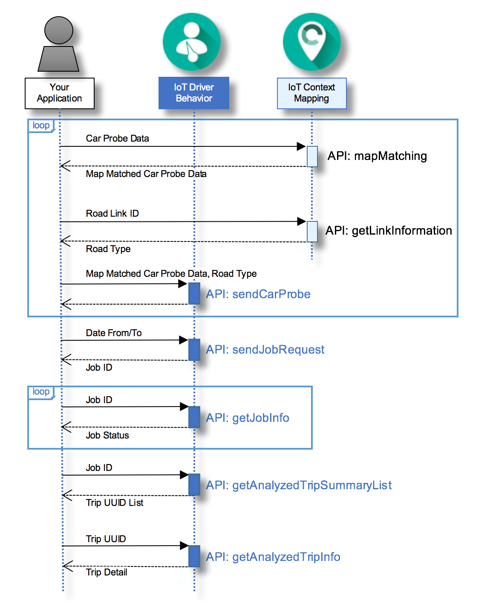

---

copyright:
  years: 2016, 2017
lastupdated: "2017-02-28"
---

{:new_window: target="_blank"}
{:shortdesc: .shortdesc}
{:screen: .screen}
{:codeblock: .codeblock}
{:pre: .pre}

# Getting started with Driving Behavior Analysis
{: #drb_index}

Driving Behavior Analysis is a service within the {{site.data.keyword.Bluemix_notm}} {{site.data.keyword.iotdriverinsights_full}} service that you can use to collect and analyze driver behavior from car probe and contextual data. Furthermore, you can use the {{site.data.keyword.iotdriverinsights_short}} APIs to integrate the analyzed driver data with other {{site.data.keyword.Bluemix_notm}} applications to gain valuable insights into driving behavior and vehicle usage patterns.

{:shortdesc}

The following diagram outlines a typical sequence of API calls in the Driving Behavior Analysis service:

After you create and deploy {{site.data.keyword.iotdriverinsights_short}} as an unbound service instance, complete the following tasks to integrate your applications with the {{site.data.keyword.iotdriverinsights_short}} API.

You can also use the [{{site.data.keyword.iotmapinsights_short}} and {{site.data.keyword.iotdriverinsights_short}} tutorial](https://github.com/IBM-Bluemix/car-data-management){:new_window} to help you to create a sample application with sample car probe data.

## Before you begin
{: #drb_byb}

- Review the [About Driving Behavior Analysis](drb_iotdriverinsights_overview.html) topic to familiarize yourself with the analyzable behaviors and contexts.
- Get the automatically generated *Tenant ID*, *Username*, and *Password* values, which are required to access the {{site.data.keyword.iotdriverinsights_short}} API.

1. From the {{site.data.keyword.Bluemix_notm}} dashboard, click the {{site.data.keyword.iotdriverinsights_short}} service tile.
2. Select the **Manage** view of your service instance.
3. Make a note of the *Tenant ID*, *Username*, and *Password* values that are displayed.

- Optional: If you would like to use geospatial functions with your driver data, deploy the {{site.data.keyword.iotmapinsights_short}} {{site.data.keyword.Bluemix_notm}} service in your organization.

## Task 1: Uploading vehicle and context data
{: #drb_task1}
Upload one or more sets of driver trip data to your {{site.data.keyword.iotdriverinsights_short}} tenant to make the driver data available for analysis.

1. Optional: If you deployed the {{site.data.keyword.iotmapinsights_short}} service, map your driver data to geospatial data.  
Before your application sends car probe data to the [{{site.data.keyword.iotdriverinsights_short}} API](http://ibm.biz/IoTDriverBehavior_APIdoc){:new_window}, you can map it to geospatial data by using the [{{site.data.keyword.iotmapinsights_short}} API](http://ibm.biz/IoTContextMapping_APIdoc){:new_window}. Geospatial data enhances the quality of the analyzed driver behavior results.

     1. Get map-matched car probe data by using the `mapMatching` API.  
     Map matching maps the driving data from the car probe to geospatial road data.
        - Request: Car probe data
        - Response: Map matched car probe data
     2. Get road type data with the `getLinkInformation` API.  
        - Request: Road link ID
        - Response: Road type
2. Send car probe data to the store to be analyzed with the `sendCarProbeData` API.  
Upload your raw car probe data and optional matched geospatial data to {{site.data.keyword.iotdriverinsights_short}}.
   - Request: Map matched car probe data and Road type

## Task 2: Processing vehicle and context data  
{: #drb_task2}
Process the vehicle and context data against the configurable analysis parameters. For information about how to configure the analysis parameters, see the [Configuring parameters for the service](drb_iotdriverinsights_admin.html#configureparameters) topic.

1. Send a job request to analyze car probe data over a certain time period with the `sendJobRequest` API.
   - Request: Date from and to
   - Response: Job ID
2. Check the job status with the `getJobInfo` API.  
The driver behavior data processing is complete when the job status returned states 'SUCCEEDED'. You can now request driver behavior data.
   - Request: Job ID
   - Response: Job status

## Task 3: Analyze trips
{: #drb_task3}
Analyze trips from a specific date range to understand how they conform to the analysis threshold parameters.

1. Get the analyzed trip summary list with the `getAnalyzedTripSummaryList` API.  
The trip summary list includes analyzed trip summary information according to the input parameters.
   - Request: Job ID
   - Response: List of analyzed trip summary
2. Get the detailed analyzed trip information with the `getAnalyzedTripInfo` API.  
Finally, get the detailed driver behavior information for a specific analyzed trip.
   - Request: Trip uuid
   - Response: Details of the analyzed trip

## Next steps
{: #drb_post}
When you complete the steps, a set of driver behavior data is generated in your organization.  Use your applications or your preferred analytics software to process the information further into more meaningful business data.

# Related Links
{: #rellinks}

## Tutorials and samples
{: #samples}

* [{{site.data.keyword.iotmapinsights_short}} / {{site.data.keyword.iotdriverinsights_short}} Tutorial Part1](https://github.com/IBM-Bluemix/car-data-management){:new_window}
* [{{site.data.keyword.iotmapinsights_short}} / {{site.data.keyword.iotdriverinsights_short}} Tutorial Part2](https://github.com/IBM-Bluemix/map-driver-insights){:new_window}
* [IoT for Automotive Starter Application](https://iot-for-automotive-starter-experience.mybluemix.net){:new_window}

## API reference
{: #api}

* [API docs](http://ibm.biz/IoTDriverBehavior_APIdoc){:new_window}

## Other resources
{: #general}

* [Getting started with {{site.data.keyword.iotmapinsights_short}}](../IotMapInsights/index.html){:new_window}
* [Getting started with {{site.data.keyword.iot_full}}](https://www.ng.bluemix.net/docs/services/IoT/index.html){:new_window}
* [dW Answers on IBM developerWorks](https://developer.ibm.com/answers/topics/iot-driver-behavior){:new_window}
* [Stack Overflow](http://stackoverflow.com/questions/tagged/iot-driver-behavior){:new_window}
* [What's new in Bluemix Services](http://www.ng.bluemix.net/docs/whatsnew/index.html#services_category){:new_window}
