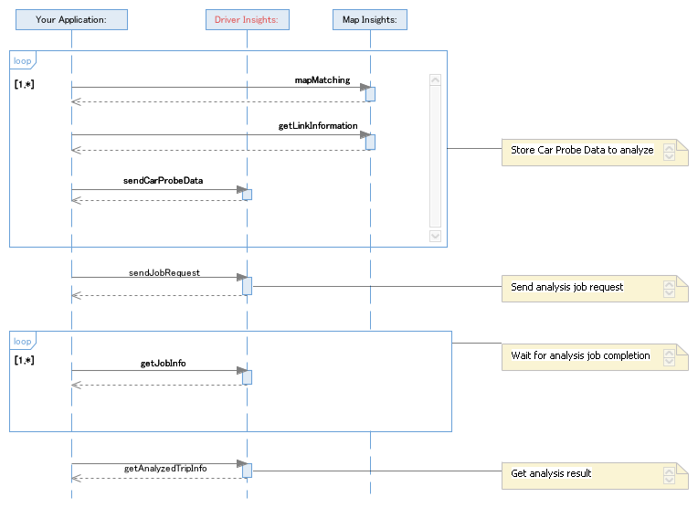

---

copyright:
  years: 2016

---

{:new_window: target="_blank"}
{:shortdesc: .shortdesc}
{:screen: .screen}
{:codeblock: .codeblock}
{:pre: .pre}

# Getting started with {{site.data.keyword.iotdriverinsights_full}} (Experimental)
{: #gettingstartedtemplate}
*Last updated: 18 March 2016*

With {{site.data.keyword.iotdriverinsights_full}}, you can run analytics on driver's behavior from car probe data and contextual data.
{:shortdesc}

Following steps are the rough sequence to interact your application with {{site.data.keyword.iotdriverinsights_short}} API.

1. Send car probe data to be analyzed
	1. Before sending car probe data to {{site.data.keyword.iotdriverinsights_short}} API, you can add additional data to your car probe data by way of {{site.data.keyword.iotmapinsights_short}} API
2. Send a job request to analyze car probe data
3. Wait for the job completion
4. Get analysis result

As for the analyzable behaviors and contexts, refer to [Overview](iotdriverinsights_overview.html) section. 

## How to add service
To get up and running quickly with this service, follow these steps:

1. Deploy **{{site.data.keyword.iotdriverinsights_full}} service** to your Bluemix organization.
	1. From your Bluemix account Dashboard, click **Use services** or **APIs**.
	2. Locate the **Internet of Things** section of the service catalog and select **{{site.data.keyword.iotdriverinsights_full}}**.
	3. On the **{{site.data.keyword.iotdriverinsights_full}}** page, verify the Add Service selections:
		- App - Leave unbound.
		- Service name - Optionally change the service name to something that is easy to remember. This name is displayed in the **{{site.data.keyword.iotdriverinsights_full}}** tile in the Bluemix dashboard.
		- Selected plan - Select **Free** or **purchase plan** that is suitable for your needs.  
		> **Important:** With the free {{site.data.keyword.iotdriverinsights_short}} plan, total upload size of Vehicle Probe Data is limited to 200 MB.
	4. Click **Use** to deploy **{{site.data.keyword.iotdriverinsights_full}}** to your Bluemix services.
2. For more detail for how to run and configure the service, refer to [Administering](iotdriverinsights_admin.html) section and [API Documentation](https://new-console.ng.bluemix.net/apidocs/121){:new_window}.

# Related Links
{: #rellinks}

## API Reference
{: #api}
* [API Documentation](https://new-console.ng.bluemix.net/apidocs/121){:new_window}

## Related Links
{: #general}
* [dW Answers on IBM developerWorks](https://developer.ibm.com/answers/topics/iot-driver-insights/){:new_window}
* [stackoverflow](http://stackoverflow.com/questions/tagged/iot-driver-insights){:new_window}
* [What's new in Bluemix Services](http://www.ng.bluemix.net/docs/whatsnew/index.html#services_category){:new_window}

