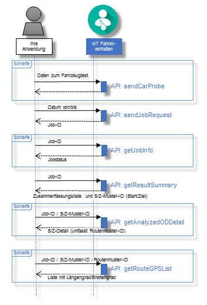

---

copyright:
  years: 2016

---

{:new_window: target="_blank"}
{:shortdesc: .shortdesc}
{:screen: .screen}
{:codeblock: .codeblock}
{:pre: .pre}

# Einführung in die Analyse des Streckenverlaufsmusters
{: #tp_index}
Letzte Aktualisierung: 16. Juni 2016
{: .last-updated}

Die API für die Analyse des Streckenverlaufsmusters ist ein Service innerhalb des {{site.data.keyword.iotdriverinsights_full}}-Service von {{site.data.keyword.Bluemix_notm}}, mit dem Sie die Start/Ziel-Muster (S/Z-Muster) und Routenmuster von Fahrten aus Fahrzeugtestdaten analysieren können. 

{:shortdesc}

Im folgenden Diagramm wird die typische Sequenz von API-Aufrufen bei der Analyse des Streckenververlaufsmusters dargestellt: 

Führen Sie nach der Erstellung und Bereitstellung von {{site.data.keyword.iotdriverinsights_short}} als nicht gebundene Serviceinstanz die folgenden Tasks aus, um Ihre Anwendungen in die API für die Analyse des Streckenverlaufsmusters zu integrieren. 

## Vorbereitende Schritte
{: #tp_byb}
- Lesen Sie den Abschnitt [Informationen zur Analyse des Streckenverlaufsmusters](tp_iotdriverinsights_overview.html), um sich mit den analysierbaren Verhaltensweisen und Kontexten vertraut zu machen. 
- Rufen Sie die automatisch generierten Werte für *Tenant-ID*, *Benutzername* und *Kennwort* ab, die erforderlich sind, um auf die {{site.data.keyword.iotdriverinsights_short}}-API zuzugreifen: 

  1. Klicken Sie im {{site.data.keyword.Bluemix_notm}}-Dashboard auf die Kachel für den {{site.data.keyword.iotdriverinsights_short}}-Service. 
  2. Wählen Sie die Ansicht **Verwalten** Ihrer Serviceinstanz aus. 
  3. Notieren Sie die Werte für Tenant-ID, Benutzername und Kennwort. 

## Task 1: Fahrzeugdaten hochladen
{: #tp_task1}
Laden Sie mehrere Sets von Fahrdaten in Ihren {{site.data.keyword.iotdriverinsights_short}}-Tenant hoch, damit die Fahrerdaten für die Analyse des Streckenverlaufsmusters bereitstehen. 

1. Senden Sie Fahrzeugtestdaten zur Analyse über die `sendCarProbeData`-API an den Speicher.
Laden Sie Ihre Fahrzeugtestdaten in {{site.data.keyword.iotdriverinsights_short}} hoch.
   - Anforderung: Fahrzeugtestdaten

## Task 2: Fahrzeugdaten verarbeiten
{: #tp_task2}

Verarbeiten Sie die Fahrzeugdaten, um das S/Z-Muster (Start/Zielmuster) und das Routenmuster zu analysieren.

1. Senden Sie eine Jobanforderung zur Analyse der Fahrzeugtestdaten während eines bestimmten Zeitraums mit `sendJobRequest` der API für die Analyse des Streckenverlaufsmusters. 
   - Anforderung: Datum von/bis
   - Antwort: Job-ID
2. Überprüfen Sie den Jobstatus mit `getJobInfo` der API für die Analyse des Streckenverlaufsmusters.
Die Datenverarbeitung ist beendet, wenn der zurückgegebene Jobstatus 'SUCCEEDED' lautet. Nun können Sie Ergebnisdaten der Analyse des Streckenverlaufsmusters anfordern. 
   - Anforderung: Job-ID
   - Antwort: Jobstatus

## Task 3: Fahrten analysieren
{: #tp_task3}
Analysieren Sie Fahrten eines bestimmten Datumsbereichs, um zu sehen, wie sie den Schwellenwertparametern der Analyse entsprechen. 

1. Zum Abrufen der Zusammenfassungsliste der analysierten Muster (Start/Ziel) verwenden Sie `getResultSummary` der API für die Analyse des Streckenverlaufsmusters.
Die Zusammenfassungsliste der S/Z-Muster enthält eine Zusammenfassung der Informationen zu analysierten Fahrten entsprechend den Eingabeparametern: 
   - Anforderung: Job-ID
   - Antwort: Zusammenfassungsliste und S/Z (Start/Ziel), Muster-ID
2. Zum Abrufen der detaillierten Informationen zu analysierten S/Z-Mustern und Routenmustern verwenden Sie `getAnalyzedDetail` des API-Befehls für die Analyse des Streckenverlaufsmusters.
Rufen Sie die Detailinformationen zu Streckenverlaufsmustern für analysierte Fahrten ab.
   - Anforderung: Job-ID /  S/Z-Muster-ID
   - Antwort: Details zu S/Z (einschließlich Routenmuster-ID)
3. Zum Abrufen einer Liste mit GPS-Punkten aller Routenmuster verwenden Sie `getRouteGPSList` der API für die Analyse des Streckenverlaufsmusters.
Rufen Sie schließlich die GPS-Punkte eines bestimmten Routenmusters ab. 
   - Anforderung: Job-ID /  S/Z-Muster-ID / Routenmuster-ID
   - Antwort: Liste mit Längengrad/Breitengrad eines Routenmusters

## Nächste Schritte
{: #tp_post}
Nachdem Sie die Schritte ausgeführt haben, wird ein Set von Analysedaten zum Streckenverlaufsmuster in Ihrer Organisation generiert. Sie können die Informationen mit Ihren Anwendungen oder Ihrer bevorzugten Analysesoftware weiter verarbeiten, um aussagefähigere Geschäftsdaten zu erhalten. 

# Zugehörige Links
{: #rellinks}

## API-Referenz
{: #api}

* [API-Dokumente](http://ibm.biz/IoTDriverBehavior_APIdoc){:new_window}

## Andere Ressourcen
{: #general}

* [Einführung in {{site.data.keyword.iotmapinsights_short}}](../IotMapInsights/index.html){:new_window}
* [Einführung in {{site.data.keyword.iot_full}}](https://www.ng.bluemix.net/docs/services/IoT/index.html){:new_window}
* [dW Answers in IBM developerWorks](https://developer.ibm.com/answers/topics/iot-driver-behavior){:new_window}
* [Stack Overflow](http://stackoverflow.com/questions/tagged/iot-driver-behavior){:new_window}
* [Neuerungen in Bluemix Services](http://www.ng.bluemix.net/docs/whatsnew/index.html#services_category){:new_window}
