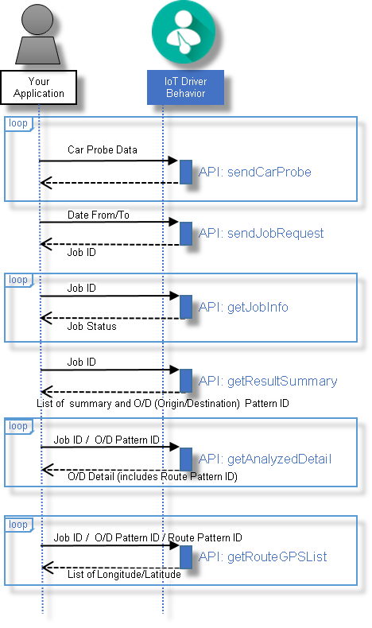

---

copyright:
  years: 2016

---

{:new_window: target="_blank"}
{:shortdesc: .shortdesc}
{:screen: .screen}
{:codeblock: .codeblock}
{:pre: .pre}

# Trajectory Pattern Analysis 시작하기
{: #tp_index}
마지막 업데이트 날짜: 2016년 6월 16일
{: .last-updated}

Trajectory Pattern Analysis API는 자동차 프로브 데이터에서 운전 운행의 기점/종점(O/D) 및 경로 패턴을 분석하는 데 사용할 수 있는 {{site.data.keyword.Bluemix_notm}} {{site.data.keyword.iotdriverinsights_full}} 서비스 내의 서비스입니다.

{:shortdesc}

다음 다이어그램은 Trajectory Pattern Analysis의 일반적인 API 호출 순서를 대략적으로 보여줍니다.

바인딩되지 않은 서비스 인스턴스로 {{site.data.keyword.iotdriverinsights_short}}를 작성하고 배치한 후, 다음 태스크를 완료하여 사용자의 애플리케이션을 Trajectory Pattern Analysis API와 통합하십시오.

## 시작하기 전에
{: #tp_byb}
- [Trajectory Pattern Analysis 정보](tp_iotdriverinsights_overview.html) 주제를 검토하여 분석 가능한 행동 및 컨텍스트를 익히십시오.
- 자동으로 생성된 *테넌트 ID*, *사용자 이름* 및 *비밀번호* 값을 가져오십시오. 이는 {{site.data.keyword.iotdriverinsights_short}} API에 액세스하는 데 필요합니다.

  1. {{site.data.keyword.Bluemix_notm}} 대시보드에서 {{site.data.keyword.iotdriverinsights_short}} 서비스 타일을 클릭하십시오.
  2. 서비스 인스턴스의 **관리** 보기를 선택하십시오.
  3. 테넌트 ID, 사용자 이름 및 비밀번호 값을 기록해 두십시오.

## 태스크 1: 차량 데이터 업로드
{: #tp_task1}
운전 운행 데이터의 여러 세트를 {{site.data.keyword.iotdriverinsights_short}} 테넌트에 업로드하여 Trajectory Pattern Analysis에서 운전자 데이터를 사용할 수 있도록 만드십시오.

1. `sendCarProbeData` API를 사용하여 자동차 프로브 데이터를 분석할 저장소에 전송하십시오.
자동차 프로브 데이터를 {{site.data.keyword.iotdriverinsights_short}}에 업로드하십시오.
   - 요청: 자동차 프로브 데이터

## 태스크 2: 차량 데이터 처리
{: #tp_task2}

차량 데이터를 처리하여 O/D(기점/종점) 패턴 및 경로 패턴 분석

1. Trajectory Pattern Analysis API의 `sendJobRequest`를 통해 작업 요청을 전송하여 특정 기간의 자동차 프로브 데이터를 분석하십시오.
   - 요청: 시작 및 종료 날짜
   - 응답: 작업 ID
2. Trajectory Pattern Analysis API의 `getJobInfo`를 사용하여 작업 상태를 확인하십시오.
데이터 처리는 작업 상태가 'SUCCEEDED' 상태를 리턴했을 때 완료됩니다. 이제 궤적 패턴 분석 결과 데이터를 요청할 수 있습니다.
   - 요청: 작업 ID
   - 응답: 작업 상태

## 태스크 3: 운행 분석
{: #tp_task3}
특정 날짜 범위에서 운행을 분석하여 분석 임계값 매개변수를 준수하는 방식을 파악하십시오.

1. 분석된 (기점/종점) 패턴 요약 목록을 가져오려면 Trajectory Pattern Analysis API의 `getResultSummary`를 사용하십시오.
O/D 패턴 요약 목록에는 입력 매개변수에 따라 분석된 운행 요약 정보가 포함됩니다.
   - 요청: 작업 ID
   - 응답: 요약 및 O/D(기점/종점), 패턴 ID의 목록
2. 자세한 분석된 O/D 패턴 및 경로 패턴 정보를 가져오려면 Trajectory Pattern Analysis API 명령의 `getAnalyzedDetail`을 사용하십시오.
분석된 운행에 대한 자세한 궤적 패턴 정보를 가져오십시오.
   - 요청: 작업 ID / O/D 패턴 ID
   - 응답: O/D의 세부사항(경로 패턴 ID 포함)
3. 각 경로 패턴의 GPS 지점 목록을 검색하려면 Trajectory Pattern Analysis API의 `getRouteGPSList`를 사용하십시오.
최종적으로, 특정 경로 패턴의 GPS 지점 목록을 가져오십시오.
   - 요청: 작업 ID / O/D 패턴 ID / 경로 패턴 ID
   - 응답: 경로 패턴의 경도/위도 목록

## 다음 단계
{: #tp_post}
단계를 완료하면 분석된 궤적 패턴 데이터의 세트가 해당 조직에서 생성됩니다. 사용자의 애플리케이션 또는 선호되는 분석 소프트웨어를 사용하여 정보를 더 의미 있는 비즈니스 데이터로 처리하십시오.

# 관련 링크
{: #rellinks}

## API 참조
{: #api}

* [API 문서](http://ibm.biz/IoTDriverBehavior_APIdoc){:new_window}

## 기타 리소스
{: #general}

* [{{site.data.keyword.iotmapinsights_short}} 시작하기](../IotMapInsights/index.html){:new_window}
* [{{site.data.keyword.iot_full}} 시작하기](https://www.ng.bluemix.net/docs/services/IoT/index.html){:new_window}
* [IBM developerWorks의 dW Answers](https://developer.ibm.com/answers/topics/iot-driver-behavior){:new_window}
* [Stack Overflow](http://stackoverflow.com/questions/tagged/iot-driver-behavior){:new_window}
* [Bluemix 서비스의 새로운 기능](http://www.ng.bluemix.net/docs/whatsnew/index.html#services_category){:new_window}
