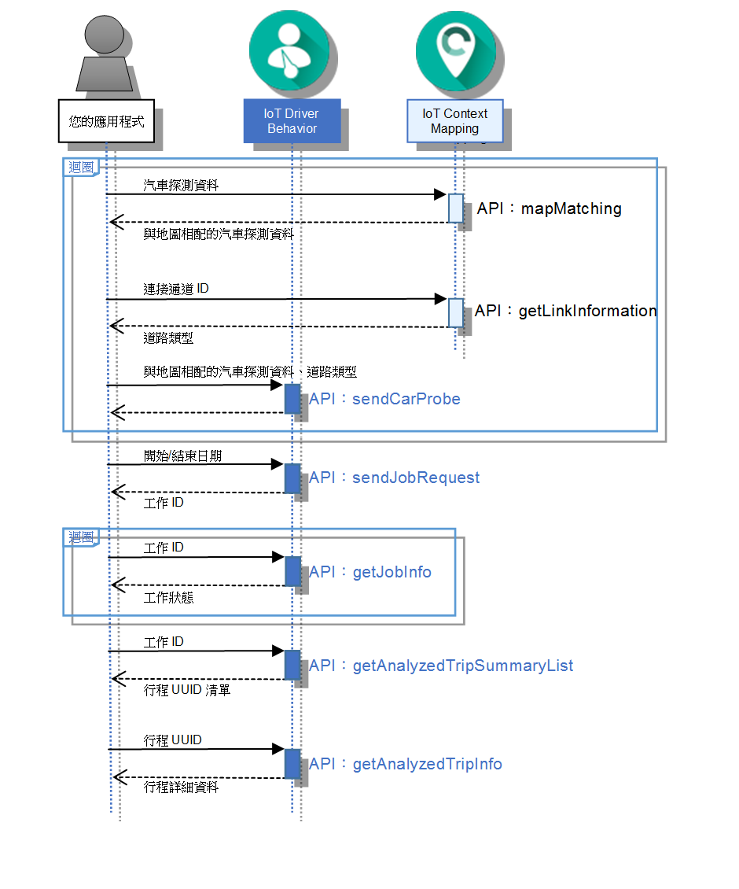

---

copyright:
  years: 2016

---

{:new_window: target="_blank"}
{:shortdesc: .shortdesc}
{:screen: .screen}
{:codeblock: .codeblock}
{:pre: .pre}

# 開始使用 Driving Behavior Analysis
{: #drb_index}
前次更新：2016 年 6 月 16 日
{: .last-updated}

Driving Behavior Analysis 是 {{site.data.keyword.Bluemix_notm}} {{site.data.keyword.iotdriverinsights_full}} 服務內的一種服務，可用來從汽車探測資料和環境定義資料中收集和分析駕駛人行為。再者，您可以使用 {{site.data.keyword.iotdriverinsights_short}} API，將已分析的駕駛人行為資料整合至其他 {{site.data.keyword.Bluemix_notm}} 應用程式。

{:shortdesc}

下圖概述 Driving Behavior Analysis 服務中的一般 API 呼叫順序：

將 {{site.data.keyword.iotdriverinsights_short}} 建立和部署為未連結的服務實例之後，請完成下列作業來整合您的應用程式與 {{site.data.keyword.iotdriverinsights_short}} API。

您也可以使用 [{{site.data.keyword.iotmapinsights_short}} 和 {{site.data.keyword.iotdriverinsights_short}} 指導教學](https://github.com/IBM-Bluemix/car-data-management){:new_window}，協助您使用範例汽車探測資料來建立範例應用程式。

## 開始之前
{: #drb_byb}

- 檢閱[關於 Driving Behavior Analysis](drb_iotdriverinsights_overview.html) 主題，以熟悉可分析的行為和環境定義。
- 取得自動產生的*承租戶 ID*、*使用者名稱*及*密碼*值，這些是存取 {{site.data.keyword.iotdriverinsights_short}} API 的必要項目。

1. 從 {{site.data.keyword.Bluemix_notm}} 儀表板中，按一下 {{site.data.keyword.iotdriverinsights_short}} 服務磚。
2. 選取服務實例的**管理**視圖。
3. 記下所顯示的*承租戶 ID*、*使用者名稱*及*密碼*值。

- 選用項目：如果您想要搭配使用地理空間功能與駕駛人資料，請在組織中部署 {{site.data.keyword.iotmapinsights_short}} {{site.data.keyword.Bluemix_notm}} 服務。

## 作業 1：上傳車輛和環境定義資料
{: #drb_task1}
將一或多組的駕駛人行程資料上傳至 {{site.data.keyword.iotdriverinsights_short}} 承租戶，讓駕駛人資料可用來進行分析。

1. 選用項目：如果您已部署 {{site.data.keyword.iotmapinsights_short}} 服務，請將駕駛人資料對映至地理空間資料。
應用程式將汽車探測資料傳送到 [{{site.data.keyword.iotdriverinsights_short}} API](http://ibm.biz/IoTDriverBehavior_APIdoc){:new_window} 之前，您可以使用 [{{site.data.keyword.iotmapinsights_short}} API](http://ibm.biz/IoTContextMapping_APIdoc){:new_window}，將它對映至地理空間資料。地理空間資料可加強已分析的駕駛人行為結果的品質。

     1. 使用 `mapMatching` API，以取得與地圖相配的汽車探測資料。
     地圖比對會將駕駛資料從汽車探測資料對映至地理空間道路資料。
        - 要求：汽車探測資料
        - 回應：與地圖相配的汽車探測資料
     2. 使用 `getLinkInformation` API 來取得道路類型資料。  
        - 要求：連接通道 ID
        - 回應：道路類型
2. 使用 `sendCarProbeData` API，將要分析的汽車探測資料傳送至儲存庫。
將原始汽車探測資料和選用的相配地理空間資料上傳至 {{site.data.keyword.iotdriverinsights_short}}。
   - 要求：與地圖相配的汽車探測資料和道路類型

## 作業 2：處理車輛和環境定義資料  
{: #drb_task2}
根據可配置的分析參數，處理車輛和環境定義資料。如需如何配置分析參數的相關資訊，請參閱[配置服務的參數](drb_iotdriverinsights_admin.html#configureparameters)主題。

1. 使用 `sendJobRequest` API，傳送用來分析特定時段之汽車探測資料的工作要求。
   - 要求：開始和結束日期
   - 回應：工作 ID
2. 使用 `getJobInfo` API 來檢查工作狀態。
工作狀態傳回 'SUCCEEDED' 狀態時，駕駛人行為資料處理即完成。您現在可以要求駕駛人行為資料。
   - 要求：工作 ID
   - 回應：工作狀態

## 作業 3：分析行程
{: #drb_task3}
分析特定日期範圍的行程，以瞭解它們符合分析臨界值參數的程度。

1. 使用 `getAnalyzedTripSummaryList` API 來取得已分析的行程摘要清單。
根據輸入參數，行程摘要清單會包括已分析的行程摘要資訊。
   - 要求：工作 ID
   - 回應：已分析的行程摘要清單
2. 使用 `getAnalyzedTripInfo` API 來取得詳細的已分析行程資訊。
最後，取得特定已分析行程的詳細駕駛人行為資訊。
   - 要求：行程 UUID
   - 回應：已分析行程的詳細資料

## 後續步驟
{: #drb_post}
當您完成這些步驟後，組織中會產生一組駕駛人行為資料。請使用您的應用程式或您偏好的分析軟體，將資訊進一步處理為更有意義的商業資料。

# 相關鏈結
{: #rellinks}

## 指導教學和範例
{: #samples}

* [{{site.data.keyword.iotmapinsights_short}} / {{site.data.keyword.iotdriverinsights_short}} 指導教學第 1 部分](https://github.com/IBM-Bluemix/car-data-management){:new_window}
* [{{site.data.keyword.iotmapinsights_short}} / {{site.data.keyword.iotdriverinsights_short}} 指導教學第 2 部分](https://github.com/IBM-Bluemix/map-driver-insights){:new_window}
* [IoT for Automotive Starter 應用程式](https://iot-automotive-starter.mybluemix.net){:new_window}

## API 參考資料
{: #api}

* [API 文件](http://ibm.biz/IoTDriverBehavior_APIdoc){:new_window}

## 其他資源
{: #general}

* [開始使用 {{site.data.keyword.iotmapinsights_short}}](../IotMapInsights/index.html){:new_window}
* [開始使用 {{site.data.keyword.iot_full}}](https://www.ng.bluemix.net/docs/services/IoT/index.html){:new_window}
* [IBM developerWorks 上的 dW Answers](https://developer.ibm.com/answers/topics/iot-driver-behavior){:new_window}
* [Stack Overflow](http://stackoverflow.com/questions/tagged/iot-driver-behavior){:new_window}
* [Bluemix 服務的新增功能](http://www.ng.bluemix.net/docs/whatsnew/index.html#services_category){:new_window}
