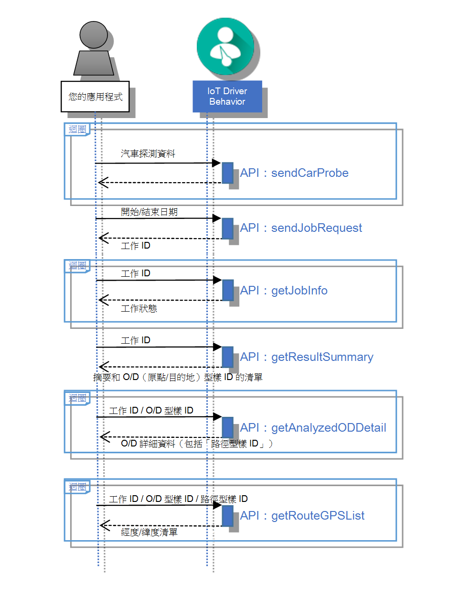

---

copyright:
  years: 2016

---

{:new_window: target="_blank"}
{:shortdesc: .shortdesc}
{:screen: .screen}
{:codeblock: .codeblock}
{:pre: .pre}

# 開始使用 Trajectory Pattern Analysis
{: #tp_index}
前次更新：2016 年 6 月 16 日
{: .last-updated}

Trajectory Pattern Analysis API 是 {{site.data.keyword.Bluemix_notm}} {{site.data.keyword.iotdriverinsights_full}} 服務內的一種服務，可用來從汽車探測資料中分析駕駛行程的「原點/目的地 (O/D)」型樣和路徑型樣。

{:shortdesc}

下圖概述 Trajectory Pattern Analysis 中的一般 API 呼叫順序：

將 {{site.data.keyword.iotdriverinsights_short}} 建立和部署為未連結的服務實例之後，請完成下列作業來整合您的應用程式與 Trajectory Pattern Analysis API。

## 開始之前
{: #tp_byb}
- 檢閱[關於 Trajectory Pattern Analysis](tp_iotdriverinsights_overview.html) 主題，以熟悉可分析的行為和環境定義。
- 取得自動產生的*承租戶 ID*、*使用者名稱*及*密碼*值，這些是存取 {{site.data.keyword.iotdriverinsights_short}} API 的必要項目：

  1. 從 {{site.data.keyword.Bluemix_notm}} 儀表板中，按一下 {{site.data.keyword.iotdriverinsights_short}} 服務磚。
  2. 選取服務實例的**管理**視圖。
  3. 記下承租戶 ID、使用者名稱及密碼值。

## 作業 1：上傳車輛資料
{: #tp_task1}
將多組的駕駛行程資料上傳至 {{site.data.keyword.iotdriverinsights_short}} 承租戶，讓駕駛人資料可供 Trajectory Pattern Analysis 使用。

1. 使用 `sendCarProbeData` API，將要分析的汽車探測資料傳送至儲存庫。將汽車探測資料上傳至 {{site.data.keyword.iotdriverinsights_short}}。
   - 要求：汽車探測資料

## 作業 2：處理車輛資料
{: #tp_task2}

處理用來分析 O/D（原點/目的地）型樣和路徑型樣的車輛資料

1. 使用 Trajectory Pattern Analysis API 的 `sendJobRequest`，傳送用來分析特定時段之汽車探測資料的工作要求。
   - 要求：開始和結束日期
   - 回應：工作 ID
2. 使用 Trajectory Pattern Analysis API 的 `getJobInfo` 來檢查工作狀態。工作狀態傳回 'SUCCEEDED' 狀態時，資料處理即完成。您現在可以要求行程型樣分析結果資料。
   - 要求：工作 ID
   - 回應：工作狀態

## 作業 3：分析行程
{: #tp_task3}
分析特定日期範圍的行程，以瞭解它們符合分析臨界值參數的程度。

1. 若要取得已分析（原點/目的地）型樣摘要清單，請使用 Trajectory Pattern Analysis API 的 `getResultSummary`。根據輸入參數，O/D 型樣摘要清單會包括已分析的行程摘要資訊。
   - 要求：工作 ID
   - 回應：摘要和 O/D（原點/目的地）、型樣 ID 的清單
2. 若要取得詳細已分析 O/D 型樣和路徑型樣資訊，請使用 Trajectory Pattern Analysis API 指令的 `getAnalyzedDetail`。取得已分析行程的詳細行程型樣資訊。
   - 要求：工作 ID / O/D 型樣 ID
   - 回應：O/D 詳細資料（包括「路徑型樣 ID」）
3. 若要擷取每個路徑型樣的 GPS 點清單，請使用 Trajectory Pattern Analysis API 的 `getRouteGPSList`。最後，取得特定路徑型樣的 GPS 點清單。
   - 要求：工作 ID / O/D 型樣 ID / 路徑型樣 ID
   - 回應：路徑型樣的經度/緯度清單

## 後續步驟
{: #tp_post}
當您完成這些步驟後，組織中會產生一組已分析行程型樣資料。請使用您的應用程式或您偏好的分析軟體，將資訊進一步處理為更有意義的商業資料。

# 相關鏈結
{: #rellinks}

## API 參考資料
{: #api}

* [API 文件](http://ibm.biz/IoTDriverBehavior_APIdoc){:new_window}

## 其他資源
{: #general}

* [開始使用 {{site.data.keyword.iotmapinsights_short}}](../IotMapInsights/index.html){:new_window}
* [開始使用 {{site.data.keyword.iot_full}}](https://www.ng.bluemix.net/docs/services/IoT/index.html){:new_window}
* [IBM developerWorks 上的 dW Answers](https://developer.ibm.com/answers/topics/iot-driver-behavior){:new_window}
* [Stack Overflow](http://stackoverflow.com/questions/tagged/iot-driver-behavior){:new_window}
* [Bluemix 服務的新增功能](http://www.ng.bluemix.net/docs/whatsnew/index.html#services_category){:new_window}
