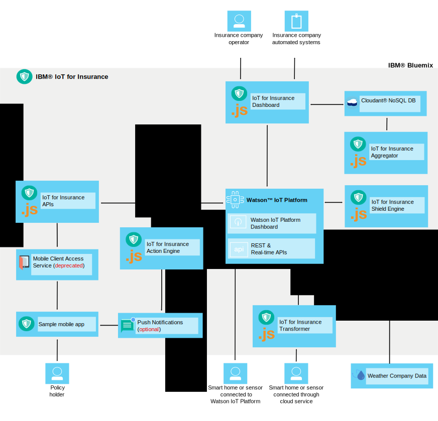

---

copyright:
  years: 2016
lastupdated: "2016-11-07"
---

<!-- Common attributes used in the template are defined as follows: -->
{:new_window: target="\_blank"}
{:shortdesc: .shortdesc}

# About {{site.data.keyword.iotinsurance_short}}
{: #about}

{{site.data.keyword.iotinsurance_full}} is an integrated IoT production instance that collects and analyzes full-context data from policy holders to provide personalized risk assessments, real-time protection, and policy cost reductions.
{: shortdesc}

{{site.data.keyword.iotinsurance_short}} provides a full context view of the policy holder's assets and situation, including information such as location, weather, traffic, and overall wellness. In-depth analysis of this information enables the insurer to provide personalized risk assessment and real-time protection for the policy holder. Benefits for the policy holder include risk avoidance in the form of early alerts, personalized advice, and streamlined claims processing and settlement. Benefits for the insurer include customer satisfaction, customer loyalty, and expense reduction by using claims avoidance and processing automation.

## Architecture
{: #architecture}

The {{site.data.keyword.iotinsurance_short}} components work together as described in this section. This organization is also shown in the architecture diagram. The {{site.data.keyword.iotinsurance_short}} dashboard displays data stored in the {{site.data.keyword.iot_short_notm}} and in the {{site.data.keyword.cloudantfull}} database. The user's smart devices, connected through the Wink cloud, send data to the Transformer, which processes the data and sends it onto the {{site.data.keyword.iot_short_notm}}. The data is processed by the shield engine, which generates a shield event and sends it through APIs to the Action Engine. The Action Engine uses {{site.data.keyword.mobilepushfull}} to send notifications to the user's mobile application. The user can also use the mobile application to respond to alerts or offers. The response is processed by the {{site.data.keyword.amafull}} service and returned through the APIs to {{site.data.keyword.iot_short_notm}} and then to the {{site.data.keyword.iotinsurance_short}} dashboard.

## Insurance dashboard
{: #insurance_dashboard}
The Insurance Dashboard gives insurance company users, such as agents, a complete view of what is happening with their customers' insured assets. They can see the shields and events at a country, state, or account levels.

The sample insurance dashboard is loaded with simulated data to show you an example of the kind of information that you can collect and analyze.

## Sample mobile app
{: #mobileapp}
The sample mobile app is where insurance policy holders such, as homeowners, view and respond to the information that {{site.data.keyword.iotinsurance_short}} sends from the sensors in their homes.

Using a mobile device, homeowners authorize the service to connect to the sensor provider's cloud to send and receive data. For example, a homeowner might receive a notification in the mobile starter app when the sensor detects a water leak. For more information, see [Installing and connecting the sample mobile app](iotinsurance_mobile_app.html).

## REST and real-time APIs
{: #rest_api}
The REST APIs are used by the mobile starter app, the insurance dashboard, the shield engine, and the hazard controller. They  enable users to know the associations that exist between devices and shields and actions. By using the APIs, programmers can create new users, generate event data, create and register new shields, and fetch event data.

The API that you access from the service console is customized for your instance of  {{site.data.keyword.iotinsurance_short}}.

On the API page, you can  
  - View all available API calls and associated documentation.
  - Try individual API calls.  Select an API call to display all information, then click **Try it out!**.

API examples are available to help you get started with common scenarios. For more information, see [{{site.data.keyword.iotinsurance_short}} API examples](https://github.com/IBM-Bluemix/iot4i-api-examples-nodejs).

## Transformer
{: #transformer}
The Transformer requests new information from the cloud server API and transforms it to match the data in {{site.data.keyword.iotinsurance_short}}. The data is then published for the rest of the {{site.data.keyword.iotinsurance_short}} implementation to use. Users must authorize the Transformer component to access sensor cloud data and process the recorded data. Authorization is granted by using the mobile starter app. Wink is the only cloud vendor that is supported at this time.

## Shield engine
{: #shield_engine}
Based on the information that is stored in an event, the Shield engine determines if a hazard such as a water leak occurred. If a hazard is identified, it is passed to the Action Engine.

## Action engine
{: #action_engine}
The Action engine determines the actions to take based on the information that is specified in the shield.

You can create new shields in JavaScript by using the {{site.data.keyword.iotinsurance_short}} API.

## Shields
{: #shields}
A shield is a specific protection that a customer acquires from the insurance provider. For example, a homeowner purchases insurance on their home to shield it against fire, water damage, burglaries, and other hazards. The {{site.data.keyword.iotinsurance_short}} solution provides a built-in shield against water. Customers are alerted and can respond when an event that involves water threatens their home. Using the REST API, developers can add more shields.
Shields run in the {{site.data.keyword.iotinsurance_short}} analytics engine. The analytics engine identifies the type of hazard (for example, *Water is detected*), the user account of the sensor that sent the hazard, and the shields that are associated with the account. Action can be taken based on that information.

# Related Links
{: #rellinks}

## Tutorials and Samples
{: #samples}
* [Sample mobile app code on GitHub](https://github.com/ibm-watson-iot/ioti-mobile){:new_window}

## API Reference
{: #api}
* [{{site.data.keyword.iotinsurance_short}} API](https://iot4i-api-docs.mybluemix.net/){:new_window}
* [{{site.data.keyword.iotinsurance_short}} API Examples](https://github.com/IBM-Bluemix/iot4i-api-examples-nodejs/#iot-for-insurance-api-examples){:new_window}

## Related Links
{: #general}
* [{{site.data.keyword.iot_full}} documentation](https://console.ng.bluemix.net/docs/services/IoT/index.html)
* [Developer support forum](https://developer.ibm.com/answers/search.html?f=&type=question&redirect=search%2Fsearch&sort=relevance&q=%2B[iot]%20%2B[bluemix])
* [Stack overflow support forum](http://stackoverflow.com/questions/tagged/ibm-bluemix)
