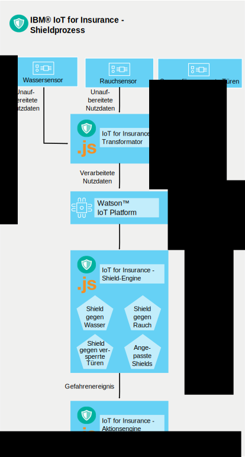

---

copyright:
  years: 2016, 2017
lastupdated: "2017-03-07"
---

<!-- Common attributes used in the template are defined as follows: -->
{:new_window: target="blank"}
{:shortdesc: .shortdesc}
{:screen: .screen}
{:codeblock: .codeblock}
{:pre: .pre}

# Funktionsweise des Service
{{site.data.keyword.iotinsurance_full}} erstellt einen Ablauf zum Erfassen, Verwalten und Analysieren von Daten von verbundenen Versicherungsnehmern.
{:shortdesc}

Der Versicherer erstellt eine Instanz von {{site.data.keyword.iotinsurance_short}} innerhalb der {{site.data.keyword.Bluemix_notm}}-Organisation. In den Häusern der Kunden des Versicherungsunternehmens sind Sensoren installiert, die mit der Cloud des Sensoranbieters verbunden sind. Über ihre mobilen Geräte berechtigen Kunden den Service {{site.data.keyword.iotinsurance_short}} für den Empfang der Sensordaten. Der Transformator {{site.data.keyword.iotinsurance_short}} stellt eine Verbindung zur Cloud des Sensoranbieters her, entnimmt die Daten der einzelnen Benutzer und sendet diese an den {{site.data.keyword.iot_short_notm}}-Server. Wenn der Sensor anzeigt, dass die Parameter, die in den Shields des Versicherungsunternehmens angegeben sind, im Haushalt des Kunden gegeben sind, werden sowohl an das Dashboard des Versicherungsunternehmens als auch an das Gerät des Kunden entsprechende Benachrichtigungen gesendet.

Ein verbundener Sensor ermittelt ein Ereignis, z. B. einen Wasserleitungsschaden, und sendet diese Informationen an einen Smart Home-Anbieter wie Wink.  {{site.data.keyword.iotinsurance_short}} erkennt das Signal über seine Verbindung mit der Cloud des Smart Home-Anbieters und erstellt Alertnutzdaten. Die Nutzdaten werden mittels MQTT zur Verarbeitung an die {{site.data.keyword.iotinsurance_short}}-Shield-Engine gesendet. Die Shield-Engine analysiert, ob die Nutzdaten mit den durch die Shield-Regeln definierten Kriterien übereinstimmen. Ist dies der Fall, gibt die Shield-Engine mittels MQTT Nutzdaten für eine Gefahr an die {{site.data.keyword.iotinsurance_short}}-Aktionsengine aus. Die Aktionsengine führt Aktionen aus, die das Shield für den jeweiligen Gefahrentyp definiert, z. B. Senden einer Textnachricht an den Hausbesitzer.

{{site.data.keyword.iotinsurance_short}} ist für die Übergabe von Nutzdaten zu Alerts und Gefahren zwischen den Komponenten auf {{site.data.keyword.iot_full}} angewiesen. Für ein vollständiges, funktionierendes System sind Benutzer, Shields und Zuordnungen zwischen Benutzern und Shields erforderlich.

