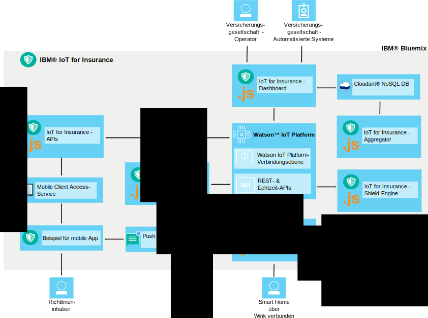

---

copyright:
  years: 2016, 2017
lastupdated: "2017-03-08"
---

<!-- Common attributes used in the template are defined as follows: -->
{:new_window: target="blank"}
{:shortdesc: .shortdesc}
{:screen: .screen}
{:codeblock: .codeblock}
{:pre: .pre}

# Informationen zu {{site.data.keyword.iotinsurance_short}}
{: #about}

{{site.data.keyword.iotinsurance_full}} ist eine integrierte IoT-Produktionsinstanz zur Erfassung und Analyse von Gesamtkontextdaten für Versicherungsnehmer, die eine personalisierte Risikobewertung, Echtzeitschutz und eine Reduzierung der Versicherungskosten ermöglicht.
{: shortdesc}

{{site.data.keyword.iotinsurance_short}} bietet eine Gesamtkontextansicht der Vermögenswerte und der Situation des Versicherungsnehmers, einschließlich Informationen wie Standortdaten, Wetterdaten, Verkehrsdaten und Gesundheitszustand. Durch die detaillierte Analyse dieser Informationen kann das Versicherungsunternehmen dem Versicherungsnehmer eine personalisierte Risikobewertung und Echtzeitschutz bereitstellen. Die Vorteile für den Versicherungsnehmer bestehen unter anderem in der Risikovermeidung in Form von frühzeitigen Warnungen, personalisierter Beratung und einer effizienten Bearbeitung und Begleichung von Leistungsansprüchen. Die Vorteile für das Versicherungsunternehmen beinhalten Kundenzufriedenheit, Kundenbindung und Ausgabensenkung durch Vermeidung von Schadensfällen sowie durch Prozessautomation.

## Architektur
{: #architecture}

Die {{site.data.keyword.iotinsurance_short}}-Komponenten arbeiten wie in diesem Abschnitt beschrieben zusammen. Diese Organisation wird auch im Architekturdiagramm angezeigt. Im {{site.data.keyword.iotinsurance_short}}-Dashboard werden Daten angezeigt, die in {{site.data.keyword.iot_short_notm}} und in der {{site.data.keyword.cloudantfull}}-Datenbank gespeichert werden. Eine Verbindung zu den intelligenten mobilen Geräten des Benutzers kann entweder über die Cloud oder direkt über die {{site.data.keyword.iot_short_notm}} hergestellt werden. Sind sie über die Cloud verbunden, senden sie Daten an den Transformator, der die Daten verarbeitet und an die {{site.data.keyword.iot_short_notm}} sendet. Daten aus {{site.data.keyword.weatherfull}} können auch per Pull-Operation an den {{site.data.keyword.iotinsurance_short}} Weather Company Data Transformer und von dort an die {{site.data.keyword.iot_short_notm}} übertragen werden. Die Daten werden von der Shield-Engine verarbeitet, die ein Shield-Ereignis generiert und es über APIs an die Aktionsengine sendet. Die Aktionsengine kann optional {{site.data.keyword.mobilepushfull}} nutzen, um Benachrichtigungen an die mobile Anwendung des Benutzers zu senden. Der Benutzer kann die mobile Anwendung auch zum Antworten auf Alerts oder Angebote verwenden.

**Hinweis**: Frühere Versionen von {{site.data.keyword.iotinsurance_short}} nutzten den Service {{site.data.keyword.amafull}}, um die Antworten zu verarbeiten und sie über die APIs an die {{site.data.keyword.iot_short_notm}} und anschließend an das {{site.data.keyword.iotinsurance_short}}-Dashboard zurückzugeben. Dieser Prozess funktioniert weiterhin für Instanzen der frühen Versionen von {{site.data.keyword.iotinsurance_short}}. Allerdings umfassen neue Instanzen von {{site.data.keyword.iotinsurance_short}} {{site.data.keyword.amashort}} bzw. {{site.data.keyword.mobilepushshort}} nicht. Für die Verwendung der mobilen App müssen Sie einen angepassten Authentifizierungsprozess einrichten. Optional können Sie auch eine [Instanz von {{site.data.keyword.mobilepushshort}}](../mobilepush/index.html) erstellen und an die API binden, um Push-Benachrichtigungen zu aktivieren.

## Insurance-Dashboard
{: #insurance_dashboard}
Das Insurance-Dashboard gibt den Benutzern im Versicherungsunternehmen (wie z. B. Sachbearbeitern) eine Gesamtübersicht mit den relevanten Informationen zu ihren Kunden. Sie können die Shields und Ereignisse auf Landes-, Bezirks- oder Kundenebene anzeigen.

Das Beispiel-Insurance-Dashboard wird mit simulierten Daten geladen, um Ihnen zu zeigen, welche Informationen Sie sammeln und analysieren können.

## Beispiel für mobile App
{: #mobileapp}
Über das Beispiel für eine mobile App können Versicherungsnehmer (z. B. Hauseigentümer) die Informationen anzeigen und darauf reagieren, die {{site.data.keyword.iotinsurance_short}} von den Sensoren in ihren Häusern sendet.

Unter Verwendung eines Mobilgeräts berechtigen die Hauseigentümer den Service, eine Verbindung zur Cloud des Sensoranbieters herzustellen, um Daten zu senden und zu empfangen. Beispiel: Ein Hauseigentümer erhält eine Benachrichtigung in der mobilen Starter-App, wenn der Sensor einen Wasserleitungsschaden erkennt. Weitere Informationen finden Sie unter [Beispiel für mobile App installieren und verbinden](iotinsurance_mobile_app.html).

## REST- und Echtzeit-APIs
{: #rest_api}
Die REST-APIs werden von der mobilen Starter-App, dem Insurance-Dashboard, der Shield-Engine sowie dem Risikocontroller verwendet. Sie geben Benutzern Informationen zu den Zuordnungen zwischen Geräten, Shields und Aktionen. Durch die Verwendung der APIs können Programmierer neue Benutzer erstellen, Ereignisdaten generieren, neue Shields erstellen und registrieren sowie Ereignisdaten abrufen.

Die API, auf die Sie über die Servicekonsole zugreifen, wird für Ihre Instanz von {{site.data.keyword.iotinsurance_short}} angepasst.

Auf der Seite 'API' haben Sie die folgenden Möglichkeiten:  
  - Sie können alle verfügbaren API-Aufrufe sowie die zugehörige Dokumentation anzeigen.
  - Sie können einzelne API-Aufrufe testen.  Sie können einen API-Aufruf auswählen, um alle Informationen anzuzeigen; klicken Sie anschließend auf die Option zum Testen.

Sie können die API-Beispiele als Unterstützung bei der Einführung in allgemeine Szenarios verwenden. Weitere Informationen finden Sie bei den [{{site.data.keyword.iotinsurance_short}}-API-Beispielen](https://github.com/IBM-Bluemix/iot4i-api-examples-nodejs).

## Transformator
{: #transformer}
Der Transformator fordert neue Informationen von der Cloud-Server-API an und setzt diese so um, dass sie den Daten in {{site.data.keyword.iotinsurance_short}} entsprechen. Die Daten werden anschließend veröffentlicht, damit sie von der übrigen {{site.data.keyword.iotinsurance_short}}-Implementierung verwendet werden können. Benutzer müssen die Transformatorkomponente für den Zugriff auf die Sensordaten in der Cloud und die Verarbeitung der aufgezeichneten Daten autorisieren. {{site.data.keyword.iotinsurance_short}} unterstützt mehrere Cloudanbieter und Geräte. Eine vollständige Liste der unterstützten Cloudanbieter sowie Anweisungen zur Herstellung einer Verbindung zwischen Geräten und {{site.data.keyword.iotinsurance_short}} finden Sie im Abschnitt zu den [unterstützten Geräten und Anbietern](iotinsurance_supporteddevices.html).

## Weather Company Data Transformer
{: #wcdtransformer}
Durch die Anwendung Weather Company werden relevante Wetterdaten aus dem Service 'Weather Company Data' in den IoT4I-Datenstrom eingefügt. Diese Daten können dann für die Erstellung von wetterfähigen Shields verwendet werden.

**Hinweis**: Der Weather Company Data Transformer wird nur als Konzeptnachweis bzw. technische Neuentwicklung unterstützt und ist nicht für den Einsatz in der Produktion gedacht.

## Shield-Engine
{: #shield_engine}
Auf der Grundlage der Informationen, die in einem Ereignis gespeichert werden, stellt die Shiled-Engine fest, ob es zu einer Gefahrensituation gekommen ist (z. B. ein Wasserleitungsschaden). Wurde eine Gefahrensituation ermittelt, werden die Daten an die Aktionsengine übergeben.

Bei einem 'Shield' handelt es sich um einen bestimmten Schutz, den ein Kunde beim Versicherer anfordert. Beispiel: Ein Hauseigentümer erwirbt für sein Haus Versicherungsschutz gegen Feuer, Wasserschäden, Einbruch und andere Gefahren. Die {{site.data.keyword.iotinsurance_short}}-Lösung bietet einen integrierten Schutz gegen Wasserschäden. Kunden werden benachrichtigt und können reagieren, sobald ein Ereignis des Typs 'Wasser' ihr Haus gefährdet. Unter Verwendung der REST-API können Entwickler zusätzliche Shields hinzufügen.  

Shields werden in der {{site.data.keyword.iotinsurance_short}}-Analyseengine ausgeführt. Die Analyseengine erkennt den Gefahrentyp (z. B. *Wasserleitungsschaden*), das Benutzerkonto des Sensors, der die Gefahrenmeldung gesendet hat, sowie die Shields, die dem Konto zugeordnet sind. Auf der Basis dieser Informationen können Maßnahmen ergriffen werden. Sie können die Shields aus der {{site.data.keyword.iotinsurance_short}}-Shields-Bibliothek verwenden oder ändern bzw. eigene Shields erstellen und implementieren. Weitere Informationen zu Shields sowie zur [{{site.data.keyword.iotinsurance_short}}-Shields-Bibliothek ](https://github.com/ibm-watson-iot/ioti-shields){: new_window} finden Sie beim [Shield-Toolkit](iotinsurance_shield_toolkit.html).

## Aktionsengine
{: #action_engine}
Mit der Aktionsengine werden die Aktionen bestimmt, die auf Basis der in dem Shield angegebenen Informationen auszuführen sind.

Mithilfe der {{site.data.keyword.iotinsurance_short}}-API können Sie neue Shields in JavaScript erstellen.

# Zugehörige Links
{: #rellinks}

## Lernprogramme und Beispiele
{: #samples}
* [Code einer mobilen Beispiel-App unter GitHub ](https://github.com/ibm-watson-iot/ioti-mobile){:new_window}

## API-Referenz
{: #api}
* [{{site.data.keyword.iotinsurance_short}}-API ](https://iot4i-api-docs.mybluemix.net/){:new_window}
* [{{site.data.keyword.iotinsurance_short}}-API-Beispiele ](https://github.com/IBM-Bluemix/iot4i-api-examples-nodejs/#iot-for-insurance-api-examples){:new_window}

## Zugehörige Links
{: #general}
* [{{site.data.keyword.iot_full}}-Dokumentation](https://console.ng.bluemix.net/docs/services/IoT/index.html){:new_window}
* [Unterstützungsforum für Entwickler ](https://developer.ibm.com/answers/search.html?f=&type=question&redirect=search%2Fsearch&sort=relevance&q=%2B[iot]%20%2B[bluemix]){:new_window}
* [Stack Overflow-Unterstützungsforum ](http://stackoverflow.com/questions/tagged/ibm-bluemix){:new_window}
