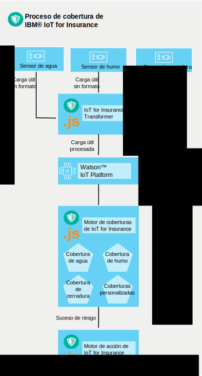

---

copyright:
  years: 2016, 2017
lastupdated: "2017-03-07"
---

<!-- Common attributes used in the template are defined as follows: -->
{:new_window: target="blank"}
{:shortdesc: .shortdesc}
{:screen: .screen}
{:codeblock: .codeblock}
{:pre: .pre}

# Cómo funciona el servicio
{{site.data.keyword.iotinsurance_full}} crea un flujo para recopilar, gestionar y analizar datos de los asegurados conectados.
{:shortdesc}

El proveedor del seguro crea una instancia de {{site.data.keyword.iotinsurance_short}} en la organización de {{site.data.keyword.Bluemix_notm}}. Los clientes del asegurador tienen sensores en sus casas, conectados a la nube del proveedor del sensor. Desde sus dispositivos móviles, los clientes autorizan al servicio {{site.data.keyword.iotinsurance_short}} para recibir datos de sensor. El transformador {{site.data.keyword.iotinsurance_short}} se conecta a la nube del proveedor del sensor y extrae datos para cada usuario y los envía al servidor de {{site.data.keyword.iot_short_notm}}. Si el sensor muestra que se cumplen los parámetros especificados en las coberturas del asegurador en el hogar del cliente, las notificaciones se enviarán al panel de control del asegurador y al dispositivo del cliente.

Un sensor conectado detecta un suceso, como una fuga de agua, y envía la información a un proveedor de hogares inteligentes, como Wink.  {{site.data.keyword.iotinsurance_short}} detecta la señal utilizando su conexión con la nube del proveedor de hogares inteligentes y crea una carga útil de la alerta. La carga útil se envía a través de MQTT al motor de coberturas {{site.data.keyword.iotinsurance_short}} para su procesamiento. El motor de coberturas analiza si la carga útil coincide con los criterios que se definen en las reglas de cobertura. Si coincide, el motor de coberturas emite una carga útil de riesgo a través de MQTT al motor de acción {{site.data.keyword.iotinsurance_short}}. El motor de acción realiza acciones que define la cobertura para ese tipo de riesgo, por ejemplo, enviar un mensaje de texto al propietario del hogar.

{{site.data.keyword.iotinsurance_short}} confía en {{site.data.keyword.iot_full}} para pasar cargas útiles de alerta y riesgo entre sus componentes. Un sistema de trabajo completo requiere usuarios, coberturas y asociaciones entre usuarios y coberturas.

