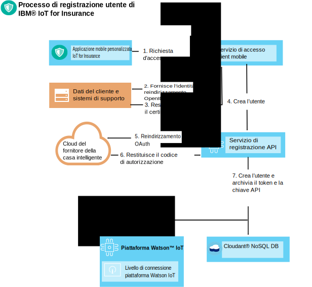
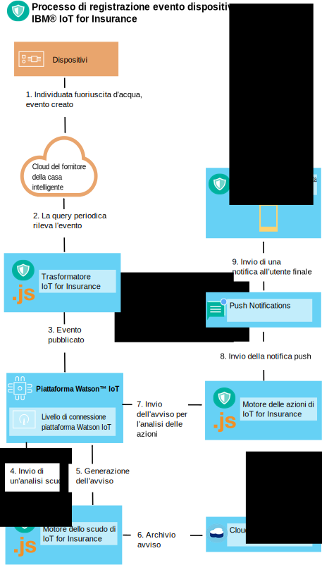

---

copyright:
  years: 2016, 2017
lastupdated: "2017-03-08"
---

<!-- Common attributes used in the template are defined as follows: -->
{:new_window: target="blank"}
{:shortdesc: .shortdesc}
{:screen: .screen}
{:codeblock: .codeblock}
{:pre: .pre}


# Utilizzo del toolkit del dispositivo
{: #iot4i_connecting_devices}
Utilizzando il toolkit del dispositivo {{site.data.keyword.iotinsurance_full}}, puoi collegare i dispositivi creati da un fornitore del dispositivo al tuo servizio {{site.data.keyword.iotinsurance_short}}.
{:shortdesc}

I dispositivi possono inviare i dati direttamente a {{site.data.keyword.iot_full}} o tramite il cloud del fornitore del dispositivo. Puoi collegare i dispositivi registrando gli utenti autorizzati e quindi configurando la ricezione e la generazione dell'evento del dispositivo. Per un elenco di fornitori e dispositivi supportati e di procedure di integrazione di esempio, consulta [Fornitori e dispositivi supportati](iotinsurance_supporteddevices.html).

Utilizza le istruzioni nelle seguenti sezioni per collegare i tuoi dispositivi.

## Registrazione degli utenti autorizzati
{: #reg_users}
Quando il cloud del fornitore del dispositivo supporta OAuth come un protocollo di autorizzazione {{site.data.keyword.iotinsurance_short}} può agire come un client OAuth e collegarsi al cloud del fornitore. Un ID client e un'autorizzazione ottenuti dal fornitore del servizio sono obbligatori per ricevere e aggiornare i dati al posto dell'utente.  

### Flusso OAuth
{: #oauth_flow}
Il seguente diagramma mostra un flusso OAuth semplificato in cui {{site.data.keyword.iotinsurance_short}} viene autorizzato tramite un provider OAuth come Facebook. Nel diagramma, le richieste {{site.data.keyword.iotinsurance_short}} accedono a un client OAuth, che reindirizza la richiesta di accesso al provider OAuth. Il provider crea una modulo HTML in cui l'utente {{site.data.keyword.iotinsurance_short}} immette un ID utente e una password. Il provider concede quindi l'autorizzazione e restituisce facoltativamente un codice OAuth per abilitare gli aggiornamenti. Il diagramma mostra un flusso molto di base; i provider OAuth normalmente offrono più endpoint REST per i passi rappresentati nel diagramma.  


### Flusso di registrazione utente
{: #user_reg_flow}

La registrazione utente è diversa a seconda del fornitore. Per comprendere come ottenere i token di accesso cloud necessari e su come registrarli per {{site.data.keyword.iotinsurance_short}} utilizzando l'API, consulta [Fornitori e dispositivi supportati](iotinsurance_supporteddevices.html).

#### Flusso di registrazione mobile (*obsoleto*)

**Nota**: l'applicazione mobile supporta solo Wink e le modifiche a {{site.data.keyword.amashort}}
hanno disabilitato il flusso di registrazione utente descritto in questa sezione. Questo flusso è disponibile solo per le istanze esistenti della versione 1.0 di {{site.data.keyword.iotinsurance_short}}.

Il seguente diagramma mostra un flusso di registrazione utente semplificato. In questo esempio, viene effettuata una nuova richiesta di registrazione utente da un dispositivo mobile. La richiesta viene elaborata da {{site.data.keyword.amafull}}, che fornisce un identificativo al sistema di supporto del cliente e invia la richiesta al servizio di registrazione dell'API. Il servizio di registrazione dell'API restituisce la richiesta OAuth al cloud del fornitore del dispositivo, che ne verifica l'autenticazione con il sistema di supporto del cliente. Il cloud del fornitore del dispositivo restituisce il codice o il token di autorizzazione al servizio di registrazione dell'API. Il servizio di registrazione crea quindi l'utente e un token API univoco in {{site.data.keyword.iot_short_notm}} e in {{site.data.keyword.cloudant}}.



## Generazione degli eventi del dispositivo
{: #generating_device_events}
I dispositivi possono collegarsi a {{site.data.keyword.iot_short_notm}} quando il produttore fornisce un codice di autorizzazione diretto che può essere utilizzato con la chiave API generata durante la registrazione dell'utente. Questo tipo di collegamento viene descritto in [Sviluppo dei dispositivi in {{site.data.keyword.iot_short_notm}}](https://console.{DomainName}/docs/services/IoT/devices/device_dev_index.html).

Quando il dispositivo viene collegato tramite il cloud del fornitore, gli eventi del dispositivo vengono inviati tramite una connessione che utilizza l'endpoint REST fornito dal fornitore del dispositivo. Il token di connessione OAuth ottenuto durante la registrazione dell'utente concede l'autorizzazione per queste chiamate. Il trasformatore {{site.data.keyword.iotinsurance_short}} trasmette le informazioni utente associate per ogni dispositivo dal cloud del fornitore. Include quindi l'associazione utente con i dati evento del dispositivo che trasmette a {{site.data.keyword.iot_short_notm}}.

Quando il dispositivo viene collegato direttamente a {{site.data.keyword.iot_short_notm}}, il collegamento tra il dispositivo e l'utente viene archiviato in {{site.data.keyword.iot_short_notm}}. Il trasformatore {{site.data.keyword.iotinsurance_short}} memorizza nella cache queste informazioni e quindi arricchisce gli eventi del dispositivo con il link all'utente.

### Cloud a Cloud - flusso evento dispositivo
{: #device_event_flow}
Il seguente diagramma mostra un flusso dell'evento del dispositivo semplificato. In questo esempio, un dispositivo rileva una fuoriuscita d'acqua. Il trasformatore {{site.data.keyword.iotinsurance_short}} esegue periodicamente il polling delle modifiche nello stato del dispositivo al cloud del fornitore. Quando viene rilevato l'evento, il trasformatore lo invia a {{site.data.keyword.iot_short_notm}}. Il motore dello scudo {{site.data.keyword.iotinsurance_short}} analizza l'evento e genera un avviso e lo archivia in {{site.data.keyword.cloudant}}. {{site.data.keyword.iot_short_notm}} trasferisce l'archivio al motore delle azioni {{site.data.keyword.iotinsurance_short}} per le analisi. Il motore delle azioni trasmette l'avviso all'applicazione mobile del cliente tramite {{site.data.keyword.mobilepushshort}}.  



### Come configurare il polling per lo stato del dispositivo
{: #device_polling}
Il microservizio del trasformatore è responsabile del polling e della ricezione degli aggiornamenti dello stato. Se l'API REST del fornitore del servizio supporta gli aggiornamenti del dispositivo asincroni, puoi stabilire una sottoscrizione che abiliti il trasformatore a ricevere gli aggiornamenti dello stato del servizio come si verificano. Altrimenti, puoi configurare il trasformatore ad eseguire il polling degli aggiornamenti dello stato del dispositivo.

Le seguenti chiamate della pseudo-funzione vengono utilizzate per definire il processo di polling:

*Tabelle 1: Chiamate della pseudo-funzione*

Pseudo-funzione | Descrizione
------------- | -------------
`getRegisteredUserDevices(userName)` | Richiama i dispositivi utente registrati disponibili che stanno utilizzando il nome utente.
`getProviderDevices(providerUserToken)` | Richiama l'API REST del provider del dispositivo per ottenere lo stato dei dispositivi dell'utente che stanno utilizzando il token di connessione utente.
`findDevicesToAdd(), findDevicesToDel(), findDevicesToUpdate()` | Trova i dispositivi nuovi, eliminati e modificati confrontando i dispositivi registrati con i dispositivi che al momento esistono nel provider del dispositivo.
` syncData()` | Sincronizza i dispositivi dell'utente eliminando i dispositivi vecchi, aggiungendone di nuovi e aggiornando i dispositivi modificati.  
 `notifyIoTP()` | Invia una notifica a {{site.data.keyword.iot_short_notm}} con le modifiche come gli eventi MQTT.

Il trasformatore pubblica gli aggiornamenti dello stato a {{site.data.keyword.iot_short_notm}}, come illustrato nel seguente esempio di codice.
```
// come specificato in VCAP.services
var appClientConfig = {
  "org":iot_org,
  "id":iot_appid,
  "auth-key":iot_authkey,
  "auth-token":iot_authtoken
};

var appClient = new iotclient.IotfApplication(appClientConfig);
try {
  appClient.connect();
} catch (err) {
  console.log('IoT connect failed with error' +err);
}

...

// genera l'evento IoT, tieni presente che il contenuto è un oggetto JSON arbitrario
try {
  appClient.publishDeviceEvent("iOS",userToken.username, "status", "json", JSON.stringify(iotDevice));
} catch (err) {
  console.log('IoT publish failed with error' +err +'foruser' +userToken.username);
}

```

Il trasformatore utilizza {{site.data.keyword.cloudant}} per accedere ai dati dell'utente come il token di connessione e per archiviare l'ultimo stato del dispositivo conosciuto per motivi di confronto.  I seguenti metodi e frammenti di codice {{site.data.keyword.cloudant}} vengono forniti come riferimento.  

`getUserTokensByProvider`  Questo metodo ottiene tutti i token utente di un provider particolare.

```
dbHelper.getUserTokensByProvider(provider, function (err,results) {
  if (!err) {
    console.log(results.token.length + " tokens retrieved for provider: " + Provider);
  } else {
    console.log("no tokens returned, err:",err);
  }
  });
```

`getDevicesByUser` - Questo metodo richiama tutti i dispositivi utente registrati per nome utente.
```
dbHelper.getDevicesByUser(username, function (err,results) {
  if (!err) {
    console.log(results.length + " devices retrieved for username: " + username);
  } else {
    console.log("no devices returned, err:",err);
  }
  });
```

`bulkUpdateDevices` - Questo metodo aggiorna o aggiunge un gruppo di dispositivi dell'utente.
```
dbHelper.bulkUpdateDevices(userDevices, function (err,results) {
  if (!err) {
    console.log(results.length + " devices updated");
    } else {
      console.log("no devices updated, err:",err);
    }
  });
```

`bulkDelDevices` - Questo metodo elimina un gruppo di dispositivi dell'utente.
```
dbhelper.bulkDelDevices(userDevices, function (err, results) {
  if (!err) {
    console.log(results.length + "devices deleted");
  } else {
    console.log("no devices deleted, err:",err);
  }
  });

```


## Distribuzione di una nuova istanza del trasformatore
{: #deploy_new_transformer}
Puoi distribuire una nuova istanza del trasformatore nella stessa organizzazione o nello stesso spazio in cui viene distribuito {{site.data.keyword.iotinsurance_short}}.  

**Nota:** per informazioni e assistenza durante la distribuzione di una nuova istanza del trasformatore, consulta [Come contattare il supporto](../support/index.html#contacting-support).

Prima di iniziare, scarica e installa l'interfaccia di riga di comando Cloud Foundry. Utilizza l'interfaccia di riga di comando Cloud Foundry per modificare e distribuire le istanze del servizio a {{site.data.keyword.iot_short_notm}}. Per ulteriori informazioni, consulta [Inizia a codificare con l'interfaccia riga di comando cf ](https://www.ng.bluemix.net/docs/#starters/install_cli.html){:new_window}.

1. Nell'interfaccia di riga di comando, modifica la tua directory nella `directory con il file YML del descrittore della distribuzione e le origini` utilizzando il seguente comando:
```
$ cd directory_name
```
2. Elenca tutte le applicazioni in {{site.data.keyword.iotinsurance_short}} e prendi nota del nome del trasformatore. Il nome finisce in `transformer`.

3. Arresta il trasformatore {{site.data.keyword.iotinsurance_short}}. Ad esempio,
```
$ cf stop iot4i-dev-transformer
```
4. Elenca tutti i servizi inclusi in  {{site.data.keyword.iotinsurance_short}} e prendi nota dei nomi dei servizi {{site.data.keyword.iot_short_notm}} e {{site.data.keyword.cloudant}}.  Il nome del servizio {{site.data.keyword.iot_short_notm}} include le lettere `iotf` nel nome. Il nome del servizio {{site.data.keyword.cloudant}} include `cloudant` nel nome.

5. Utilizza i nomi di cui hai preso nota nei passi precedenti per creare un file descrittore della distribuzione simile al seguente esempio.  
  ```
  applications:
  - path: .
    memory: 1024M
    instances: 1
    name: iot4i-dev-transformer
    no-route: false
    disk_quota: 1024M
    command: node index.js
    services:
    - iot4i-iotf-service
    - iot4i-cloudantNoSQLDB
    env:
       ENV: dev
       APIDOMAIN: iot4insurance-api-v.mybluemix.net
       NODE_MODULES_CACHE: false
  ```
6. Trasmetti il tuo trasformatore a {{site.data.keyword.Bluemix_notm}} utilizzando il seguente comando, sostituendo `newtransformer` con il nome del tuo file descrittore della distribuzione:
  ```
  $ cf push -f newtransformer.yml
  ```
7. Puoi controllare i log per visualizzare i messaggi di distribuzione utilizzando il seguente comando:
  ```
  $ cf logs iot4i-dev-transformer
  ```
