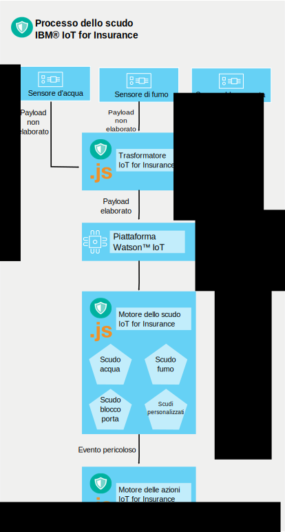

---

copyright:
  years: 2016, 2017
lastupdated: "2017-03-07"
---

<!-- Common attributes used in the template are defined as follows: -->
{:new_window: target="blank"}
{:shortdesc: .shortdesc}
{:screen: .screen}
{:codeblock: .codeblock}
{:pre: .pre}

# Come funziona il sevizio
{{site.data.keyword.iotinsurance_full}} crea un flusso per raccogliere, gestire e analizzare i dati dai possessori della polizza collegati.
{:shortdesc}

Il provider dell'assicurazione crea un'istanza {{site.data.keyword.iotinsurance_short}} nell'organizzazione {{site.data.keyword.Bluemix_notm}}. I clienti dell'assicuratore dispongono di sensori nelle loro case, collegati al cloud del provider dei sensori. Per i loro dispositivi mobili, i clienti autorizzano il servizio {{site.data.keyword.iotinsurance_short}} a ricevere i dati dai sensori. Il trasformatore {{site.data.keyword.iotinsurance_short}} si collega al cloud del provider dei sensori e trasmette i dati di ogni utente e li invia al server {{site.data.keyword.iot_short_notm}}. Se il sensore mostra che i parametri specificati negli scudi dell'assicuratore vengono soddisfatti nella casa del cliente, le notifiche vengono inviate al dashboard dell'assicuratore e al dispositivo del cliente.

Un sensore collegato rileva un evento, come una fuoriuscita d'acqua ed invia queste informazioni a un fornitore casa intelligente, come Wink.  {{site.data.keyword.iotinsurance_short}} rileva il segnale utilizzando la propria connessione con il cloud del fornitore casa intelligente e crea un payload dell'avviso. Il payload è inviato tramite MQTT al motore dello scudo {{site.data.keyword.iotinsurance_short}} per l'elaborazione. Il motore dello scudo analizza se il payload corrisponde ai criteri definiti dalle regole dello scudo. Se corrisponde, il motore dello scudo emette un payload di pericolo tramite MQTT al motore delle azioni {{site.data.keyword.iotinsurance_short}}. Il motore delle azioni esegue le azioni definite dallo scudo per tale tipo di pericolo, ad esempio, inviando un messaggio di testo al proprietario di casa.

{{site.data.keyword.iotinsurance_short}} si basa su {{site.data.keyword.iot_full}} per trasmettere l'avviso e i payload di pericolo tra i componenti. Un sistema di lavoro completo richiede utenti, scudi e associazioni tra gli utenti e gli scudi.

