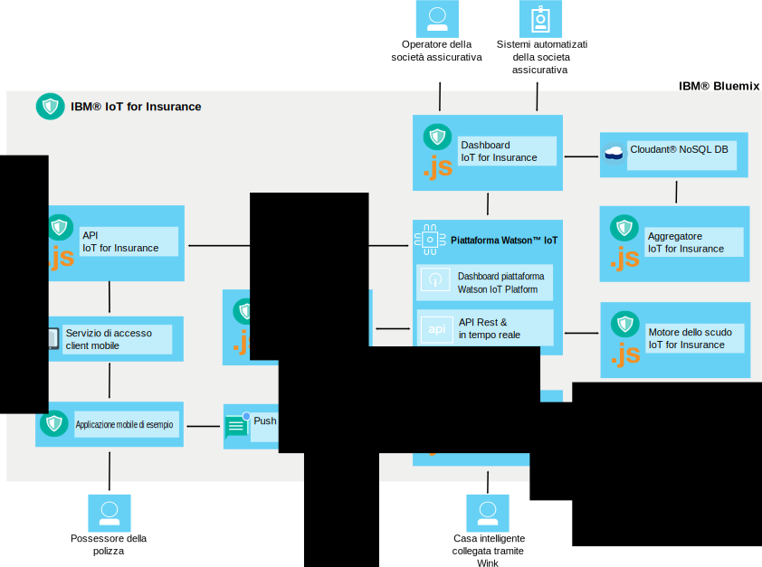

---

copyright:
  years: 2016, 2017
lastupdated: "2017-03-08"
---

<!-- Common attributes used in the template are defined as follows: -->
{:new_window: target="blank"}
{:shortdesc: .shortdesc}
{:screen: .screen}
{:codeblock: .codeblock}
{:pre: .pre}

# Informazioni su {{site.data.keyword.iotinsurance_short}}
{: #about}

{{site.data.keyword.iotinsurance_full}} è un'istanza di produzione IoT integrata che raccoglie e analizza i dati di contesto completo dai possessori della polizza per fornire valutazioni del rischio, protezione in tempo reale e riduzione dei costi della politica personalizzati.
{: shortdesc}

{{site.data.keyword.iotinsurance_short}} fornisce una visualizzazione di contesto completo dei beni e della situazione del possessore della polizza, incluse informazioni come l'ubicazione, il meteo, il traffico e il benessere generale. Le analisi approfondite di queste informazioni consentono all'assicuratore di fornire valutazioni del rischio e protezione in tempo reale per il possessore della polizza. I benefici per il possessore della polizza includono la possibilità di evitare i rischi con avvisi anticipati, avvertenze personalizzate e un accordo e elaborazione dei reclami accelerato. I benefici per l'assicuratore includono la soddisfazione del cliente, la fedeltà del cliente e la riduzione delle spese utilizzando il contenimento dei reclami e l'automazione del processo.

## Architettura
{: #architecture}

I componenti {{site.data.keyword.iotinsurance_short}} funzionano insieme come descritto in questa sezione. Questa organizzazione viene anche mostrata nel diagramma dell'architettura. Il dashboard {{site.data.keyword.iotinsurance_short}} visualizza i dati archiviati in {{site.data.keyword.iot_short_notm}} e nel database {{site.data.keyword.cloudantfull}}. I dispositivi smart dell'utente possono essere collegati tramite il cloud o direttamente a {{site.data.keyword.iot_short_notm}}. Se vengono collegati tramite il cloud, inviano i dati al trasformatore, che li elabora ed invia in {{site.data.keyword.iot_short_notm}}. I dati da {{site.data.keyword.weatherfull}} possono essere trasmessi anche in {{site.data.keyword.iotinsurance_short}} Weather Company Data Transformer e da qui a {{site.data.keyword.iot_short_notm}}. I dati vengono elaborati dal motore dello scudo, che genera un evento scudo e lo invia tramite le API al motore delle azioni. Il motore delle azioni può facoltativamente utilizzare {{site.data.keyword.mobilepushfull}} per inviare notifiche all'applicazione mobile dell'utente. L'utente può inoltre utilizzare l'applicazione mobile per rispondere agli avvisi o alle offerte.

**Nota**: le versioni precedenti di {{site.data.keyword.iotinsurance_short}} utilizzano il servizio {{site.data.keyword.amafull}} per elaborare le risposte e restituirle tramite le API a {{site.data.keyword.iot_short_notm}} e quindi al dashboard {{site.data.keyword.iotinsurance_short}}. Questo processo continua a funzionare per le istanze delle versioni precedenti di {{site.data.keyword.iotinsurance_short}}. Tuttavia, le nuove istanze di {{site.data.keyword.iotinsurance_short}} non includono {{site.data.keyword.amashort}} o {{site.data.keyword.mobilepushshort}}. Per utilizzare l'applicazione mobile, devi creare un processo di autenticazione personalizzato. Puoi anche facoltativamente creare e associare un'[istanza di {{site.data.keyword.mobilepushshort}}](../mobilepush/index.html) all'API per abilitare le notifiche push.

## Dashboard assicurazione
{: #insurance_dashboard}
Il dashboard dell'assicurazione fornisce agli utenti della compagnia assicurativa, come gli agenti, un visuale completa di cosa sta succedendo con i beni assicurati dei propri clienti. Possono visualizzare gli scudi e gli eventi a livello nazionale, statale o dell'account.

Il dashboard dell'assicurazione di esempio è caricato con dati simulati per mostrarti un esempio del tipo di informazioni che puoi raccogliere e analizzare.

## Applicazione mobile di esempio
{: #mobileapp}
L'applicazione mobile di esempio è dove i possessori della polizza d'assicurazione, come i proprietari di casa, visualizzano e rispondono alle informazioni che {{site.data.keyword.iotinsurance_short}} invia dai sensori nelle loro case.

Utilizzando un dispositivo mobile, i proprietari di casi autorizzano il servizio a collegarsi al cloud del provider dei sensori per inviare e ricevere dati. Ad esempio, un proprietario di casa può ricevere una notifica nell'applicazione starter mobile quando il sensore rileva una fuoriuscita d'acqua. Per ulteriori informazioni, consulta [Installazione e collegamento dell'applicazione mobile di esempio](iotinsurance_mobile_app.html).

## API REST e in tempo reale
{: #rest_api}
Le API REST vengono utilizzate dall'applicazione starter mobile, dal dashboard dell'assicurazione, dal motore della protezione e dal controllore del pericolo. Consentono agli utenti di conoscere le associazioni che esistono tra i dispositivi e gli scudi e le azioni. Utilizzando queste API, i programmatori possono creare nuovi utenti, generare dati di eventi, creare e registrare nuovi scudi e richiamare i dati dell'evento.

L'API a cui accedi dalla console del servizio viene personalizzata per la tua assicurazione di {{site.data.keyword.iotinsurance_short}}.

Nella pagina dell'API, puoi  
  - Visualizzare le chiamate API disponibili e la documentazione associata.
  - Tentare chiamate API individuali.  Selezionare una chiamata API per visualizzare tutte le informazioni e quindi fare clic su **Provalo adesso!**.

Gli esempi API sono disponibili per aiutarti ad iniziare ad utilizzare gli scenari comuni. Per ulteriori informazioni, vedi [Esempi di API {{site.data.keyword.iotinsurance_short}}](https://github.com/IBM-Bluemix/iot4i-api-examples-nodejs).

## Trasformatore
{: #transformer}
Il trasformatore richiede nuove informazioni dall'API del server cloud e le trasforma per corrispondere ai dati in {{site.data.keyword.iotinsurance_short}}. I dati sono quindi pubblicati per il resto dell'implementazione {{site.data.keyword.iotinsurance_short}} da utilizzare. Gli utenti devono autorizzare il componente Trasformatore ad accedere ai dati cloud del sensore e ad elaborare i dati registrati. {{site.data.keyword.iotinsurance_short}} supporta più dispositivi e fornitori cloud. Per un elenco completo di fornitori cloud supportati e di istruzioni su come collegare i dispositivi a {{site.data.keyword.iotinsurance_short}}, consulta [Fornitori e dispositivi supportati](iotinsurance_supporteddevices.html).

## Weather Company Data Transformer
{: #wcdtransformer}
L'applicazione Weather Company inserisce i dati meteo rilevanti dal servizio dati Weather Company nel flusso di dati IoT4I. Questi dati possono essere utilizzati per creare gli scudi abilitati per il meteo.

**Nota**: Weather Company Data Transformer è supportato come una prova di utilizzo o un'anteprima tecnica soltanto e non è pensato per l'utilizzo di produzione.

## Motore dello scudo
{: #shield_engine}
In base alle informazioni archiviate in un evento, il motore dello scudo determina se si verifica una pericolo come una fuoriuscita d'acqua. Se viene identificato un pericolo, viene trasmesso al motore dello scudo

Uno scudo è una protezione che un cliente compra dal provider dell'assicurazione. Ad esempio, un proprietario di casa acquista un'assicurazione sulla propria casa per proteggerlo in caso di incendio, danni dovuti a perdite d'acqua, a furti con scasso o ad altri pericoli. La soluzione {{site.data.keyword.iotinsurance_short}} fornisce uno scudo integrato contro l'acqua. I clienti vengono avvertiti e possono rispondere quando un evento che coinvolge l'acqua minaccia la loro casa. Utilizzando l'API REST, gli sviluppatori possono aggiungere altri scudi.  

Gli scudi sono eseguiti nel motore di analisi {{site.data.keyword.iotinsurance_short}}. Il motore di analisi identifica il tipo di pericolo (ad esempio *Acqua rilavata*), l'account utente del sensore che invia il pericolo e gli scudi associati con l'account. Possono essere intraprese delle azioni in base a tali informazioni. Puoi utilizzare o modificare gli scudi inclusi nella libreria degli scudi {{site.data.keyword.iotinsurance_short}} o puoi creare e implementare i tuoi propri scudi. Per ulteriori informazioni sugli scudi o sulla libreria degli scudi [{{site.data.keyword.iotinsurance_short}} ](https://github.com/ibm-watson-iot/ioti-shields){: new_window}, consulta il [Toolkit dello scudo](iotinsurance_shield_toolkit.html).

## Motore delle azioni
{: #action_engine}
Il motore delle azioni determina le azioni da intraprendere in base alle informazioni specificate nello scudo.

Puoi creare nuovi scudi in JavaScript utilizzando l'API {{site.data.keyword.iotinsurance_short}}.

# Link correlati
{: #rellinks}

## Esercitazioni ed esempi
{: #samples}
* [Sample mobile app code on GitHub ](https://github.com/ibm-watson-iot/ioti-mobile){:new_window}

## Riferimento API
{: #api}
* [{{site.data.keyword.iotinsurance_short}} API ](https://iot4i-api-docs.mybluemix.net/){:new_window}
* [{{site.data.keyword.iotinsurance_short}} API Examples ](https://github.com/IBM-Bluemix/iot4i-api-examples-nodejs/#iot-for-insurance-api-examples){:new_window}

## Link correlati
{: #general}
* [Documentazione {{site.data.keyword.iot_full}}](https://console.ng.bluemix.net/docs/services/IoT/index.html){:new_window}
* [Developer support forum ](https://developer.ibm.com/answers/search.html?f=&type=question&redirect=search%2Fsearch&sort=relevance&q=%2B[iot]%20%2B[bluemix]){:new_window}
* [Stack overflow support forum ](http://stackoverflow.com/questions/tagged/ibm-bluemix){:new_window}
