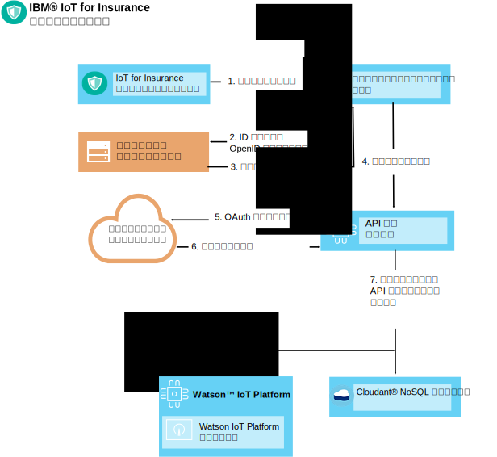

---

copyright:
  years: 2016, 2017
lastupdated: "2017-03-08"
---

<!-- Common attributes used in the template are defined as follows: -->
{:new_window: target="blank"}
{:shortdesc: .shortdesc}
{:screen: .screen}
{:codeblock: .codeblock}
{:pre: .pre}


# デバイス・ツールキット
{: #iot4i_connecting_devices}
{{site.data.keyword.iotinsurance_full}} デバイス・ツールキットを使用することにより、任意のデバイス・ベンダー製のデバイスを {{site.data.keyword.iotinsurance_short}} サービスに接続することができます。
{:shortdesc}

デバイスは、{{site.data.keyword.iot_full}} に対して、直接、またはデバイス・ベンダーのクラウドを介してデータを送信できます。デバイスを接続するには、許可ユーザーを登録してから、デバイス・イベントの生成と受信をセットアップします。サポートされるデバイスとベンダーのリスト、および統合手順サンプルについては、[サポートされるデバイスとベンダー](iotinsurance_supporteddevices.html)を参照してください。

デバイスを接続するには、以下のセクションの手順を使用してください。

## 許可ユーザーの登録
{: #reg_users}
デバイス・ベンダーのクラウドで OAuth が許可プロトコルとしてサポートされている場合、{{site.data.keyword.iotinsurance_short}} は OAuth クライアントとしてベンダーのクラウドに接続することができます。ユーザーのためにデータを受信したり更新したりするには、デバイス・ベンダーから入手したクライアントの ID と許可が必要です。  

### OAuth のフロー
{: #oauth_flow}
以下の図に、簡略化した OAuth のフローを示します。この中で、{{site.data.keyword.iotinsurance_short}} は Facebook などの OAuth プロバイダーにより許可が与えられています。この図で、{{site.data.keyword.iotinsurance_short}} が OAuth クライアントに対してアクセス要求をすると、そこから OAuth プロバイダーにアクセス要求が転送されます。プロバイダーにより HTML フォームが生成されます。{{site.data.keyword.iotinsurance_short}} ユーザーはそこにユーザー ID とパスワードを入力します。次にプロバイダーは許可を付与します。オプションとして、更新を有効にするための OAuth コードを返すこともできます。この図に示されているのは、非常に基本的なフローです。多くの場合、OAuth プロバイダーは、図に描かれている手順のため、複数の REST エンドポイントを提供します。  


### ユーザー登録のフロー
{: #user_reg_flow}

ユーザー登録はベンダーごとに異なります。必要なクラウド・アクセス・トークンを取得する方法と、API を使用してそのトークンを {{site.data.keyword.iotinsurance_short}} に登録する方法を確認するには、[サポートされるデバイスとベンダー](iotinsurance_supporteddevices.html)を参照してください。

#### モバイル登録のフロー (*非推奨*)

**注**: モバイル・アプリは Wink のみをサポートしています。また、{{site.data.keyword.amashort}} に加えられた変更により、このセクションで説明されているユーザー登録のフローを使用できなくなりました。
このフローは、既存のバージョン 1.0 の {{site.data.keyword.iotinsurance_short}} インスタンスでのみ使用できます。

以下の図に、簡略化したユーザー登録のフローを示します。このサンプルでは、新しいユーザー登録要求がモバイル・デバイスから出されます。要求は {{site.data.keyword.amafull}} によって処理されます。ここで顧客のサポート・システムのための ID が提供され、API 登録サービスに対して要求が送信されます。API 登録サービスにより OAuth 要求がデバイス・ベンダーのクラウドに転送されます。そこで、顧客のサポート・システムによる認証が検証されます。デバイス・ベンダーのクラウドから、API 登録サービスに許可コードまたはトークンが返されます。次に登録サービスは、{{site.data.keyword.iot_short_notm}} と {{site.data.keyword.cloudant}} の中にユーザーと固有 API トークンを作成します。



## デバイス・イベントの生成
{: #generating_device_events}
ユーザー登録中に生成される API キーと共に使用できる直接許可コードがデバイスのメーカーから提供されている場合、デバイスは {{site.data.keyword.iot_short_notm}} に接続できます。このタイプの接続については、[{{site.data.keyword.iot_short_notm}} でのデバイスの開発](https://console.{DomainName}/docs/services/IoT/devices/device_dev_index.html)で説明されています。

ベンダーのクラウドを介してデバイスが接続されている場合、デバイス・ベンダーから提供される REST エンドポイントを使用する接続を介して、デバイス・イベントが送信されます。それらの呼び出しのための許可は、ユーザー登録中に取得される OAuth ベアラー・トークンによって付与されます。{{site.data.keyword.iotinsurance_short}} 変換プログラムは、それぞれのデバイスに関連付けられたユーザー情報をベンダーのクラウドからプルします。次いで、{{site.data.keyword.iot_short_notm}} に渡されるデバイス・イベント・データとのユーザー関連付けが取り込まれます。

デバイスが {{site.data.keyword.iot_short_notm}} に直接接続されている場合、デバイスとユーザーとの間のリンクが {{site.data.keyword.iot_short_notm}} に保管されます。{{site.data.keyword.iotinsurance_short}} 変換プログラムによってその情報がキャッシュに入れられ、デバイス・イベントにユーザーへのリンクが追加されます。

### クラウド・トゥー・クラウド - デバイス・イベントのフロー
{: #device_event_flow}
以下の図に、簡略化したデバイス・イベントのフローを示します。この例では、デバイスによって水漏れが検出されます。{{site.data.keyword.iotinsurance_short}} 変換プログラムは、定期的にベンダーのクラウドをポーリングして、デバイス状況の変更を調べます。イベントが検出された場合、変換プログラムはそれを {{site.data.keyword.iot_short_notm}} に送信します。{{site.data.keyword.iotinsurance_short}} シールド・エンジンによってイベントが分析された後、アラートが生成され、そのアラートが {{site.data.keyword.cloudant}} に保管されます。そのアラートは、{{site.data.keyword.iot_short_notm}} によって {{site.data.keyword.iotinsurance_short}} アクション・エンジンに転送されて、分析されることになります。次にアクション・エンジンは、{{site.data.keyword.mobilepushshort}} を介してアラートを利用者のモバイル・アプリにプッシュします。  


### デバイス状況のポーリングをセットアップする方法
{: #device_polling}
変換プログラム・マイクロサービスは、状況の更新のポーリングと受信を行います。デバイス・ベンダーの REST API で非同期のデバイス更新がサポートされている場合、デバイス状況の更新が発生した時点で、変換プログラムがそれを受信できるようにするサブスクリプションを設定できます。その他の場合、デバイス状況の更新をポーリングするように、変換プログラムをセットアップすることができます。

ポーリング・プロセスを定義するために、以下の疑似関数の呼び出しが使用されています。

*表 1: 疑似関数の呼び出し*

疑似関数 | 説明
------------- | -------------
`getRegisteredUserDevices(userName)` | ユーザー名を使用している使用可能な登録済みユーザー・デバイスを取得します。
`getProviderDevices(providerUserToken)` | ユーザー・ベアラー・トークンを使用しているユーザー・デバイスの状況を取得するためのデバイス・プロバイダー REST API を呼び出します。
`findDevicesToAdd(), findDevicesToDel(), findDevicesToUpdate()` | 登録済みデバイスと、デバイス・プロバイダーの中に現在存在するデバイスとを比較することにより、新しいデバイス、削除されたデバイス、変更が加えられたデバイスを検索します。
`syncData()` | 古いデバイスを削除し、新しいデバイスを追加し、修正が加えられたデバイスを更新することにより、ユーザー・デバイスを同期します。  
 `notifyIoTP()` | {{site.data.keyword.iot_short_notm}} に対し、MQTT イベントなどの変更を通知します。

変換プログラムは、以下のサンプル・コードに示されているように、状況の更新を {{site.data.keyword.iot_short_notm}} に通知します。
```
// as specified in VCAP.services
var appClientConfig = {
  "org":iot_org,
  "id":iot_appid,
  "auth-key":iot_authkey,
  "auth-token":iot_authtoken
};

var appClient = new iotclient.IotfApplication(appClientConfig);
try {
  appClient.connect();
} catch (err) {
  console.log('IoT connect failed with error' +err);
}

...

// generate IoT event, note that the content is an arbitrary JSON object  
try {
  appClient.publishDeviceEvent("iOS",userToken.username, "status", "json", JSON.stringify(iotDevice));
} catch (err) {
  console.log('IoT publish failed with error' +err +'foruser' +userToken.username);
}

```

変換プログラムは、{{site.data.keyword.cloudant}} を使用することにより、ベアラー・トークンなどのユーザー・データにアクセスし、後で比較するために既知の最後のデバイス状況を保管します。以下の {{site.data.keyword.cloudant}} メソッドとコード・スニペットは、参照用として示されています。  

`getUserTokensByProvider`  このメソッドは、特定のプロバイダーのすべてのユーザー・トークンを取得します。

```
dbHelper.getUserTokensByProvider(provider, function (err,results) {
  if (!err) {
    console.log(results.token.length + " tokens retrieved for provider: " + Provider);
  } else {
    console.log("no tokens returned, err:",err);
  }
  });
```

`getDevicesByUser` - このメソッドは、登録されているすべてのユーザー・デバイスを、ユーザー名ごとに取得します。
```
dbHelper.getDevicesByUser(username, function (err,results) {
  if (!err) {
    console.log(results.length + " devices retrieved for username: " + username);
  } else {
    console.log("no devices returned, err:",err);
  }
  });
```

`bulkUpdateDevices` - このメソッドは、一群のユーザー・デバイスを更新または追加します。
```
dbHelper.bulkUpdateDevices(userDevices, function (err,results) {
  if (!err) {
    console.log(results.length + " devices updated");
    } else {
      console.log("no devices updated, err:",err);
    }
  });
```

`bulkDelDevices` - このメソッドは、一群のユーザー・デバイスを削除します。
```
dbhelper.bulkDelDevices(userDevices, function (err, results) {
  if (!err) {
    console.log(results.length + "devices deleted");
  } else {
    console.log("no devices deleted, err:",err);
  }
  });

```


## 変換プログラムの新しいインスタンスのデプロイ
{: #deploy_new_transformer}
変換プログラムの新しいインスタンスを、{{site.data.keyword.iotinsurance_short}} がデプロイされているのと同じ組織そしてスペース内にデプロイすることができます。  

**注:** 変換プログラムの新しいインスタンスをデプロイするときに情報や支援を得るには、[サポートへのお問い合わせ](../support/index.html#contacting-support)を参照してください。

開始する前に、Cloud Foundry コマンド・ライン・インターフェースをダウンロードし、インストールしてください。Cloud Foundry コマンド・ライン・インターフェースを使用してサービス・インスタンスを変更し、それを {{site.data.keyword.iot_short_notm}} にデプロイします。詳しくは、[cf コマンド・ライン・インターフェースを使用したコーディングの開始 ](https://www.ng.bluemix.net/docs/#starters/install_cli.html){:new_window} を参照してください。

1. コマンド・ライン・インターフェースで、以下のコマンドを使用して、ディレクトリーを`ソースとデプロイメント記述子 YML ファイルを格納するディレクトリー`に変更します。
```
$ cd directory_name
```
2. {{site.data.keyword.iotinsurance_short}} の中のすべてのアプリのリストを取得し、変換プログラムの名前をメモします。名前の末尾が `transformer` になっています。

3. {{site.data.keyword.iotinsurance_short}} 変換プログラムを停止します。例えば、次のように入力します。
```
$ cf stop iot4i-dev-transformer
```
4. {{site.data.keyword.iotinsurance_short}} に含まれているすべてのサービスのリストを取得し、{{site.data.keyword.iot_short_notm}} と {{site.data.keyword.cloudant}} のサービスの名前をメモします。{{site.data.keyword.iot_short_notm}} サービスの名前には、`iotf` の文字が含まれています。{{site.data.keyword.cloudant}} サービスの名前には、`cloudant` が含まれています。

5. 前のステップでメモした名前を使用して、以下の例のようなデプロイメント記述子ファイルを作成します。  
  ```
  applications:
  - path: .
    memory: 1024M
    instances: 1
    name: iot4i-dev-transformer
    no-route: false
    disk_quota: 1024M
    command: node index.js
    services:
    - iot4i-iotf-service
    - iot4i-cloudantNoSQLDB
    env:
       ENV: dev
       APIDOMAIN: iot4insurance-api-v.mybluemix.net
       NODE_MODULES_CACHE: false
  ```
6. 変換プログラムを {{site.data.keyword.Bluemix_notm}} の中にプッシュします。そのためには、以下のコマンドを使用して、`newtransformer` を、デプロイメント記述子ファイルの名前に置き換えます。
  ```
  $ cf push -f newtransformer.yml
  ```
7. 以下のコマンドを使用することにより、ログを確認してデプロイメント・メッセージを表示します。
  ```
  $ cf logs iot4i-dev-transformer
  ```
