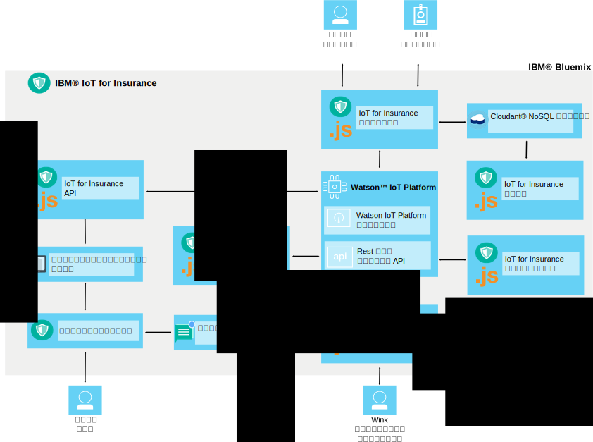

---

copyright:
  years: 2016, 2017
lastupdated: "2017-03-08"
---

<!-- Common attributes used in the template are defined as follows: -->
{:new_window: target="blank"}
{:shortdesc: .shortdesc}
{:screen: .screen}
{:codeblock: .codeblock}
{:pre: .pre}

# {{site.data.keyword.iotinsurance_short}} について
{: #about}

{{site.data.keyword.iotinsurance_full}} は、保険契約者からフルコンテキスト・データを収集して分析し、パーソナライズされたリスク評価、リアルタイム保護、保険契約関連コストの削減を実現する、統合 IoT 実稼働インスタンスです。
{: shortdesc}

{{site.data.keyword.iotinsurance_short}} は、保険契約者の資産と状況に関するフルコンテキスト・ビューを提供します。これには、場所、天候、交通、全般的な健康状態などの情報が含まれます。この情報の詳細な分析により、保険会社は、パーソナライズされたリスク評価やリアルタイムの保護を保険契約者に提供することができます。保険契約者の側のメリットとして、早期アラート方式によるリスク回避、パーソナライズされたアドバイス、合理化された請求処理と支払いなどがあります。保険会社の側のメリットとしては、顧客満足度と顧客ロイヤルティーの向上や、請求回避と処理の自動化による経費削減などがあります。

## アーキテクチャー
{: #architecture}

{{site.data.keyword.iotinsurance_short}} のコンポーネントは、このセクションで説明されているようにして連携動作します。この組織は、アーキテクチャーの図にも示されています。{{site.data.keyword.iotinsurance_short}} ダッシュボードには、{{site.data.keyword.iot_short_notm}} と {{site.data.keyword.cloudantfull}} データベースに格納されているデータが表示されます。ユーザーのスマート・デバイスは、クラウド経由で、または直接 {{site.data.keyword.iot_short_notm}} に接続できます。クラウド経由で接続した場合、データは変換プログラムに送信され、そこでデータが処理されて {{site.data.keyword.iot_short_notm}} に送信されます。{{site.data.keyword.weatherfull}} からのデータも、{{site.data.keyword.iotinsurance_short}} Weather Company データ変換プログラムに取り込まれ、そこから {{site.data.keyword.iot_short_notm}} に送信されます。データはシールド・エンジンによって処理されます。そこでシールド・イベントが生成され、API によってアクション・エンジンに送信されます。アクション・エンジンは、オプションで {{site.data.keyword.mobilepushfull}} を使用して、ユーザーのモバイル・アプリケーションに通知を送信することができます。ユーザーも、モバイル・アプリケーションを使用してアラートまたはオファーに応答することができます。

**注**: 旧バージョンの {{site.data.keyword.iotinsurance_short}} は、{{site.data.keyword.amafull}} サービスを使用して応答を処理し、それを API によって {{site.data.keyword.iot_short_notm}} に返してから、{{site.data.keyword.iotinsurance_short}} ダッシュボードに返します。このプロセスは、旧バージョンの {{site.data.keyword.iotinsurance_short}} インスタンスで引き続き機能します。しかし、新規の {{site.data.keyword.iotinsurance_short}} インスタンスには、{{site.data.keyword.amashort}} と {{site.data.keyword.mobilepushshort}} が組み込まれません。モバイル・アプリを使用するには、カスタムの認証プロセスを作成する必要があります。またオプションで、[{{site.data.keyword.mobilepushshort}} のインスタンス](../mobilepush/index.html)を作成し、それを API にバインドしてプッシュ通知を有効にすることができます。

## 保険ダッシュボード
{: #insurance_dashboard}
保険ダッシュボードには、保険会社のユーザー (代理店など) 向けに、顧客の保険対象資産の状況に関する全体像が示されます。シールドとイベントを国レベル、都道府県レベル、およびアカウント・レベルで表示できます。

サンプル保険ダッシュボードにはシミュレーション・データがロードされ、収集して分析できる情報の種類が例示されます。

## サンプル・モバイル・アプリ
{: #mobileapp}
サンプル・モバイル・アプリでは、保険契約者 (住宅所有者など) が、自宅にあるセンサーから {{site.data.keyword.iotinsurance_short}} によって送信される情報を表示し、それに対応します。

モバイル・デバイスを使用する際に、住宅所有者はサービスにセンサー提供会社のクラウドに接続してデータを送受信することを許可します。例えば、センサーが水漏れを検知したときに、住宅所有者がモバイル・スターター・アプリで通知を受信することなどが考えられます。詳しくは、[サンプル・モバイル・アプリのインストールと接続](iotinsurance_mobile_app.html)を参照してください。

## REST とリアルタイム API
{: #rest_api}
REST API は、モバイル・スターター・アプリ、保険ダッシュボード、シールド・エンジン、ハザード・コントローラーが使用します。これにより、デバイスとシールドとアクションの間に存在する関連をユーザーが把握できるようになります。プログラマーはこれらの API を使用して、新しいユーザーを作成し、イベント・データを生成し、新しいシールドを作成して登録し、イベント・データをフェッチすることができます。

サービス・コンソールからアクセスする API は、{{site.data.keyword.iotinsurance_short}} インスタンスに合わせてカスタマイズされます。

API ページでは、以下を行うことができます。  
  - 使用可能なすべての API 呼び出しと関連資料を参照する。
  - 個々の API 呼び出しを試行する。API 呼び出しを選択してすべての情報を表示し、**「お試しください」**をクリックします。

一般的なシナリオで開始するのに役立つ、API サンプルが用意されています。詳しくは、[{{site.data.keyword.iotinsurance_short}} API examples](https://github.com/IBM-Bluemix/iot4i-api-examples-nodejs) を参照してください。

## Transformer
{: #transformer}
変換プログラムは、クラウド・サーバー API に新規情報を要求し、それを {{site.data.keyword.iotinsurance_short}} のデータに合わせて変換します。その後、データは {{site.data.keyword.iotinsurance_short}} 実装環境の他の部分で使用するために発行されます。ユーザーは、変換プログラム・コンポーネントに対し、センサー・クラウド・データにアクセスして記録データを処理することを許可する必要があります。{{site.data.keyword.iotinsurance_short}} は、複数のクラウド・ベンダーとデバイスをサポートします。サポートされるクラウド・ベンダーの詳細なリストと、デバイスを {{site.data.keyword.iotinsurance_short}} に接続する手順については、[サポートされるデバイスとベンダー](iotinsurance_supporteddevices.html)を参照してください。

## Weather Company データ変換プログラム
{: #wcdtransformer}
Weather Company アプリケーションは、Weather Company データ・サービスからの関連した天候データを、IoT4I データ・ストリームに注入します。続いてこのデータは、天候対応シールドを構築するために使用されます。

**注**: Weather Company データ変換プログラムは、PoC (概念検証) またはテクニカル・プレビューとしてのみサポートされます。実動用としての使用を意図したものではありません。

## シールド・エンジン
{: #shield_engine}
シールド・エンジンは、イベントに格納された情報に基づいて、水漏れなどのハザードが発生していないかどうか判別します。ハザードが識別されると、アクション・エンジンに渡されます。

シールドとは、顧客が保険会社から取得する特定の保護のことです。例えば、住宅所有者は火災、水による損害、住居侵入、その他のハザードに対するシールドを備えるために住宅用の保険を購入します。{{site.data.keyword.iotinsurance_short}} ソリューションには、水に対するシールドが組み込まれています。顧客は、水に関係したイベントによって自宅に危険が差し迫ると、アラートを受信し、対応することができます。REST API を使用して、開発者はさらにシールドを追加できます。
  

シールドは {{site.data.keyword.iotinsurance_short}} 分析エンジンで実行されます。分析エンジンは、ハザードのタイプ (*水の検知*など)、ハザードを送信したセンサーのユーザー・アカウント、そのアカウントに関連付けられたシールドを識別します。この情報に基づいて、アクションを実行することができます。{{site.data.keyword.iotinsurance_short}} シールド・ライブラリーに含まれるシールドを使用または変更するか、あるいは独自のシールドを作成して実装することができます。シールドと [{{site.data.keyword.iotinsurance_short}} シールド・ライブラリー ](https://github.com/ibm-watson-iot/ioti-shields){: new_window} について詳しくは、[シールド・ツールキット](iotinsurance_shield_toolkit.html)を参照してください。

## アクション・エンジン
{: #action_engine}
アクション・エンジンは、シールドで指定されている情報に基づいて、実行するアクションを決定します。

{{site.data.keyword.iotinsurance_short}} API を使用すると、新規シールドを JavaScript で作成できます。
