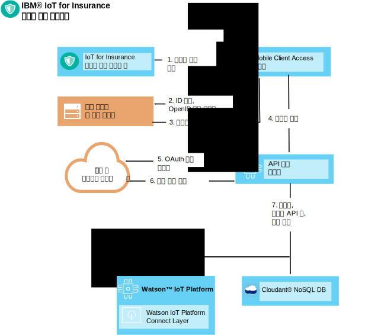
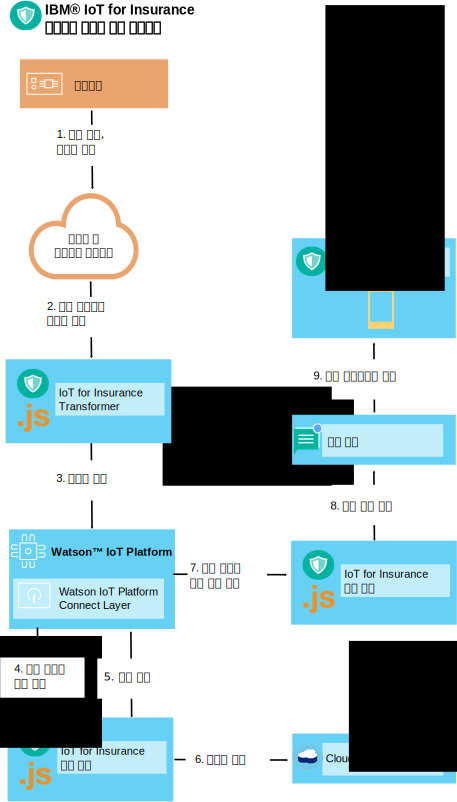

---

copyright:
  years: 2016, 2017
lastupdated: "2017-03-08"
---

<!-- Common attributes used in the template are defined as follows: -->
{:new_window: target="blank"}
{:shortdesc: .shortdesc}
{:screen: .screen}
{:codeblock: .codeblock}
{:pre: .pre}


# 디바이스 툴킷
{: #iot4i_connecting_devices}
{{site.data.keyword.iotinsurance_full}} 디바이스 툴킷을 사용하여 디바이스 공급업체에서 만든 디바이스를 사용자의 {{site.data.keyword.iotinsurance_short}} 서비스에 연결할 수 있습니다.
{:shortdesc}

디바이스로 데이터를 직접 {{site.data.keyword.iot_full}}에 전송하거나 디바이스 공급업체 클라우드를 통해 전송할 수 있습니다. 권한이 부여된 사용자를 등록하고 디바이스 이벤트 생성 및 수신을 설정하여 디바이스를 연결합니다. 지원되는 디바이스 및 공급업체의 목록과 샘플 통합 프로시저는 [지원되는 디바이스 및 공급업체](iotinsurance_supporteddevices.html)를 참조하십시오.

다음 섹션의 지시사항을 사용하여 디바이스를 연결하십시오. 

## 권한 부여된 사용자 등록
{: #reg_users}
디바이스 공급업체의 클라우드에서 OAuth를 권한 부여 프로토콜로 지원하면 {{site.data.keyword.iotinsurance_short}}에서 OAuth 클라이언트 역할을 수행하여 공급업체 클라우드에 연결할 수 있습니다. 사용자 대신 데이터를 수신하거나 업데이트하기 위해서는 디바이스 공급업체에서 가져온 클라이언트 ID와 권한이 필요합니다.   

### OAuth 플로우
{: #oauth_flow}
다음 다이어그램은 Facebook과 같은 OAuth 제공업체를 통해 {{site.data.keyword.iotinsurance_short}}의 권한을 부여하는 약식 OAuth 플로우를 보여줍니다. 이 다이어그램에서는 {{site.data.keyword.iotinsurance_short}}에서 OAuth 클라이언트에 액세스를 요청하며 이 클라이언트는 액세스 요청의 경로를 OAuth 제공업체로 재지정합니다. 제공업체에서는 {{site.data.keyword.iotinsurance_short}} 사용자가 사용자 ID와 비밀번호를 입력하는 HTML 양식을 생성합니다. 그러면 제공업체에서 권한을 부여하고 선택적으로 업데이트를 허용하는 OAuth 코드를 리턴합니다. 이 다이어그램에는 기본 플로우만 표시됩니다. OAuth 제공업체는 일반적으로 다이어그램에 묘사된 단계를 수행하기 위해 여러 REST 엔드포인트를 제공합니다.   


### 사용자 등록 플로우
{: #user_reg_flow}

사용자 등록은 공급업체에 따라 다릅니다. 필요한 클라우드 액세스 토큰을 가져오는 방법과 API를 사용하여 해당 액세스 토큰을 {{site.data.keyword.iotinsurance_short}}에 등록하는 방법을 알려면 [지원되는 디바이스 및 공급업체](iotinsurance_supporteddevices.html)를 참조하십시오.

#### 모바일 등록 플로우(*더 이상 사용되지 않음*)

**참고**: 모바일 앱은 Wink만 지원하며 {{site.data.keyword.amashort}}에 대한 변경사항으로 인해
이 섹션에서 설명하는 사용자 등록 플로우가 사용되지 않습니다. 이 플로우는 {{site.data.keyword.iotinsurance_short}}의 버전 1.0의 기존 인스턴스에 대해서만 사용할 수 있습니다.

다음 다이어그램은 단순화된 사용자 등록 플로우를 보여줍니다. 이 예에서는 모바일 디바이스에서 새 사용자 등록 요청을 작성합니다. 이 요청은 {{site.data.keyword.amafull}}에서 처리되며 여기서 고객의 지원 시스템으로 ID를 제공하고 API 등록 서비스로 요청을 전송합니다. API 등록 서비스는 OAuth 요청의 경로를 디바이스 공급업체 클라우드로 재지정하며 여기서 차례로 고객 지원 시스템을 인증합니다. 이 디바이스 공급업체 클라우드는 권한 코드나 토큰을 API 등록 서비스에 리턴합니다. 그러면 등록 서비스에서 사용자와 고유 API 토큰을 {{site.data.keyword.iot_short_notm}} 및 {{site.data.keyword.cloudant}}에 작성합니다. 



## 디바이스 이벤트 생성
{: #generating_device_events}
제조업체에서 사용자 등록 중 생성되는 API 키와 함께 사용할 수 있는 직접 권한 코드를 제공하는 경우 디바이스에서 {{site.data.keyword.iot_short_notm}}에 연결할 수 있습니다. 이 유형의 연결은 [{{site.data.keyword.iot_short_notm}}에서 디바이스 개발](https://console.{DomainName}/docs/services/IoT/devices/device_dev_index.html)에 설명되어 있습니다. 

디바이스를 공급업체 클라우드를 통해 연결하면 디바이스 공급업체에서 제공하는 REST 엔드포인트를 사용하는 연결을 통해 디바이스 이벤트를 전송합니다. 사용자 등록 중 획득하는 OAuth 소유자 토큰은 이러한 호출에 대한 권한을 부여합니다. {{site.data.keyword.iotinsurance_short}} Transformer는 공급업체 클라우드에서 개별 디바이스의 연관 사용자 정보를 가져옵니다. 그런 다음 {{site.data.keyword.iot_short_notm}}에 전달하는 디바이스 이벤트 데이터와의 사용자 연관을 포함합니다. 

디바이스를 {{site.data.keyword.iot_short_notm}}에 직접 연결하는 경우, 디바이스와 사용자 간의 링크를 {{site.data.keyword.iot_short_notm}}에 저장합니다. {{site.data.keyword.iotinsurance_short}} Transformer는 해당 정보를 캐시에 저장하고 사용자 링크로 디바이스 이벤트를 보강합니다. 

### 클라우드 대 클라우드 - 디바이스 이벤트 플로우
{: #device_event_flow}
다음 다이어그램은 단순화된 디바이스 이벤트 플로우를 보여줍니다. 이 예에서는 디바이스에서 누수를 발견합니다. {{site.data.keyword.iotinsurance_short}} Transformer는 디바이스 상태 변경이 있는지 주기적으로 공급업체 클라우드를 폴링합니다. 이벤트를 발견하면 Transformer에서 이를 {{site.data.keyword.iot_short_notm}}에 전송합니다. {{site.data.keyword.iotinsurance_short}} 실드 엔진은 이벤트를 분석하여 경보를 생성한 다음 {{site.data.keyword.cloudant}}에 저장합니다. {{site.data.keyword.iot_short_notm}}에서 이 경보를 분석하도록 {{site.data.keyword.iotinsurance_short}} 조치 엔진에 전송합니다. 그러면 조치 엔진에서 {{site.data.keyword.mobilepushshort}}를 통해 이용자의 모바일 앱에 경보를 푸시합니다.   



### 디바이스 상태 폴링 설정 방법
{: #device_polling}
Transformer 마이크로서비스는 상태 업데이트를 폴링하고 수신합니다. 디바이스 공급업체의 REST API에서 비동기 디바이스 업데이트를 지원하는 경우, 디바이스 상태 업데이트가 발생하면 Transformer에서 수신할 수 있도록 구독을 설정할 수 있습니다. 또는 Transformer에서 디바이스 상태 업데이트를 폴링하도록 설정할 수 있습니다. 

다음 유사 함수 호출을 사용하여 폴링 프로세스를 정의합니다. 

*표 1: 유사 함수 호출*

유사 함수 | 설명
------------- | -------------
`getRegisteredUserDevices(userName)` | 사용자 이름을 사용하는 등록된 가용 사용자 디바이스를 검색합니다.
`getProviderDevices(providerUserToken)` | 디바이스 제공업체 REST API를 호출하여 사용자의 소유자 토큰을 사용하는 사용자 디바이스 상태를 가져옵니다.
`findDevicesToAdd(), findDevicesToDel(), findDevicesToUpdate()` | 등록된 디바이스를 현재 디바이스 제공업체에 있는 디바이스와 비교하여 새 디바이스, 삭제된 디바이스, 수정된 디바이스를 찾습니다.
` syncData()` | 기존 디바이스 삭제, 새 디바이스 추가, 수정된 디바이스 업데이트를 수행하여 사용자 디바이스를 동기화합니다.   
 `notifyIoTP()` | MQTT 이벤트와 같은 변경이 있는 {{site.data.keyword.iot_short_notm}}을 알립니다.

Transformer는 다음 코드 예제와 같이 상태 업데이트를 {{site.data.keyword.iot_short_notm}}에 게시합니다. 
```
// as specified in VCAP.services
var appClientConfig = {
  "org":iot_org,
  "id":iot_appid,
  "auth-key":iot_authkey,
  "auth-token":iot_authtoken
};

var appClient = new iotclient.IotfApplication(appClientConfig);
try {
  appClient.connect();
} catch (err) {
  console.log('IoT connect failed with error' +err);
}

...

// generate IoT event, note that the content is an arbitrary JSON object  
try {
  appClient.publishDeviceEvent("iOS",userToken.username, "status", "json", JSON.stringify(iotDevice));
} catch (err) {
  console.log('IoT publish failed with error' +err +'foruser' +userToken.username);
}

```

Transformer는 {{site.data.keyword.cloudant}}를 사용하여 소유자 토큰과 같은 사용자 데이터에 액세스해서 마지막으로 알려진 디바이스 상태를 저장하고 이를 비교에 사용합니다. 다음 {{site.data.keyword.cloudant}} 메소드 및 코드 스니펫이 참조로 제공됩니다.   

`getUserTokensByProvider` - 이 메소드는 특정 제공업체의 모든 사용자 토큰을 가져옵니다. 

```
dbHelper.getUserTokensByProvider(provider, function (err,results) {
  if (!err) {
    console.log(results.token.length + " tokens retrieved for provider: " + Provider);
  } else {
    console.log("no tokens returned, err:",err);
  }
  });
```

`getDevicesByUser` - 이 메소드는 사용자 이름별로 등록된 모든 사용자 디바이스를 검색합니다. 
```
dbHelper.getDevicesByUser(username, function (err,results) {
  if (!err) {
    console.log(results.length + " devices retrieved for username: " + username);
  } else {
    console.log("no devices returned, err:",err);
  }
  });
```

`bulkUpdateDevices` - 이 메소드는 사용자 디바이스 그룹을 업데이트하거나 추가합니다. 
```
dbHelper.bulkUpdateDevices(userDevices, function (err,results) {
  if (!err) {
    console.log(results.length + " devices updated");
    } else {
      console.log("no devices updated, err:",err);
    }
  });
```

`bulkDelDevices` - 이 메소드는 사용자 디바이스 그룹을 삭제합니다. 
```
dbhelper.bulkDelDevices(userDevices, function (err, results) {
  if (!err) {
    console.log(results.length + "devices deleted");
  } else {
    console.log("no devices deleted, err:",err);
  }
  });

```


## 새 Transformer 인스턴스 배치
{: #deploy_new_transformer}
새 Transformer 인스턴스를 {{site.data.keyword.iotinsurance_short}}가 배치되는 동일한 조직과 영역에 배치할 수 있습니다.   

**참고:** 새 Transformer 인스턴스를 배치할 때 정보 및 지원이 필요하면 [지원 문의](../support/index.html#contacting-support)를 참조하십시오.

시작하기 전에 Cloud Foundry 명령행 인터페이스를 다운로드하여 설치하십시오. Cloud Foundry 명령행 인터페이스를 사용하여 서비스 인스턴스를 수정하거나 {{site.data.keyword.iot_short_notm}}에 배치할 수 있습니다. 자세한 정보는 [cf 명령행 인터페이스로 코딩 시작 ](https://www.ng.bluemix.net/docs/#starters/install_cli.html){:new_window}을 참조하십시오. 

1. 명령행 인터페이스에서 다음 명령을 사용하여 디렉토리를 `소스 및 배치 디스크립터 YML 파일이 있는 디렉토리`로 변경하십시오. 
```
$ cd directory_name
```
2. {{site.data.keyword.iotinsurance_short}}에서 모든 앱을 표시하고 Transformer 이름을 기록하십시오. 이 이름은 `transformer`로 끝나야 합니다.

3. {{site.data.keyword.iotinsurance_short}} Transformer를 중지하십시오. 예: 
```
$ cf stop iot4i-dev-transformer
```
4. {{site.data.keyword.iotinsurance_short}}에 포함된 모든 서비스를 표시하고 {{site.data.keyword.iot_short_notm}} 및 {{site.data.keyword.cloudant}} 서비스 이름을 기록하십시오. {{site.data.keyword.iot_short_notm}} 서비스 이름에는 `iotf`가 포함됩니다. {{site.data.keyword.cloudant}} 서비스 이름에는 `cloudant`가 포함됩니다. 

5. 이전 단계에서 기록한 이름을 사용하여 다음 예제와 유사한 배치 디스크립터 파일을 작성하십시오.   
  ```
  applications:
  - path: .
    memory: 1024M
    instances: 1
    name: iot4i-dev-transformer
    no-route: false
    disk_quota: 1024M
    command: node index.js
    services:
    - iot4i-iotf-service
    - iot4i-cloudantNoSQLDB
    env:
       ENV: dev
       APIDOMAIN: iot4insurance-api-v.mybluemix.net
       NODE_MODULES_CACHE: false
  ```
6. 다음 명령을 사용하여 `newtransformer`를 배치 디스크립터 파일 이름으로 바꿔서 Transformer를 {{site.data.keyword.Bluemix_notm}}에 푸시하십시오. 
  ```
  $ cf push -f newtransformer.yml
  ```
7. 다음 명령으로 로그를 검사하여 배치 메시지를 볼 수 있습니다. 
  ```
  $ cf logs iot4i-dev-transformer
  ```
