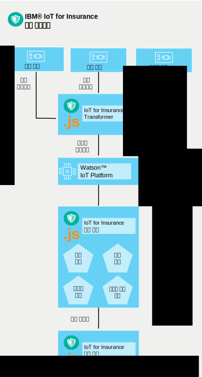

---

copyright:
  years: 2016, 2017
lastupdated: "2017-03-07"
---

<!-- Common attributes used in the template are defined as follows: -->
{:new_window: target="blank"}
{:shortdesc: .shortdesc}
{:screen: .screen}
{:codeblock: .codeblock}
{:pre: .pre}

# 서비스 작업 방식
{{site.data.keyword.iotinsurance_full}}는 연결된 보험 계약자의 데이터를 수집, 관리, 분석하는 플로우를 작성합니다.
{:shortdesc}

보험 제공업체는 {{site.data.keyword.Bluemix_notm}} 조직에 {{site.data.keyword.iotinsurance_short}} 인스턴스를 작성합니다. 보험자의 고객 집에는 센서가 있으며 이는 센서 제공업체의 클라우드에 연결되어 있습니다. 주택 소유자는 모바일 디바이스를 사용하여 센서 데이터를 수신하도록 {{site.data.keyword.iotinsurance_short}} 서비스에 권한을 부여합니다. {{site.data.keyword.iotinsurance_short}} Transformer는 센서 제공업체의 클라우드에 연결하여 각 사용자의 데이터를 가져와 {{site.data.keyword.iot_short_notm}} 서버에 보냅니다. 센서에 보험자 실드에 지정된 매개변수가 고객의 집에서 충족되지 않는 것으로 표시되는 경우 보험자 대시보드와 고객의 디바이스에 알림이 전송됩니다. 

연결된 센서는 이벤트(예: 누수)를 발견하여 해당 정보를 Wink와 같은 스마트 홈 공급업체에 보냅니다. {{site.data.keyword.iotinsurance_short}}는 스마트 홈 공급업체 클라우드와의 연결을 사용하여 신호를 감지하고 경보 페이로드를 작성합니다. 이 페이로드는 MQTT를 통해 {{site.data.keyword.iotinsurance_short}} 실드 엔진으로 발송되어 처리됩니다. 이 실드 엔진은 페이로드가 실드 규칙에서 정의하는 기준에 부합하는지 분석합니다. 이 기준에 부합하면 실드 엔진에서 MQTT를 통해 위험 페이로드를 {{site.data.keyword.iotinsurance_short}} 조치 엔진에 생성합니다. 조치 엔진은 해당 위험 유형에 대해 실드에서 정의하는 조치를 수행합니다(예: 주택 소유자에게 텍스트 메시지 발송). 

{{site.data.keyword.iotinsurance_short}}는 {{site.data.keyword.iot_full}}을 사용하여 컴포넌트 간에 경보와 위험 페이로드를 전달합니다. 전체 작업 시스템에는 사용자, 실드 및 사용자와 실드 간 연관이 필요합니다. 

