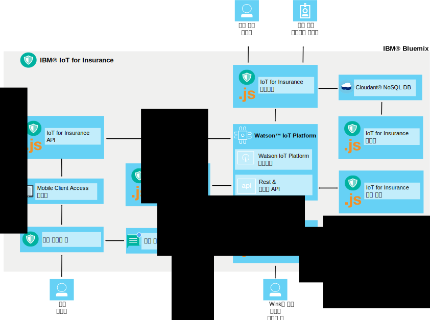

---

copyright:
  years: 2016, 2017
lastupdated: "2017-03-08"
---

<!-- Common attributes used in the template are defined as follows: -->
{:new_window: target="blank"}
{:shortdesc: .shortdesc}
{:screen: .screen}
{:codeblock: .codeblock}
{:pre: .pre}

# {{site.data.keyword.iotinsurance_short}} 정보
{: #about}

{{site.data.keyword.iotinsurance_full}}는 보험 계약자의 전체 컨텍스트 데이터를 수집하고 분석하여 개인별 맞춤 위험성 평가, 실시간 보호, 정책 비용 감소를 제공하는 통합 IoT 프로덕션 인스턴스입니다.
{: shortdesc}

{{site.data.keyword.iotinsurance_short}}에서는 위치, 날씨, 교통, 전반적인 건강상태 같은 정보를 비롯하여 보험 계약자의 자산과 상황에 대한 전체 컨텍스트 보기를 제공합니다. 보험자는 이와 같은 정보를 심층 분석하여 보험 계약자에게 개인별 맞춤 위험성 평가와 실시간 보호를 제공할 수 있습니다. 보험 계약자에게는 조기 경보, 개인별 맞춤 조언, 간소화된 청구 처리와 정산의 형태로 위험을 피할 수 있는 이점이 있습니다. 보험자에게는 청구 방지를 사용하고 자동화를 처리함으로써 고객 만족, 고객 로열티, 비용 감소와 같은 이점이 있습니다. 

## 아키텍처
{: #architecture}

{{site.data.keyword.iotinsurance_short}} 컴포넌트는 이 섹션에 설명된 것과 같이 함께 작동합니다. 이 조직은 아키텍처 다이어그램에도 표시됩니다. {{site.data.keyword.iotinsurance_short}} 대시보드에는 {{site.data.keyword.iot_short_notm}} 및 {{site.data.keyword.cloudantfull}} 데이터베이스에 저장된 데이터가 표시됩니다. 사용자의 스마트 디바이스는 클라우드를 통하거나 {{site.data.keyword.iot_short_notm}}에 직접 연결할 수 있습니다. 클라우드를 통해 연결된 경우, 사용자의 스마트 디바이스는 Transformer로 데이터를 전송하며 여기에서 데이터를 처리하고 {{site.data.keyword.iot_short_notm}}으로 전송합니다. {{site.data.keyword.weatherfull}}의 데이터를 {{site.data.keyword.iotinsurance_short}} Weather Company Data Transformer로 가져오고, 거기에서 {{site.data.keyword.iot_short_notm}}으로 가져올 수도 있습니다. 데이터는 실드 엔진에서 처리하며 실드 이벤트를 생성하여 API를 통해 조치 엔진으로 전송합니다. 조치 엔진은 선택적으로 {{site.data.keyword.mobilepushfull}}를 사용하여 사용자의 모바일 애플리케이션에 알림을 전송합니다. 사용자 또한 모바일 애플리케이션을 사용하여 경보나 오퍼링에 응답할 수 있습니다. 

**참고**: {{site.data.keyword.iotinsurance_short}}의 이전 버전에서는 응답을 처리해서 API를 통해 {{site.data.keyword.iot_short_notm}}에 리턴한 다음에 {{site.data.keyword.iotinsurance_short}} 대시보드에 리턴하도록 {{site.data.keyword.amafull}} 서비스를 사용했습니다. 이 프로세스는 {{site.data.keyword.iotinsurance_short}}의 이전 버전의 인스턴스에 대해 계속 작동합니다. 그러나 {{site.data.keyword.iotinsurance_short}}의 새 인스턴스에는 {{site.data.keyword.amashort}} 또는 {{site.data.keyword.mobilepushshort}}가 포함되지 않습니다. 모바일 앱을 사용하려면 사용자 정의 인증 프로세스를 작성해야 합니다. 푸시 알림을 사용하도록 선택적으로 [{{site.data.keyword.mobilepushshort}}의 인스턴스](../mobilepush/index.html)를 작성하여 API에 바인드할 수도 있습니다. 

## 보험 대시보드
{: #insurance_dashboard}
보험 대시보드는 보험 회사 사용자(예: 에이전트)에게 고객의 보험 가입 자산 상태에 대한 전체 보기를 제공합니다. 보험 회사 사용자는 국가, 시/도 또는 계정 레벨에서 실드와 이벤트를 볼 수 있습니다. 

샘플 보험 대시보드에는 시뮬레이션된 데이터가 로드되어 사용자가 수집하고 분석할 수 있는 정보 유형의 예를 표시합니다. 

## 샘플 모바일 앱
{: #mobileapp}
샘플 모바일 앱에서는 보험 계약자(예: 주택 소유자)가 {{site.data.keyword.iotinsurance_short}}가 센서에서 계약자의 집으로 보내는 정보를 보고 응답할 수 있습니다. 

주택 소유자는 모바일 디바이스를 사용하여 센서 제공업체의 클라우드에 연결해 데이터를 주고받을 수 있도록 서비스에 권한을 부여합니다. 예를 들어, 센서가 누수를 발견하면 주택 소유자가 모바일 스타터 앱에서 알림을 수신합니다. 자세한 정보는 [샘플 모바일 앱 설치 및 연결](iotinsurance_mobile_app.html)을 참조하십시오. 

## REST 및 실시간 API
{: #rest_api}
REST API는 모바일 스타터 앱, 보험 대시보드, 실드 엔진, 위해 제어기에서 사용됩니다. REST API를 사용하여 디바이스, 실드, 조치 사이에 존재하는 연관을 확인할 수 있습니다. 프로그래머는 이 API를 사용하여 새 사용자 작성, 이벤트 데이터 생성, 새 실드 작성과 등록, 이벤트 데이터 페치를 수행할 수 있습니다. 

사용자가 서비스 콘솔에서 액세스하는 API는 {{site.data.keyword.iotinsurance_short}}의 인스턴스에 적합하게 사용자 정의됩니다. 

API 페이지에서 다음을 수행할 수 있습니다.   
  - 사용 가능한 모든 API 호출과 연관 문서를 볼 수 있습니다. 
  - 개별 API를 호출할 수 있습니다. 모든 정보를 표시할 API 호출을 선택한 후 **사용해보기**를 클릭하십시오. 

공통 시나리오를 시작하는 데 유용한 API 예제가 제공됩니다. 자세한 정보는 [{{site.data.keyword.iotinsurance_short}} API 예제](https://github.com/IBM-Bluemix/iot4i-api-examples-nodejs)를 참조하십시오. 

## Transformer
{: #transformer}
Transformer는 클라우드 서버 API에서 새 정보를 요청하여 {{site.data.keyword.iotinsurance_short}}의 데이터와 일치하도록 변환합니다. 그런 다음 데이터는 나머지 {{site.data.keyword.iotinsurance_short}} 구현에서 사용할 수 있도록 공개됩니다. 사용자는 Transformer 컴포넌트에 센서 클라우드 데이터에 액세스하고 기록된 데이터를 처리할 수 있는 권한을 부여해야 합니다. {{site.data.keyword.iotinsurance_short}}는 다중 클라우드 공급업체 및 디바이스를 지원합니다. 지원되는 클라우드 공급업체의 전체 목록 및 디바이스를 {{site.data.keyword.iotinsurance_short}}에 연결하는 방법에 대한 지시사항은 [지원되는 디바이스 및 공급업체](iotinsurance_supporteddevices.html)를 참조하십시오.

## Weather Company Data Transformer
{: #wcdtransformer}
Weather Company 애플리케이션은 Weather Company 데이터 서비스에서 IoT4I 데이터 스트림으로 관련 기상 데이터를 삽입합니다. 그러면 이 데이터를 사용하여 기상 사용 가능 실드를 빌드할 수 있습니다. 

**참고**: Weather Company Data Transformer는 개념 증명 또는 기술적 미리보기로서만 지원되며 프로덕션 사용을 위한 것은 아닙니다. 

## 실드 엔진
{: #shield_engine}
이벤트에 저장된 정보를 기반으로 실드 엔진에서 누수 같은 위해 발생 여부를 판별합니다. 위해가 식별되면 위해 조치 엔진에 전달됩니다. 

실드는 고객이 보험 제공업체에게서 제공받는 특정 보호입니다. 예를 들어, 주택 소유자는 화재, 수해, 도난, 기타 위해로부터 보호하기 위해 주택에 대한 보험을 구매합니다. {{site.data.keyword.iotinsurance_short}} 솔루션에는 침수에 대한 기본 제공 실드가 있습니다. 주택에 침수와 관련된 사건이 발생하면 고객이 경보를 수신하고 응답할 수 있습니다. 개발자는 REST API를 사용하여 실드를 추가할 수 있습니다.   

실드는 {{site.data.keyword.iotinsurance_short}} 분석 엔진에서 실행됩니다. 분석 엔진은 위해 유형(예: *침수 발견*), 위해를 전송한 센서의 사용자 계정, 계정과 연관된 실드를 식별합니다. 해당 정보를 기반으로 조치를 수행할 수 있습니다. {{site.data.keyword.iotinsurance_short}} 실드 라이브러리에 포함된 실드를 사용 또는 수정하거나 사용자 자신의 실드를 작성해서 구현할 수 있습니다. 실드 및 [{{site.data.keyword.iotinsurance_short}} 실드 라이브러리 ](https://github.com/ibm-watson-iot/ioti-shields){: new_window}에 대한 자세한 정보는 [실드 툴킷](iotinsurance_shield_toolkit.html)을 참조하십시오.

## 조치 엔진
{: #action_engine}
조치 엔진은 실드에 지정된 정보를 기반으로 수행할 조치를 판별합니다. 

{{site.data.keyword.iotinsurance_short}} API를 사용하여 JavaScript에서 새 실드를 작성할 수 있습니다. 
