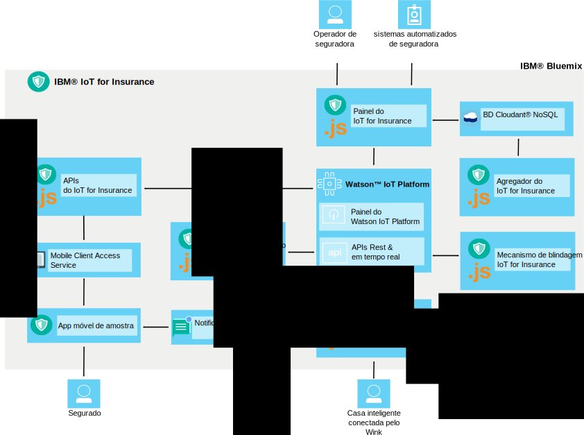

---

copyright:
  years: 2016, 2017
lastupdated: "2017-03-08"
---

<!-- Common attributes used in the template are defined as follows: -->
{:new_window: target="blank"}
{:shortdesc: .shortdesc}
{:screen: .screen}
{:codeblock: .codeblock}
{:pre: .pre}

# Sobre o {{site.data.keyword.iotinsurance_short}}
{: #about}

O {{site.data.keyword.iotinsurance_full}} é uma instância de produção IoT integrada que coleta e analisa dados de contexto completos de segurados para fornecer avaliações de risco personalizadas, proteção em tempo real e reduções de custo de política.
{: shortdesc}

O {{site.data.keyword.iotinsurance_short}} fornece uma visualização de contexto completa dos ativos e da situação do segurado, incluindo informações, como localização, clima, tráfego e bem-estar geral. Uma análise detalhada dessas informações permite que o segurador forneça avaliação de risco personalizada e proteção em tempo real para o segurado. Os benefícios para o segurado incluem a prevenção de riscos na forma de alertas precoces, avisos personalizados e processamento e quitação aperfeiçoados de reclamações. Os benefícios para o segurador incluem satisfação do cliente, lealdade do cliente e redução de despesas usando prevenção de reclamações e automação de processamento.

## Arquitetura
{: #architecture}

Os componentes do {{site.data.keyword.iotinsurance_short}} funcionam juntos
conforme descrito nesta seção. Essa organização também é mostrada no diagrama de
arquitetura. O painel do {{site.data.keyword.iotinsurance_short}} exibe dados
armazenados no {{site.data.keyword.iot_short_notm}} e no banco de dados
{{site.data.keyword.cloudantfull}}. Os dispositivos inteligentes do usuário podem ser conectados por meio da nuvem ou diretamente no {{site.data.keyword.iot_short_notm}}. Se eles forem
conectados por meio da nuvem, enviarão dados para o Transformer, que processará os dados e os
enviará para o {{site.data.keyword.iot_short_notm}}. Os dados do {{site.data.keyword.weatherfull}} também podem ser puxados para o
{{site.data.keyword.iotinsurance_short}} Weather Company Data Transformer e de lá para
o {{site.data.keyword.iot_short_notm}}. Os dados são processados pelo mecanismo de
blindagem, que gera um evento de blindagem e o envia, por meio de APIs, para o Mecanismo de ação. Opcionalmente, o Mecanismo de ação pode usar o {{site.data.keyword.mobilepushfull}} para enviar notificações para o aplicativo móvel do usuário. O usuário também pode utilizar o aplicativo móvel para responder aos
alertas e ofertas.

**Nota**: versões anteriores do {{site.data.keyword.iotinsurance_short}} usavam o serviço
{{site.data.keyword.amafull}} para processar as respostas e retorná-las por meio de
APIs para o {{site.data.keyword.iot_short_notm}} e, depois, para o painel {{site.data.keyword.iotinsurance_short}}. Esse processo continua a funcionar para
instâncias das versões anteriores do {{site.data.keyword.iotinsurance_short}}. Entretanto,
novas instâncias do {{site.data.keyword.iotinsurance_short}} não incluem o
{{site.data.keyword.amashort}} nem o {{site.data.keyword.mobilepushshort}}. Para
usar o app móvel, deve-se criar um processo de autenticação customizado. Opcionalmente, também é possível
criar e vincular uma [instância do {{site.data.keyword.mobilepushshort}}](../mobilepush/index.html) à API para ativar as notificações push.

## Painel do seguro
{: #insurance_dashboard}
O Painel do seguro fornece aos usuários da companhia de seguros, como agentes, uma visualização completa do que está acontecendo com os ativos segurados de seus clientes. Eles podem ver as proteções e os eventos em níveis de país, estado ou conta.

O painel de seguro de amostra é carregado com dados simulados para mostrar um exemplo do tipo de informações que podem ser coletadas e analisadas.

## App móvel de amostra
{: #mobileapp}
O app móvel de amostra é onde os segurados, como proprietários, visualizam e respondem às informações que o {{site.data.keyword.iotinsurance_short}} envia dos sensores em suas casas.

Usando um dispositivo móvel, os proprietários de imóveis autorizam o serviço a conectar-se à nuvem do provedor de sensor para enviar e receber dados. Por exemplo, um proprietário de imóvel pode receber uma notificação no app iniciador móvel quando o sensor detecta um vazamento de água. Para obter mais informações, consulte [Instalando e conectando o app móvel de amostra](iotinsurance_mobile_app.html).

## APIs REST e em tempo real
{: #rest_api}
As APIs REST são usadas pelo app iniciador móvel, o painel de seguro, o mecanismo de
blindagem e o controlador de risco. Elas permitem que os usuários conheçam as associações
que existem entre os dispositivos, as blindagens e as ações. Usando as APIs, os
programadores podem criar novos usuários, gerar dados de eventos, criar e registrar novas
blindagens e buscar dados de eventos.

A API que você acessa a partir do console de serviço é customizada para sua instância do {{site.data.keyword.iotinsurance_short}}.

Na página da API, é possível  
  - Visualizar todas as chamadas API disponíveis e a documentação associada.
  - Tentar chamadas API individuais.  Selecione uma chamada API para exibir todas as informações e, em seguida, clique em **Experimente!**.

Os exemplos de API estão disponíveis para ajudá-lo a iniciar a utilização de cenários comuns. Para obter mais informações, consulte
[Exemplos de API do {{site.data.keyword.iotinsurance_short}}](https://github.com/IBM-Bluemix/iot4i-api-examples-nodejs).

## Transformador
{: #transformer}
O Transformer solicita novas informações da API do servidor em nuvem e transforma-as para corresponder aos dados no {{site.data.keyword.iotinsurance_short}}. Os dados são então publicados para o restante da implementação do {{site.data.keyword.iotinsurance_short}} usar. Os usuários devem autorizar o componente Transformer a acessar dados da nuvem do sensor e processar os dados registrados. O {{site.data.keyword.iotinsurance_short}} suporta vários fornecedores de nuvem e
dispositivos. Para obter uma lista completa dos fornecedores de nuvem suportados e instruções
sobre como conectar dispositivos ao {{site.data.keyword.iotinsurance_short}}, veja [Dispositivos e fornecedores suportados](iotinsurance_supporteddevices.html).

## Weather Company Data Transformer
{: #wcdtransformer}
O aplicativo Weather Company injeta dados climáticos relevantes do serviço Weather Company Data
no fluxo de dados IoT4I. Esses dados podem então ser usados para construir blindagens ativadas pelo clima.

**Nota**: o Weather Company Data Transformer é suportado somente como uma prova
de conceito ou como uma visualização técnica e não é destinado para uso de produção.

## Mecanismo de blindagem
{: #shield_engine}
Com base nas informações armazenadas em um evento, o mecanismo de Blindagem determina se
um risco, como um vazamento de água, ocorreu. Se um risco for identificado, ele será
passado para o Mecanismo de ação.

Uma proteção é um item específico que um cliente adquire do provedor de seguro. Por exemplo, um proprietário de imóvel compra seguro para sua casa para protegê-la contra fogo, danos hídricos, assaltos e outros riscos. A solução {{site.data.keyword.iotinsurance_short}} fornece uma proteção integrada com relação à água. Os clientes são alertados e podem responder quando um evento que envolve água ameaça sua casa. Usando a API REST, os desenvolvedores podem incluir mais proteções.  

As proteções são executadas no mecanismo de análise do {{site.data.keyword.iotinsurance_short}}. O mecanismo de análise identifica o tipo de risco (por exemplo, *Detecção de água*), a conta do usuário do sensor que enviou o risco e as proteções que estão associadas à conta. A ação pode ser executada com base nessas informações. É possível usar
ou modificar as blindagens que estão incluídas na biblioteca de blindagens do {{site.data.keyword.iotinsurance_short}} ou criar e implementar suas próprias
blindagens. Para obter mais informações sobre as blindagens e a biblioteca de blindagens do [{{site.data.keyword.iotinsurance_short}} ](https://github.com/ibm-watson-iot/ioti-shields){: new_window}, veja o [Kit de ferramentas de blindagem](iotinsurance_shield_toolkit.html).

## Mecanismo de ação
{: #action_engine}
O Mecanismo de ação determina as ações a serem tomadas com base nas informações que são
especificadas na blindagem.

É possível criar novas proteções no JavaScript usando a API do {{site.data.keyword.iotinsurance_short}}.

# Links Relacionados
{: #rellinks}

## Tutoriais e amostras
{: #samples}
* [Código do app móvel de amostra
no GitHub ](https://github.com/ibm-watson-iot/ioti-mobile){:new_window}

## Referência de API
{: #api}
* [API {{site.data.keyword.iotinsurance_short}} ](https://iot4i-api-docs.mybluemix.net/){:new_window}
* [Exemplos de API {{site.data.keyword.iotinsurance_short}} ](https://github.com/IBM-Bluemix/iot4i-api-examples-nodejs/#iot-for-insurance-api-examples){:new_window}

## Links Relacionados
{: #general}
* [Documentação do {{site.data.keyword.iot_full}}](https://console.ng.bluemix.net/docs/services/IoT/index.html){:new_window}
* [Fórum de suporte do desenvolvedor ](https://developer.ibm.com/answers/search.html?f=&type=question&redirect=search%2Fsearch&sort=relevance&q=%2B[iot]%20%2B[bluemix]){:new_window}
* [Fórum de suporte do
Stack overflow ](http://stackoverflow.com/questions/tagged/ibm-bluemix){:new_window}
