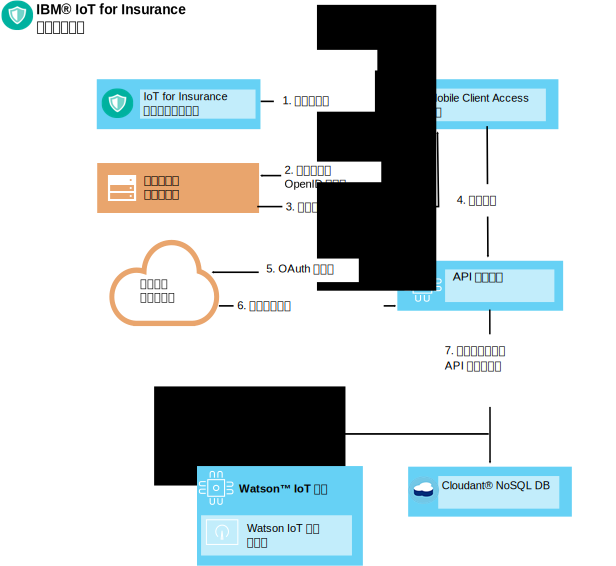
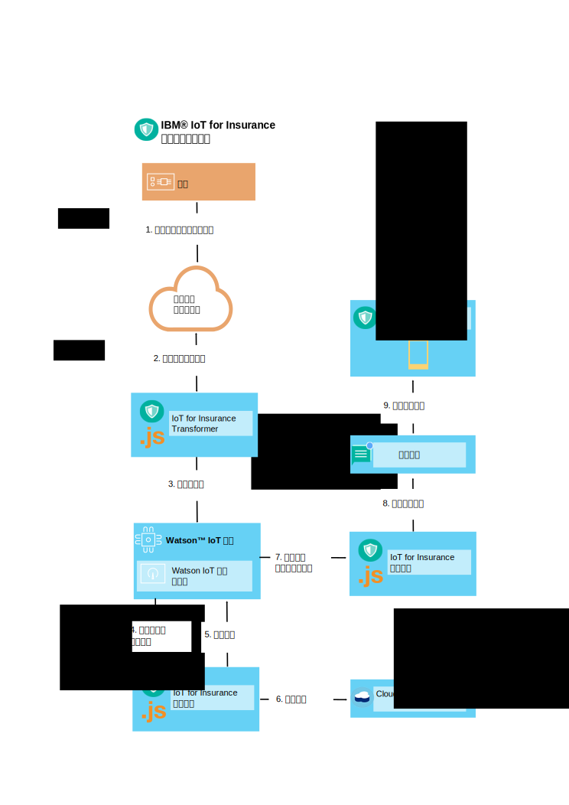

---

copyright:
  years: 2016, 2017
lastupdated: "2017-03-08"
---

<!-- Common attributes used in the template are defined as follows: -->
{:new_window: target="blank"}
{:shortdesc: .shortdesc}
{:screen: .screen}
{:codeblock: .codeblock}
{:pre: .pre}


# 设备工具包
{: #iot4i_connecting_devices}
通过使用 {{site.data.keyword.iotinsurance_full}} 设备工具包，您可以将任何设备供应商生产的设备连接到 {{site.data.keyword.iotinsurance_short}} 服务。
{:shortdesc}

设备可以将数据直接发送到 {{site.data.keyword.iot_full}}，也可以通过设备供应商的云进行发送。您可通过注册授权用户，然后设置设备事件生成和接收来连接设备。有关受支持设备和供应商以及样本集成过程的列表，请参阅[受支持的设备和供应商](iotinsurance_supporteddevices.html)。

使用以下各部分中的指示信息来连接设备。

## 注册授权用户
{: #reg_users}
如果设备供应商的云支持将 OAuth 作为授权协议，那么 {{site.data.keyword.iotinsurance_short}} 可以充当 OAuth 客户机并连接到供应商的云。必须从设备供应商处获取客户机标识和授权，才可以代表用户接收和更新数据。  

### OAuth 流程
{: #oauth_flow}
下图显示的是简化的 OAuth 流程，其中通过 OAuth 提供者（例如，Facebook）对 {{site.data.keyword.iotinsurance_short}} 进行了授权。在此图中，{{site.data.keyword.iotinsurance_short}} 请求访问 OAuth 客户机，这会将访问请求重定向到 OAuth 提供者。提供者会生成 HTML 表单，{{site.data.keyword.iotinsurance_short}} 用户可在其中输入用户标识和密码。然后，提供者会授予权限，并可选择返回 OAuth 代码以启用更新。此图显示的是非常基本的流程；OAuth 提供者通常会为图中所描绘的步骤提供多个 REST 端点。  


### 用户注册流程
{: #user_reg_flow}

用户注册根据供应商而变化。要了解如何获取所需的云访问令牌，以及如何使用 API 将它们注册到 {{site.data.keyword.iotinsurance_short}}，请参阅[受支持的设备和供应商](iotinsurance_supporteddevices.html)。

#### 移动注册流程（*已弃用*）

**注**：移动应用程序仅支持 Wink，且对 {{site.data.keyword.amashort}} 的更改已禁用本节中所述的用户注册流程。
此流程仅用于 {{site.data.keyword.iotinsurance_short}} V1.0 版的现有实例。

下图显示的是简化的用户注册流程。在此示例中，新用户注册请求是从移动设备发起的。请求由 {{site.data.keyword.amafull}} 进行处理，这将向客户的支持系统提供标识，并向 API 注册服务发送请求。API 注册服务会将 OAuth 请求重定向到设备供应商的云，再由该云验证向客户的支持系统进行的认证。设备供应商的云会将授权代码或令牌返回给 API 注册服务。然后，注册服务会在 {{site.data.keyword.iot_short_notm}} 和 {{site.data.keyword.cloudant}} 中创建用户和唯一 API 令牌。



## 生成设备事件
{: #generating_device_events}
如果制造商提供了直接授权代码，可以与用户注册期间生成的 API 密钥一起使用，那么设备可以连接到 {{site.data.keyword.iot_short_notm}}。[在 {{site.data.keyword.iot_short_notm}} 上开发设备](https://console.{DomainName}/docs/services/IoT/devices/device_dev_index.html)中描述了此连接类型。

设备经由供应商的云进行连接时，会通过使用设备供应商提供的 REST 端点的连接来发送设备事件。用户注册期间获取的 OAuth 不记名令牌会为这些调用授予权限。{{site.data.keyword.iotinsurance_short}} Transformer 会从供应商的云中拉取每个设备的关联用户信息。然后，就会在其传递到 {{site.data.keyword.iot_short_notm}} 的设备事件数据中包含用户关联。

设备直接连接到 {{site.data.keyword.iot_short_notm}} 时，设备和用户之间的链接会存储在 {{site.data.keyword.iot_short_notm}} 中。{{site.data.keyword.iotinsurance_short}} Transformer 会对这些信息进行高速缓存，然后使用用户的链接来丰富设备事件。

### 云到云 - 设备事件流程
{: #device_event_flow}
下图显示的是简化的设备事件流程。在此示例中，设备会检查漏水情况。{{site.data.keyword.iotinsurance_short}} Transformer 会定期轮询供应商的云，以确定设备状态是否有变化。检测到事件时，Transformer 会将该事件发送到 {{site.data.keyword.iot_short_notm}}。{{site.data.keyword.iotinsurance_short}} 保障引擎对事件进行分析后，会生成警报并将警报存储在 {{site.data.keyword.cloudant}} 中。{{site.data.keyword.iot_short_notm}} 会将警报传输到 {{site.data.keyword.iotinsurance_short}} 操作引擎进行分析。然后，操作引擎通过 {{site.data.keyword.mobilepushshort}} 将警报推送到消费者的移动应用程序。  



### 如何设置设备状态轮询
{: #device_polling}
Transformer 微服务负责轮询和接收状态更新。如果设备供应商的 REST API 支持异步设备更新，那么可以建立预订，使 Transformer 在发生设备状态更新时接收这些更新。否则，可以将 Transformer 设置为轮询设备状态更新。

以下伪函数调用用于定义轮询流程：

*表 1：伪函数调用*

伪函数 | 描述
------------- | -------------
`getRegisteredUserDevices(userName)` | 检索正在使用该用户名的可用注册用户设备。
`getProviderDevices(providerUserToken)` | 调用设备提供者 REST API 来获取正在使用该用户不记名令牌的用户设备的状态。
`findDevicesToAdd()、findDevicesToDel() 和 findDevicesToUpdate()` | 将已注册的设备与设备提供者中当前存在的设备进行比较，以查找新设备、已删除设备和已修改设备。`syncData()` | 通过删除旧设备、添加新设备和更新已修改设备来同步用户设备。  
 `notifyIoTP()` | 将更改（如 MQTT 事件）通知 {{site.data.keyword.iot_short_notm}}。
Transformer 向 {{site.data.keyword.iot_short_notm}} 发布状态更新，如以下代码示例中所示。
```
// 如 VCAP.services 中所指定
var appClientConfig = {
  "org":iot_org,
  "id":iot_appid,
  "auth-key":iot_authkey,
  "auth-token":iot_authtoken
};

var appClient = new iotclient.IotfApplication(appClientConfig);
try {
  appClient.connect();
} catch (err) {
  console.log('IoT connect failed with error' +err);
}

...

// 生成 IoT 事件，请注意，内容为任意 JSON 对象
try {
  appClient.publishDeviceEvent("iOS",userToken.username, "status", "json", JSON.stringify(iotDevice));
} catch (err) {
  console.log('IoT publish failed with error' +err +'foruser' +userToken.username);
}

```

Transformer 使用 {{site.data.keyword.cloudant}} 来访问用户数据（例如，不记名令牌），并存储最新的已知设备状态以用于比较。以下 {{site.data.keyword.cloudant}} 方法和代码片段仅供参考。  

`getUserTokensByProvider` - 此方法用于获取特定提供者的所有用户令牌。

```
dbHelper.getUserTokensByProvider(provider, function (err,results) {
  if (!err) {
    console.log(results.token.length + " tokens retrieved for provider: " + Provider);
  } else {
    console.log("no tokens returned, err:",err);
  }
  });
```

`getDevicesByUser` - 此方法用于按用户名来检索所有已注册用户设备。
```
dbHelper.getDevicesByUser(username, function (err,results) {
  if (!err) {
    console.log(results.length + " devices retrieved for username: " + username);
  } else {
    console.log("no devices returned, err:",err);
  }
  });
```

`bulkUpdateDevices` - 此方法用于更新或添加一组用户设备。
```
dbHelper.bulkUpdateDevices(userDevices, function (err,results) {
  if (!err) {
    console.log(results.length + " devices updated");
    } else {
      console.log("no devices updated, err:",err);
    }
  });
```

`bulkDelDevices` - 此方法用于删除一组用户设备。
```
dbhelper.bulkDelDevices(userDevices, function (err, results) {
  if (!err) {
    console.log(results.length + "devices deleted");
  } else {
    console.log("no devices deleted, err:",err);
  }
  });

```


## 部署新的 Transformer 实例
{: #deploy_new_transformer}
您可以在部署了 {{site.data.keyword.iotinsurance_short}} 的组织和空间中部署新的 Transformer 实例。  

**注：**有关部署新 Transformer 实例时的信息和协助，请参阅[联系支持](../support/index.html#contacting-support)。

开始之前，请下载并安装 Cloud Foundry 命令行界面。使用 Cloud Foundry 命令行界面来修改服务实例，并将其部署到 {{site.data.keyword.iot_short_notm}}。有关更多信息，请参阅[开始使用 cf 命令行界面编码 ](https://www.ng.bluemix.net/docs/#starters/install_cli.html){:new_window}。

1. 在命令行界面中，使用以下命令将目录更改为`包含源和部署描述符 YML 文件的目录`：
```
$ cd directory_name
```
2. 列出 {{site.data.keyword.iotinsurance_short}} 中的所有应用程序，并记下 Transformer 的名称。名称以 `transformer` 结尾。

3. 停止 {{site.data.keyword.iotinsurance_short}} Transformer。例如，
```
$ cf stop iot4i-dev-transformer
```
4. 列出 {{site.data.keyword.iotinsurance_short}} 中包含的所有服务，并记下 {{site.data.keyword.iot_short_notm}} 和 {{site.data.keyword.cloudant}} 服务的名称。{{site.data.keyword.iot_short_notm}} 服务的名称包含字母 `iotf`。{{site.data.keyword.cloudant}} 服务的名称包含 `cloudant`。

5. 使用先前步骤中记下的名称，创建类似于以下示例的部署描述符文件。  
  ```
  applications:
  - path: .
    memory: 1024M
    instances: 1
    name: iot4i-dev-transformer
    no-route: false
    disk_quota: 1024M
    command: node index.js
    services:
    - iot4i-iotf-service
    - iot4i-cloudantNoSQLDB
    env:
       ENV: dev
       APIDOMAIN: iot4insurance-api-v.mybluemix.net
       NODE_MODULES_CACHE: false
  ```
6. 通过使用以下命令，并将 `newtransformer` 替换为部署描述符文件的名称，以将 Transformer 推送到 {{site.data.keyword.Bluemix_notm}} 中：
  ```
  $ cf push -f newtransformer.yml
  ```
7. 可以使用以下命令来检查日志以查看部署消息：
  ```
  $ cf logs iot4i-dev-transformer
  ```
