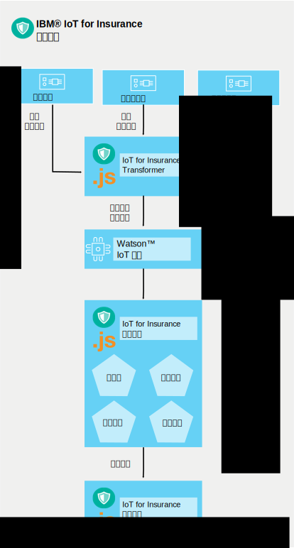

---

copyright:
  years: 2016
lastupdated: "2016-10-26"

---

{:new_window: target="\_blank"}
{:shortdesc: .shortdesc}
{:screen:.screen}
{:codeblock:.codeblock}

# 服务工作方式
{{site.data.keyword.iotinsurance_full}} 可创建流来收集、管理和分析所连接的保单持有者的数据。
{:shortdesc}

保险提供者在 {{site.data.keyword.Bluemix_notm}} 组织内创建 {{site.data.keyword.iotinsurance_short}} 的实例。承保人的客户在家中有传感器，可连接到传感器提供者的云。客户从移动设备授权 {{site.data.keyword.iotinsurance_short}} 服务接收传感器数据。{{site.data.keyword.iotinsurance_short}} Transformer 连接到传感器提供者的云，拉取每个用户的数据并将其发送给 {{site.data.keyword.iot_short_notm}} 服务器。如果传感器显示客户家中可提供在承保
人保障中指定的参数，那么将向承保人仪表板和客户设备发送通知。

连接的传感器会检测事件（例如，漏水），并向智能住宅供应商（例如，Wink）发送信息。{{site.data.keyword.iotinsurance_short}} 使用其与智能住宅供应商的云建立的连接来检测信号，并创建警报有效内容。有效内容通过 MQTT 发送给 {{site.data.keyword.iotinsurance_short}} 保障引擎进行处理。保障引擎会分析有效内容是否与保障规则定义的条件相匹配。如果匹配，保障引擎将通过 MQTT 向 {{site.data.keyword.iotinsurance_short}} 操作引擎发出危险有效内容。操作引擎会针对该类型的危险执行保障定义的操作，例如向房主发送短信。

{{site.data.keyword.iotinsurance_short}} 依赖 {{site.data.keyword.iot_full}} 在其组件之间传递警报和危险有效内容。完整的工作系统需要用户、保障以及用户与保障之间的关联。

# 相关链接
{: #rellinks}

## 教程和样本
{: #samples}
* [GitHub 上的样本移动应用程序代码](https://github.com/ibm-watson-iot/ioti-mobile){:new_window}

## API 参考
{: #api}
* [{{site.data.keyword.iotinsurance_short}} API](https://iot4i-api-docs.mybluemix.net/){:new_window}
* [{{site.data.keyword.iotinsurance_short}} API 示例](https://github.com/IBM-Bluemix/iot4i-api-examples-nodejs/#iot-for-insurance-api-examples){:new_window}

## 相关链接
{: #general}
* [{{site.data.keyword.iot_full}}文档](https://console.ng.bluemix.net/docs/services/IoT/index.html)
* [开发人员支持论坛](https://developer.ibm.com/answers/search.html?f=&type=question&redirect=search%2Fsearch&sort=relevance&q=%2B[iot]%20%2B[bluemix])
* [堆栈溢出支持论坛](http://stackoverflow.com/questions/tagged/ibm-bluemix)
