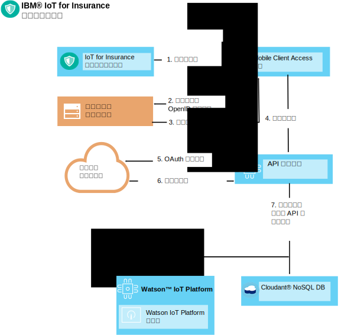
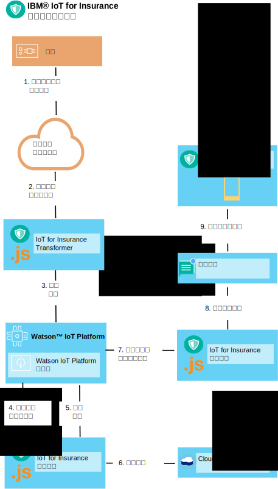

---

copyright:
  years: 2016, 2017
lastupdated: "2017-03-08"
---

<!-- Common attributes used in the template are defined as follows: -->
{:new_window: target="blank"}
{:shortdesc: .shortdesc}
{:screen: .screen}
{:codeblock: .codeblock}
{:pre: .pre}


# 使用裝置工具箱
{: #iot4i_connecting_devices}
使用「{{site.data.keyword.iotinsurance_full}} 裝置工具箱」，即可將任何裝置供應商所製造的裝置連接至 {{site.data.keyword.iotinsurance_short}} 服務。
{:shortdesc}

裝置可以將資料直接或透過裝置供應商的雲端傳送至 {{site.data.keyword.iot_full}}。登錄授權使用者，然後設定裝置事件產生及接收，即可連接裝置。如需支援的裝置及供應商清單，以及範例整合程序，請參閱[支援的裝置及供應商](iotinsurance_supporteddevices.html)。

請使用下列各節中的指示來連接裝置。

## 登錄授權使用者
{: #reg_users}
裝置供應商的雲端支援 OAuth 作為授權通訊協定時，{{site.data.keyword.iotinsurance_short}} 可以作為 OAuth 用戶端，並且連接至供應商的雲端。需要有取自裝置供應商的用戶端 ID 及授權，才能代表使用者接收及更新資料。  

### OAuth 流程
{: #oauth_flow}
下圖顯示透過 OAuth 提供者（例如 Facebook）授權 {{site.data.keyword.iotinsurance_short}} 的簡化 OAuth 流程。在本圖中，{{site.data.keyword.iotinsurance_short}} 要求存取 OAuth 用戶端，以將存取要求重新導向至 OAuth 提供者。提供者會產生 HTML 表單，以供 {{site.data.keyword.iotinsurance_short}} 使用者輸入使用者 ID 及密碼。提供者接著會授與授權，以及選擇性地傳回 OAuth 程式碼來啟用更新項目。本圖顯示非常基本的流程；OAuth 提供者一般會提供本圖中所說明步驟的多個 REST 端點。  


### 使用者登錄流程
{: #user_reg_flow}

使用者登錄會視供應商而不同。若要瞭解如何取得必要的雲端存取記號，以及如何使用 API 向 {{site.data.keyword.iotinsurance_short}} 登錄它們，請參閱[支援的裝置及供應商](iotinsurance_supporteddevices.html)。

#### 行動登錄流程（*已淘汰*）

**附註**：行動應用程式只支援 Wink，且 {{site.data.keyword.amashort}} 的變更已停用本節所述的使用者登錄流程。此流程僅適用於 {{site.data.keyword.iotinsurance_short}} 1.0 版的現有實例。

下圖顯示簡化使用者登錄流程。在此範例中，是從行動裝置提出新的使用者登錄要求。要求是由 {{site.data.keyword.amafull}} 處理，以將 ID 提供給客戶的支援系統，並將要求傳送給 API 登錄服務。API 登錄服務會將 OAuth 要求重新導向至裝置供應商的雲端，接著驗證與客戶支援系統的鑑別。裝置供應商的雲端會將授權碼或記號傳回給 API 登錄服務。登錄服務接著會在 {{site.data.keyword.iot_short_notm}} 及 {{site.data.keyword.cloudant}} 中建立使用者及唯一 API 記號。



## 產生裝置事件
{: #generating_device_events}
製造商提供直接授權碼以與使用者登錄期間所產生的 API 金鑰搭配使用時，裝置可以連接至 {{site.data.keyword.iot_short_notm}}。[在 {{site.data.keyword.iot_short_notm}} 上開發裝置](https://console.{DomainName}/docs/services/IoT/devices/device_dev_index.html)中會說明這類型連線。

透過供應商的雲端連接裝置時，會透過使用裝置供應商所提供之 REST 端點的連線來傳送裝置事件。使用者登錄期間所取得的 OAuth 載送記號會授與這些呼叫的授權。{{site.data.keyword.iotinsurance_short}} Transformer 會從供應商的雲端取回每一個裝置的關聯使用者資訊。它接著會包括傳遞給 {{site.data.keyword.iot_short_notm}} 之裝置事件資料的使用者關聯。

直接將裝置連接至 {{site.data.keyword.iot_short_notm}} 時，裝置與使用者之間的鏈結會儲存在 {{site.data.keyword.iot_short_notm}} 中。{{site.data.keyword.iotinsurance_short}} Transformer 會快取該資訊，然後利用使用者鏈結來強化裝置事件。

### 雲端對雲端 - 裝置事件流程
{: #device_event_flow}
下圖顯示簡化裝置事件流程。在此範例中，裝置偵測到漏水。{{site.data.keyword.iotinsurance_short}} Transformer 會定期輪詢供應商的雲端，以尋找裝置狀態的變更。偵測到事件時，轉換器會將它傳送給 {{site.data.keyword.iot_short_notm}}。{{site.data.keyword.iotinsurance_short}} 防護引擎會分析事件，然後產生警示，並將警示儲存在 {{site.data.keyword.cloudant}} 中。{{site.data.keyword.iot_short_notm}} 會將警示傳送給 {{site.data.keyword.iotinsurance_short}} 動作引擎，以進行分析。動作引擎接著會透過 {{site.data.keyword.mobilepushshort}} 將警示推送至消費者的行動應用程式。  



### 如何設定輪詢裝置狀態
{: #device_polling}
轉換器微服務會負責輪詢及接收狀態更新。如果裝置供應商的 REST API 支援非同步裝置更新，您可以建立訂閱，以讓轉換器接收發生的裝置狀態更新。否則，您可以設定轉換器來輪詢裝置狀態更新。

下列虛擬函數呼叫可用來定義輪詢處理程序：

*表 1：虛擬函數呼叫*

虛擬函數 | 說明
------------- | -------------
`getRegisteredUserDevices(userName)` | 擷取正在使用使用者名稱的可用已登錄使用者裝置。
`getProviderDevices(providerUserToken)` | 呼叫裝置提供者 REST API，以取得正在使用使用者載送記號的使用者裝置狀態。
`findDevicesToAdd()、findDevicesToDel()、findDevicesToUpdate()` | 比較已登錄裝置與目前存在於裝置提供者中的裝置，以尋找新的裝置、已刪除裝置及已修改裝置。
` syncData()` | 刪除舊的裝置、新增裝置，以及更新已修改裝置，來同步化使用者裝置。  
 `notifyIoTP()` | 通知 {{site.data.keyword.iot_short_notm}} 有關例如 MQTT 事件的變更。

轉換器會將狀態更新張貼至 {{site.data.keyword.iot_short_notm}}（如下列程式碼範例所示）。
```
// as specified in VCAP.services
var appClientConfig = {
  "org":iot_org,
  "id":iot_appid,
  "auth-key":iot_authkey,
  "auth-token":iot_authtoken
};

var appClient = new iotclient.IotfApplication(appClientConfig);
try {
  appClient.connect();
} catch (err) {
  console.log('IoT connect failed with error' +err);
}

...

// generate IoT event, note that the content is an arbitrary JSON object  
try {
  appClient.publishDeviceEvent("iOS",userToken.username, "status", "json", JSON.stringify(iotDevice));
} catch (err) {
  console.log('IoT publish failed with error' +err +'foruser' +userToken.username);
}

```

轉換器會使用 {{site.data.keyword.cloudant}} 來存取使用者資料（例如，載送記號），以及基於比較來儲存前一個已知裝置狀態。下列 {{site.data.keyword.cloudant}} 方法及程式碼 Snippet 是基於參照而提供。  

`getUserTokensByProvider`  此方法會取得特定提供者的所有使用者記號。

```
dbHelper.getUserTokensByProvider(provider, function (err,results) {
  if (!err) {
    console.log(results.token.length + " tokens retrieved for provider: " + Provider);
  } else {
    console.log("no tokens returned, err:",err);
  }
  });
```

`getDevicesByUser` - 此方法會依使用者名稱來擷取所有已登錄使用者裝置。
```
dbHelper.getDevicesByUser(username, function (err,results) {
  if (!err) {
    console.log(results.length + " devices retrieved for username: " + username);
  } else {
    console.log("no devices returned, err:",err);
  }
  });
```

`bulkUpdateDevices` - 此方法會更新或新增一組使用者裝置。
```
dbHelper.bulkUpdateDevices(userDevices, function (err,results) {
  if (!err) {
    console.log(results.length + " devices updated");
    } else {
      console.log("no devices updated, err:",err);
    }
  });
```

`bulkDelDevices` - 此方法會刪除一組使用者裝置。
```
dbhelper.bulkDelDevices(userDevices, function (err, results) {
  if (!err) {
    console.log(results.length + "devices deleted");
  } else {
    console.log("no devices deleted, err:",err);
  }
  });

```


## 部署新的轉換器實例
{: #deploy_new_transformer}
您可以在部署 {{site.data.keyword.iotinsurance_short}} 的相同組織及空間中部署新的轉換器實例。  

**附註：**如需部署新轉換器實例的相關資訊和協助，請參閱[與支援中心聯絡](../support/index.html#contacting-support)。

開始之前，請下載並安裝 Cloud Foundry 指令行介面。使用 Cloud Foundry 指令行介面，以修改服務實例並將其部署至 {{site.data.keyword.iot_short_notm}}。如需相關資訊，請參閱[開始使用 cf 指令行介面撰寫程式碼 ](https://www.ng.bluemix.net/docs/#starters/install_cli.html){:new_window}。

1. 在指令行介面中，使用下列指令，將目錄切換至`包含來源及部署描述子 YML 檔的目錄`：
```
$ cd directory_name
```
2. 列出 {{site.data.keyword.iotinsurance_short}} 中的所有應用程式，並記下轉換器的名稱。名稱的結尾為 `transformer`。

3. 停止 {{site.data.keyword.iotinsurance_short}} Transformer。例如，
```
$ cf stop iot4i-dev-transformer
```
4. 列出 {{site.data.keyword.iotinsurance_short}} 中內含的所有服務，並記下 {{site.data.keyword.iot_short_notm}} 及 {{site.data.keyword.cloudant}} 服務的名稱。{{site.data.keyword.iot_short_notm}} 服務的名稱中會包括 `iotf` 這些字母。{{site.data.keyword.cloudant}} 服務的名稱中會包括 `cloudant`。

5. 使用您在先前步驟中所記下的名稱，建立與下列範例類似的部署描述子檔案。  
  ```
  applications:
  - path: .
    memory: 1024M
    instances: 1
    name: iot4i-dev-transformer
    no-route: false
    disk_quota: 1024M
    command: node index.js
    services:
    - iot4i-iotf-service
    - iot4i-cloudantNoSQLDB
    env:
       ENV: dev
       APIDOMAIN: iot4insurance-api-v.mybluemix.net
       NODE_MODULES_CACHE: false
  ```
6. 使用下列指令，將 `newtransformer` 取代為部署描述子檔案名稱，以將轉換器推送至 {{site.data.keyword.Bluemix_notm}}：
  ```
  $ cf push -f newtransformer.yml
  ```
7. 您可以使用下列指令來檢查日誌，以檢視部署訊息：
  ```
  $ cf logs iot4i-dev-transformer
  ```
