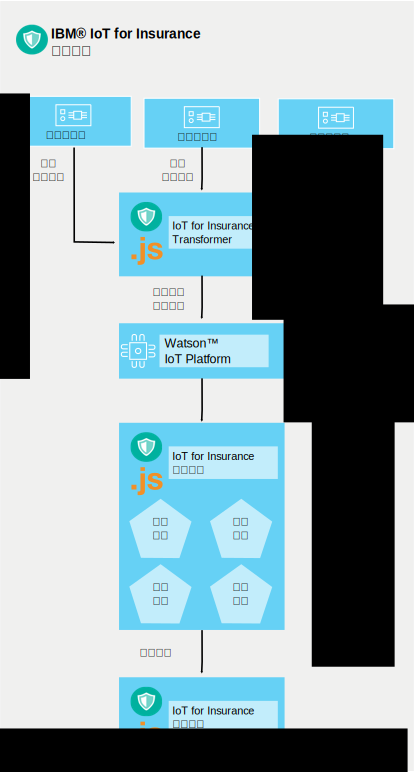

---

copyright:
  years: 2016, 2017
lastupdated: "2017-03-07"
---

<!-- Common attributes used in the template are defined as follows: -->
{:new_window: target="blank"}
{:shortdesc: .shortdesc}
{:screen: .screen}
{:codeblock: .codeblock}
{:pre: .pre}

# 服務運作方式
{{site.data.keyword.iotinsurance_full}} 會建立一個流程來收集、管理及分析來自所連接投保人的資料。
{:shortdesc}

保險提供者會在 {{site.data.keyword.Bluemix_notm}} 組織內建立 {{site.data.keyword.iotinsurance_short}} 實例。承保人的客戶在家裏會有感應器，而感應器連接至感應器提供者的雲端。客戶可以透過其行動裝置授權 {{site.data.keyword.iotinsurance_short}} 服務來接收感應器資料。{{site.data.keyword.iotinsurance_short}} Transformer 會連接至感應器提供者的雲端，並取回每一位使用者的資料，然後將它傳送至 {{site.data.keyword.iot_short_notm}} 伺服器。如果感應器顯示客戶住家符合承保人防護中所指定的參數，則會將通知傳送至承保人的儀表板及客戶裝置。

連接的感應器會偵測事件（例如漏水），並將該資訊傳送給智慧家庭供應商（例如 Wink）。{{site.data.keyword.iotinsurance_short}} 會使用與智慧家庭供應商雲端的連線來偵測信號，並建立警示有效負載。有效負載是透過 MQTT 傳送至 {{site.data.keyword.iotinsurance_short}} 防護引擎，來進行處理。防護引擎會分析有效負載是否符合防護規則所定義的準則。如果符合，則防護引擎會透過 MQTT 對 {{site.data.keyword.iotinsurance_short}} 動作引擎發出危害有效負載。動作引擎會執行防護針對該類型危害所定義的動作（例如，將文字訊息傳送給屋主）。

{{site.data.keyword.iotinsurance_short}} 依賴 {{site.data.keyword.iot_full}} 在其元件之間傳遞警示及危害有效負載。完整工作中系統需要使用者、防護以及使用者與防護之間的關聯。

