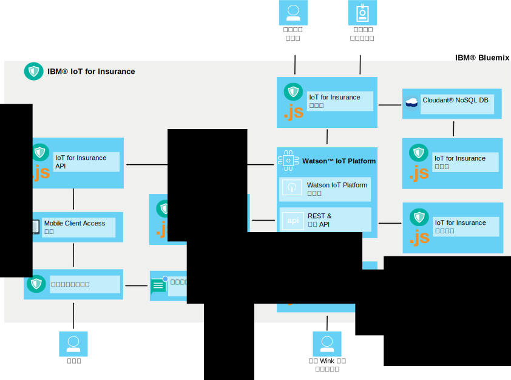

---

copyright:
  years: 2016, 2017
lastupdated: "2017-03-08"
---

<!-- Common attributes used in the template are defined as follows: -->
{:new_window: target="blank"}
{:shortdesc: .shortdesc}
{:screen: .screen}
{:codeblock: .codeblock}
{:pre: .pre}

# 關於 {{site.data.keyword.iotinsurance_short}}
{: #about}

{{site.data.keyword.iotinsurance_full}} 是一個整合 IoT 正式作業實例，可收集並分析投保人的完整背景資料，以提供個人化風險評量、即時保護及保單成本降低。
{: shortdesc}

{{site.data.keyword.iotinsurance_short}} 提供投保人資產及狀況的完整背景視圖（包括位置、天氣、交通及整體健康這類資訊）。此資訊的深度分析可讓承保人提供投保人的個人化風險評量及即時保護。投保人的好處包括透過早期警示、個人化建議以及簡化的理賠處理及結算來規避風險。承保人的好處包括客戶滿意度、客戶忠誠度，以及使用理賠規避及處理自動化來減少費用。

## 架構
{: #architecture}

{{site.data.keyword.iotinsurance_short}} 元件會如本節所述地一起運作。此組織也會顯示在架構圖中。{{site.data.keyword.iotinsurance_short}} 儀表板會顯示 {{site.data.keyword.iot_short_notm}} 及 {{site.data.keyword.cloudantfull}} 資料庫中所儲存的資料。使用者的智慧型裝置可以透過雲端連接，或是直接連接至 {{site.data.keyword.iot_short_notm}}。如果是透過雲端連接，它們會傳送資料到 Transformer，而 Transformer 會處理資料，並將它傳送至 {{site.data.keyword.iot_short_notm}}。來自 {{site.data.keyword.weatherfull}} 的資料也可以取回到 {{site.data.keyword.iotinsurance_short}} Weather Company Data Transformer，從那裡再取回到 {{site.data.keyword.iot_short_notm}}。資料是由防護引擎處理，防護引擎會產生事件並透過 API 傳送至「動作引擎」。「動作引擎」可以選擇性地使用 {{site.data.keyword.mobilepushfull}} 將通知傳送至使用者的行動應用程式。使用者也可以使用行動應用程式來回應警示或優惠。

**附註**：較舊版的 {{site.data.keyword.iotinsurance_short}} 使用 {{site.data.keyword.amafull}} 服務來處理回應，並透過 API 將它們傳回 {{site.data.keyword.iot_short_notm}}，然後傳回 {{site.data.keyword.iotinsurance_short}} 儀表板。這個處理程序仍然適用於舊版 {{site.data.keyword.iotinsurance_short}} 的實例。不過，新的 {{site.data.keyword.iotinsurance_short}} 實例不包含 {{site.data.keyword.amashort}} 或 {{site.data.keyword.mobilepushshort}}。若要使用行動應用程式，您必須建立自訂鑑別處理程序。您也可以選擇性地建立並連結 [{{site.data.keyword.mobilepushshort}} 實例](../mobilepush/index.html)至 API，以啟用推送通知。

## 保險儀表板
{: #insurance_dashboard}
「保險儀表板」可讓保險公司使用者（例如專員）完整查看其客戶的投保資產發生什麼狀況。他們可以看到國家/地區、州/省或帳戶層次的防護及事件。

範例保險儀表板會與模擬資料一起載入，以顯示您可以收集和分析之資訊種類的範例。

## 範例行動應用程式
{: #mobileapp}
範例行動應用程式是投保人（例如屋主）檢視及回應 {{site.data.keyword.iotinsurance_short}} 從其住家感應器傳送之資訊的位置。

屋主可以使用行動裝置授權服務連接至感應器提供者的雲端，以傳送及接收資料。例如，感應器偵測到漏水時，屋主可能會在行動入門範本應用程式中接收到通知。如需相關資訊，請參閱[安裝及連接範例行動應用程式](iotinsurance_mobile_app.html)。

## REST 及即時 API
{: #rest_api}
REST API 可供行動入門範本應用程式、保險儀表板、防護引擎及危害控制器使用。它們可讓使用者知道裝置及防護與動作之間的關聯。程式設計師可以使用 API 來建立新使用者、產生事件資料、建立及登錄新防護，以及提取事件資料。

針對 {{site.data.keyword.iotinsurance_short}} 實例，自訂您從服務主控台存取的 API。

在 API 頁面上，您可以：  
  - 檢視所有可用的 API 呼叫及相關聯的文件。
  - 嘗試個別 API 呼叫。請選取 API 呼叫以顯示所有資訊，然後按一下**試用！**。

API 範例可用來協助您開始使用一般實務範例。如需相關資訊，請參閱 [{{site.data.keyword.iotinsurance_short}} API 範例](https://github.com/IBM-Bluemix/iot4i-api-examples-nodejs)。

## Transformer
{: #transformer}
Transformer 要求來自雲端伺服器 API 的新資訊，並轉換它，使其符合 {{site.data.keyword.iotinsurance_short}} 中的資料。接著會發佈資料，以供其餘的 {{site.data.keyword.iotinsurance_short}} 實作使用。使用者必須授權 Transformer 元件存取感應器雲端資料以及處理記錄的資料。{{site.data.keyword.iotinsurance_short}} 支援多個雲端供應商及裝置。如需支援雲端供應商完整清單，以及如何將裝置連接至 {{site.data.keyword.iotinsurance_short}} 的指示，請參閱[支援的裝置及供應商](iotinsurance_supporteddevices.html)。

## Weather Company Data Transformer
{: #wcdtransformer}
Weather Company 應用程式會將來自 Weather Company Data Service 的相關天氣資料注入到 IoT4I 資料串流。此資料便可以用來建置啟用天氣功能的防護。

**附註**：Weather Company Data Transformer 僅以概念證明或技術預覽的形式受到支援，不作為正式作業之用。

## 防護引擎
{: #shield_engine}
根據事件中所儲存的資訊，「防護」引擎會判斷是否發生危害（例如漏水）。如果識別出危害，則會將它傳遞給「動作引擎」。

防護是客戶從保險提供者取得的特定保護。例如，屋主購買住家保險，針對火災、水害、竊盜及其他危害進行防護。{{site.data.keyword.iotinsurance_short}} 解決方案提供針對水的內建防護。在包含水的事件威脅到住家時，客戶會接收到警告並且可以進行回應。開發人員可以使用 REST API 來新增更多防護。
  

防護會在 {{site.data.keyword.iotinsurance_short}} 分析引擎中執行。分析引擎會識別危害類型（例如，*Water is detected*）、送出危害之感應器的使用者帳戶，以及與帳戶相關聯的防護。會根據該資訊來採取動作。您可以使用或修改 {{site.data.keyword.iotinsurance_short}} 防護程式庫中包含的防護，或建立並實作您自己的防護。如需防護及 [{{site.data.keyword.iotinsurance_short}} 防護程式庫 ](https://github.com/ibm-watson-iot/ioti-shields){: new_window} 的相關資訊，請參閱[防護工具箱](iotinsurance_shield_toolkit.html)。

## 動作引擎
{: #action_engine}
「動作引擎」會根據防護中指定的資訊來判斷要採取的動作。

您可以使用 {{site.data.keyword.iotinsurance_short}} API 在 JavaScript 中建立新防護。
