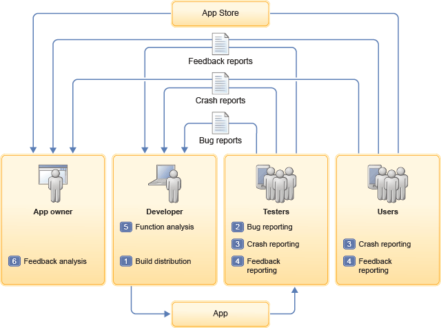

---

copyright:
  years: 2014, 2017
lastupdated: "2017-02-06"

---

{:new_window: target="_blank"}
{:shortdesc: .shortdesc}
{:screen: .screen}
{:codeblock: .codeblock}
{:pre: .pre}

# About {{site.data.keyword.mqa}} (Deprecated)
{: #about_mqa}

{{site.data.keyword.mqafull}} equips teams to capture tester and live-user experience to continuously build and deliver high-quality mobile apps.
{: shortdesc}

In a fragmented and complex environment, this service helps you to provide quality assurance for your apps. {{site.data.keyword.mqa}} delivers user feedback and quality metrics at every stage of app development. This service also includes capabilities for validating apps and tracking production usage.

You can use {{site.data.keyword.mqa}} to achieve the following goals:

* Improve the quality of your mobile apps with a holistic insight into user experience, including bug and crash reports, feedback, and user sentiment.

* Proactively manage quality risks by rapidly assessing issues and reducing cycle time. Listen to user feedback, analyze user sentiment, and use this information to develop a strategy.

The following table describes the roles on a typical team that uses Mobile Quality Assurance and the features that help team members to achieve their quality goals:

| Role | Features |
|---------: |------------: |
|**Technical app owner** This role must determine how well the app works, how much customers like it, and how to improve the app. A technical app owner can use real-time displays of user sentiment and feedback, including bug and crash reports from testers and users, to reduce defects and improve app ratings. |  User feedback provides up-to-date information about your app directly from your customers.|
|      |  Sentiment analysis mines app store ratings and reviews to extract feedback that you can act on before they go viral.|
|      |IBM Rational Team Concert integration and DevOps Services integration automatically records bugs and crashes by connecting to Rational Team Concert.|
|**Mobile app developer** This role is tasked with building a great mobile application. A mobile app developer can get rich feedback for an existing app.|  In-app user feedback provides information about your app directly from customers.|
|    |  In-app crash reporting provides rapid insight into app failures.|
|    |  Streamlined bug reporting facilitates submitting defects in seconds while you use the app from your mobile device. Crashes are automatically logged.|
|    | IBM Rational Team Concert integration and DevOps Services integration automatically records bugs and crashes by connecting to Rational Team Concert.|
|    |  Over-the-air app distribution delivers the latest content to testers as soon as it is available. |
|**Tester** This role goes beyond testing the app function to uncover challenges or flaws in the user experience. Mobile app testers can submit feedback, defects, and crash logs in seconds while they use the app on their own device. |   Over-the-air app distribution delivers the latest content for testing as soon as it is available. |
|     |  Streamlined bug reporting facilitates submitting defects in seconds while you use the app from your mobile device. Crashes are automatically logged. |
|     |  In-app crash reporting provides rapid insight into why an app fails. |
|     |  In-app user feedback provides feedback while you use the app on your mobile device. |
|**User** This role uses the mobile app and submits feedback and crash logs while they use the app on their own device. |  In-app user feedback provides feedback while you use the app on your mobile device. |
|     |  In-app crash reporting provides rapid insight into why an app fails. |
{: caption="Features of MQA by roles" caption-side="top"}

