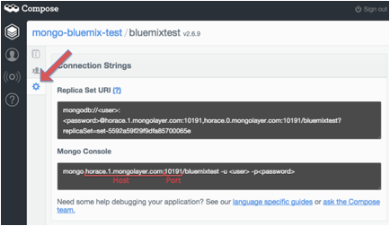

{:shortdesc: .shortdesc}
{:new_window: target="_blank"}

# Getting started with MongoDB by Compose

MongoDB has led the field of JSON document databases. With its powerful indexing and querying, aggregation and wide driver support, it has become the go-to database for many startups and enterprises.
{:shortdesc} 

### Setting up credentials for MongoDB by Compose:
In order to sign-in to Compose’s MongoDB through Bluemix, you will need the following credentials: 

- Username
- Password
- Host
- Port

The instructions below will show you where to find these credentials on the Compose platform:
1. Sign-in to your Compose account. On the dashboard, “Deployments” will be automatically selected. Under MongoDB, select the deployment that you would like to get the credentials for. 
2. Select the database that you need credentials for.
3. Select the users tab, on the left-hand navigation, then select 'Add User'. 
4. Create a username and password, be sure to write them down so you can reference them later. 
5. Select the 'Connection Strings' on the left hand navigation and you will find the host and port under the section 'Mongo Console'. 

*Figure 1. Compose dashboard*

># Related Links {:class="linklist"}
>## Tutorials and Samples {:id="samples"}
>* [Sample MongoDb App](https://todo-compose-mongo.mybluemix.net){:new_window}
>
># Related Links {:class="linklist"}
>## Related Links {:id="general"}  
>* [Welcome Compose Blog](http://cloudant.com/blog/welcome-compose/){:new_window}
>* [MongoDB Deployments Docs](https://docs.compose.io/getting-started/mongodb-deployments.html){:new_window}
>
>{:elementKind="article" id="rellinks"}
