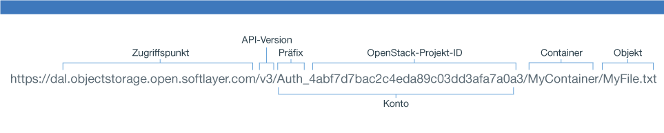

---

copyright:
  years: 2014, 2016

---
{:new_window: target="_blank"}
{:shortdesc: .shortdesc}
{:screen: .screen}
{:pre: .pre}

## Mit der Swift-REST-API auf {{site.data.keyword.objectstorageshort}} zugreifen {: #using-swift-restapi}
*Letzte Aktualisierung: 19. Oktober 2016*
{: .last-updated}

Sie können die Swift-REST-API in einer Befehlszeilen-Clientschnittstelle wie cURL verwenden oder Sie können die API in Ihrer Anwendung aufrufen.
{: shortdesc}

### {{site.data.keyword.objectstorageshort}}-URL erstellen{: #access-points}

Zur Interaktion mit der {{site.data.keyword.objectstorageshort}}-API erstellen Sie die {{site.data.keyword.objectstorageshort}}-URL wie folgt:
  ```
  https://<Zugriffspunkt>/<API-Version>/AUTH_<Projekt-ID>/<Containernamensbereich>/<object namespace>
  ```
  {: pre}

<table>
  <tr>
    <th> URL-Teile</th>
    <th> Definition</th>
  </tr>
  <tr>
    <td> API-Version</td>
    <td> Version 1: V1</td>
  </tr>
  <tr>
    <td> Kontoinformationen</td>
    <td> Die Kombination aus Ihrer Projekt-ID und dem Präfix. Zu finden in der Benutzerschnittstelle. </td>
  </tr>
  <tr>
    <td> Container-Namensbereich</td>
    <td> Der Name Ihres Containers. Zu finden in der Benutzerschnittstelle.</td>
  </tr>
  <tr>
    <td> Objekt-Namensbereich</td>
    <td> Der Name Ihrer Datei oder Ihres Objekts. Zu finden in der Benutzerschnittstelle.</td>
  </tr>
  <tr>
    <td> Zugriffspunkt</td>
    <td> London: https://lon.objectstorage.open.softlayer.com/
    <br> Dallas: https://dal.objectstorage.open.softlayer.com/ </br> </td>
  </tr>
</table>

*Tabelle 1. Erklärung der Teile der {{site.data.keyword.objectstorageshort}}-URL*

Beispiel:

In einem Beispiel-Image gezeigte Teile einer 


### {{site.data.keyword.objectstorageshort}}-API {: #openstack-reference}

Eine umfassende Liste der Optionen der {{site.data.keyword.objectstorageshort}}-REST-API mit Beispielen finden Sie in der [vollständigen Referenz zur OpenStack-Swift-API](http://developer.openstack.org/api-ref-objectstorage-v1.html).
