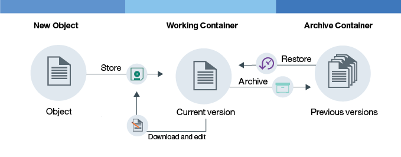

---

copyright:
  years: 2014, 2017
lastupdated: "2017-02-10"

---
{:new_window: target="_blank"}
{:shortdesc: .shortdesc}
{:codeblock: .codeblock}
{:screen: .screen}
{:pre: .pre}


# Objektversionierung einrichten {: #setting-up-versioning}

Sie können ältere Versionen Ihrer Objekte automatisch beibehalten, indem Sie die Objektversionierung einrichten. Mit der Versionierung können Sie unbeabsichtigte Überschreibungen verhindern und frühere Versionen Ihrer Dateien abrufen.
{: shortdesc}


#### Funktionweise der Objektversionierung

Die Objektversionierung ist eine Möglichkeit für einen Benutzer, ein Objekt zu speichern, das sich möglicherweise ändert. Bei der Versionierung ist die aktuelle Version Ihres Objekts immer in Ihrem Arbeitscontainer verfügbar und alle früheren Versionen befinden sich als Backup in Ihrem Archivcontainer.

<dl>
  <dt>Speichern</dt>
    <dd>Ein neues Objekt ist ein Objekt, das Sie zum ersten Mal speichern. Bei diesem Objekt kann es sich um ein ganz neues Objekt oder um ein bearbeitetes Objekt handeln, das Sie zum zweiten Mal hochladen.</dd>
  <dt>Archivieren</dt>
    <dd>Bei der Versionierung wird das ältere Objekt in den Archivcontainer verschoben, wenn ein Objekt mit demselben Namen wie ein bereits vorhandenes Objekt im Arbeitscontainer gespeichert wird. An den Namen des Objekts wird eine Zeitmarke angehängt.</dd>
  <dt>Wiederherstellen</dt>
    <dd>Wenn ein Objekt aus dem Arbeitscontainer gelöscht wird und es eine archivierte Version dieses Objekts gibt, wird die archivierte Version wiederhergestellt.  Sie können ein archiviertes Objekt jederzeit wiederherstellen.</dd>
</dl>



Abbildung 1. Objektversionierung - Übersicht


#### Lernprogramm

Führen Sie die Schritte des folgenden Lernprogramms aus, um die Funktionsweise der Objektversionierung verstehen zu lernen.

1. Erstellen Sie einen Container und geben Sie ihm einen Namen. Ersetzen Sie die Variable *Containername* mit dem Namen, den Sie dem Container geben möchten.

    ```
    swift post <Containername>
    ```
    {: pre}

2. Erstellen Sie einen zweiten Container als Sicherungsspeicher und geben Sie ihm einen Namen.

    ```
    swift post <Name des Archivcontainers>
    ```
    {: pre}

3. Richten Sie die Versionierung ein.

    Swift-Befehl:

    ```
    swift post <Containername> -H "X-Versions-Location: <Name des Archivcontainers>"
    ```
    {: pre}

    cURL-Befehl:

    ```
    curl -i -X PUT -H "X-Auth-Token: <Token>" -H "X-Versions-Location:<Name des Archivcontainers>" https://<Object Storage-URL>/<Containername>
    ```
    {: pre}

4. Laden Sie erstmalig ein Objekt in Ihren Arbeitscontainer hoch.

    ```
    swift upload <Containername> <object>
    ```
    {: pre}

5. Bearbeiten Sie Ihr Objekt und laden Sie die neue Version in Ihren Arbeitscontainer hoch.

    ```
    swift upload <Containername> <object>
    ```
    {: pre}

6.  Das Objekt in Ihrem Archivcontainer erhält automatisch einen Namen im folgenden Format: `<Länge><Objektname>/<Zeitmarke>`.
    <table>
    <caption> Tabelle 1. Beschriebene Benennungsattribute </caption>
      <tr>
        <th> Attribut </th>
        <th> Beschreibung </th>
      </tr>
      <tr>
        <td> <i>Länge</i> </td>
        <td> Die Länge des Namens Ihres Objekts. Dies ist eine aus 3 Zeichen bestehende Hexadezimalzahl ohne Innenabstand. </td>
      </tr>
      <tr>
        <td> <i>Objektname</i> </td>
        <td> Der Name Ihres Objekts. </td>
      </tr>
      <tr>
        <td> <i>Zeitmarke</i> </td>
        <td> Die Zeitmarke für den ursprünglichen Upload dieser Version des Objekts. </td>
      </tr>
    </table>

7. Listen Sie die Objekte in Ihrem Arbeitscontainer auf, um die neue Version der Datei anzuzeigen.

    ```
    swift list --lh <Containername>
    ```
    {: pre}

8. Listen Sie die Objekte in Ihrem Archivcontainer auf, um die vorherige Version der Datei mit angehängter Zeitmarke anzuzeigen.

    ```
    swift list --lh <Sicherungscontainer-Name>
    ```
    {: pre}

9. Löschen Sie das Objekt in Ihrem Arbeitscontainer. Die aktuelle Version in Ihrem Archivcontainer wird automatisch in Ihrem Arbeitscontainer wiederhergestellt.

    **Hinweis**: Sie müssen alle Versionen Ihrer Datei löschen, damit das Objekt gelöscht werden kann.

    ```
    swift delete <Containername> <object>
    ```
    {: pre}

10. Optional: Inaktivieren Sie die Objektversionierung.

    Swift-Befehl:

    ```
    swift post <Containername> -H "X-Remove-Versions-Location:"
    ```
    {: pre}

    cURL-Befehl:

    ```
    cURL -i -X POST -H "X-Auth-Token: <token>" -H "X-Remove-Versions-Location: anyvalue" https://<Objektspeicher-URL>/<Containername>
    ```
    {: pre}
