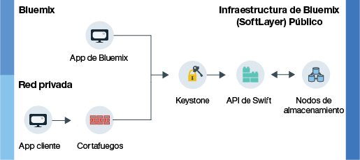

---

copyright:
  years: 2014, 2016

---

{:new_window: target="_blank"}

# Acerca de {{site.data.keyword.objectstorageshort}}  {: #about-object-storage} 

*Última actualización: 19 de octubre de 2016*
{: .last-updated}

{{site.data.keyword.objectstorageshort}} utiliza metadatos para identificar objetos colocados en el almacenamiento, de forma que se puedan buscar rápidamente y estén accesibles de forma rápida incluso entre grandes cantidades de datos.
{: shortdesc}

## Cómo funciona el {{site.data.keyword.objectstorageshort}} público de {{site.data.keyword.Bluemix_notm}}{: #public}

El {{site.data.keyword.objectstorageshort}} público tiene dos rutas independientes que un usuario puede seguir al proporcionar una cuenta. Puede empezar dentro de su propia red privada o puede acceder a {{site.data.keyword.objectstorageshort}} mediante una app de {{site.data.keyword.Bluemix_notm}}. Tanto los administradores como los desarrolladores pueden almacenar y acceder a objetos tal como se muestra en el diagrama siguiente.

<dl>
  <dt><dfn> App cliente </dfn></dt>
  <dd> Puede acceder a {{site.data.keyword.objectstorageshort}} directamente desde la aplicación mediante un cortafuegos en una red privada.</dd>
  <dt><dfn>App de {{site.data.keyword.Bluemix_notm}}</dfn></dt>
  <dd> Puede enlazar el servicio de {{site.data.keyword.objectstorageshort}} a una app de {{site.data.keyword.Bluemix_notm}}. </dd>
  <dt><dfn> Keystone </dfn></dt>
  <dd> Utilice las credenciales proporcionadas por el servicio de {{site.data.keyword.objectstorageshort}} para obtener una señal de autorización de Keystone. </dd>
  <dt><dfn> API de OpenStack Swift</dfn></dt>
  <dd> Una vez que haya autenticado la instancia, puede leer y grabar en los objetos almacenados mediante la API de Swift. </dd>
  <dt><dfn> Nodos de almacenamiento </dfn></dt>
  <dd> El servicio conserva tres copias de sus datos que se <a href="http://docs.openstack.org/developer/swift/overview_replication.html">replican a través de múltiples nodos de almacenamiento</a>. </dd>
</dl>

*Figura 1. Cómo funciona {{site.data.keyword.objectstorageshort}} público de {{site.data.keyword.Bluemix_notm}}*

**Atención**: El cifrado del lado del proveedor no se proporciona. Es responsabilidad de la aplicación cliente cifrar datos antes de subirlos. El cifrado a nivel de disco no está disponible en este momento para el {{site.data.keyword.objectstorageshort}} público de {{site.data.keyword.Bluemix_notm}}.
