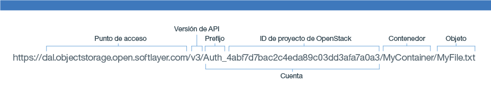

---

copyright:
  years: 2014, 2017
lastupdated: "2017-02-10"

---
{:new_window: target="_blank"}
{:shortdesc: .shortdesc}
{:codeblock: .codeblock}
{:screen: .screen}
{:pre: .pre}


# Construcción del URL de {{site.data.keyword.objectstorageshort}} para utilizar la API REST de Swift

Puede utilizar la API REST de Swift con una interfaz de cliente de línea de mandatos, como cURL, o invocar la API desde la aplicación.
{: shortdesc}


Para obtener una lista completa de las opciones y los ejemplos de la API REST de {{site.data.keyword.objectstorageshort}}, consulte la <a href="http://developer.openstack.org/api-ref-objectstorage-v1.html" target="_blank">Referencia completa de la API de OpenStack Swift. </a>


Antes de componer el URL, debe [autenticar](/docs/services/ObjectStorage/os_authenticate.html) la instancia de servicio con Keystone. Asegúrese de anotar la respuesta del catálogo. Se parecerá a la del siguiente ejemplo.

```
{
  "id" : "4207049680fa4effbecd044c7448a8cb",
  "region" : "dallas",
  "region_id" : "dallas",
  "url" : "https://dal.objectstorage.open.softlayer.com/v1/AUTH_4abf7d7bac2c4eda89c03dd3afa7a0a3",
  "interface" : "public"
},
```
{: codeblock}


Añada el espacio de nombres del contenedor y del objeto al final del URL de {{site.data.keyword.objectstorageshort}}, tal como se muestra en la siguiente imagen.

Partes del URL de 

Figura 1. Ejemplo de URL de {{site.data.keyword.objectstorageshort}}
