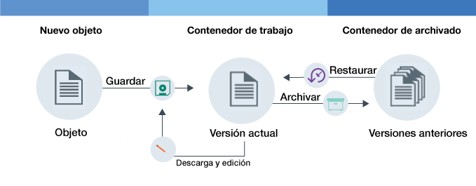

---

copyright:
  years: 2014, 2017
lastupdated: "2017-02-10"

---
{:new_window: target="_blank"}
{:shortdesc: .shortdesc}
{:codeblock: .codeblock}
{:screen: .screen}
{:pre: .pre}


# Configuración del mantenimiento de versiones de objetos {: #setting-up-versioning}

Puede conservar versiones anteriores de los objetos automáticamente, configurando el mantenimiento de versiones de objetos. Con el mantenimiento de versiones, puede impedir sobrescrituras accidentales y recuperar versiones anteriores de los archivos.
{: shortdesc}


#### Cómo funciona el mantenimiento de versiones de objetos

El mantenimiento de versiones de objetos es una forma en que el usuario almacena un objeto que puede cambiar. Con el mantenimiento de versiones, la versión actual del objeto estará siempre disponible en el contenedor de trabajo, y se realizará copia de seguridad de todas las versiones anteriores del contenedor de archivado.

<dl>
  <dt>Almacenar</dt>
    <dd>Un objeto nuevo es un objeto que está almacenando por primera vez. Este objeto puede ser un objeto completamente nuevo, o un objeto editado que esté cargando por segunda vez.</dd>
  <dt>Archivar</dt>
    <dd>Con el mantenimiento de versiones, cuando se guarda en el contenedor de trabajo un objeto con el mismo nombre que un objeto existente, el objeto anterior se moverá al contenedor de archivado. Se añadirá una indicación de fecha y hora al nombre del objeto.</dd>
  <dt>Restaurar</dt>
    <dd>Si se suprime un objeto del contenedor de trabajo y existe una versión archivada de dicho objeto, se restaurará la versión archivada. Puede restaurar un objeto archivado, en cualquier momento.</dd>
</dl>



Figura 1. Visión general del mantenimiento de versiones de objetos


#### Guía de aprendizaje

Para comprender el mantenimiento de versiones de objetos, realice la siguiente guía de aprendizaje.

1. Cree un contenedor y póngale un nombre. Sustituya la variable *nombre_contenedor* por el nombre que desee dar al contenedor.

    ```
    swift post <nombre_contenedor>
    ```
    {: pre}

2. Cree un segundo contenedor que actúe como el almacenamiento de copia de seguridad y dele un nombre.

    ```
    swift post <nombre_contenedor_archivado>
    ```
    {: pre}

3. Configure el mantenimiento de versiones.

    Mandato Swift:

    ```
    swift post <nombre_contenedor> -H "X-Versions-Location: <nombre_contenedor_archivado>"
    ```
    {: pre}

    Mandato cURL:

    ```
    curl -i -X PUT -H "X-Auth-Token: <token>" -H "X-Versions-Location:<nombre_contenedor_archivado>" https://<url_almacenamiento_objetos>/<nombre_contenedor>
    ```
    {: pre}

4. Cargue un objeto en el contenedor de trabajo por primera vez.

    ```
    swift upload <nombre_contenedor> <object>
    ```
    {: pre}

5. Edite el objeto y cargue la versión nueva en su contenedor de trabajo.

    ```
    swift upload <nombre_contenedor> <object>
    ```
    {: pre}

6.  El objeto del contenedor de archivado se cambia de nombre automáticamente con el siguiente formato: `<Length><Nombre_objeto>/<indicación de fecha y hora>`.
    <table>
    <caption> Tabla 1. Denominación de atributos descritos </caption>
      <tr>
        <th> Atributo </th>
        <th> Descripción </th>
      </tr>
      <tr>
        <td> <i>Length</i> </td>
        <td> La longitud del nombre del objeto. Es un número hexadecimal de 3 caracteres del teclado numeral. </td>
      </tr>
      <tr>
        <td> <i>Object_name</i> </td>
        <td> El nombre del objeto. </td>
      </tr>
      <tr>
        <td> <i> Indicación de fecha y hora </i> </td>
        <td> La indicación de fecha y hora de cuándo se cargó originalmente dicha versión del objeto. </td>
      </tr>
    </table>

7. Enumere los objetos del contenedor de trabajo para ver la versión nueva del archivo.

    ```
    swift list --lh <nombre_contenedor>
    ```
    {: pre}

8. Enumere los objetos del contenedor de archivado para ver la versión anterior del archivo con una indicación de fecha y hora añadida.

    ```
    swift list --lh <nombre_contenedor_copia_de_seguridad>
    ```
    {: pre}

9. Suprima el objeto del contenedor de trabajo. La versión más reciente del contenedor de archivado se restaura automáticamente en su contenedor de trabajo.

    **Nota**: Debe suprimir todas las versiones del archivo para que se suprima el objeto.

    ```
    swift delete <nombre_contenedor> <object>
    ```
    {: pre}

10. Opcional: Inhabilitar el mantenimiento de versiones de objetos.

    Mandato Swift:

    ```
    swift post <container_name> -H "X-Remove-Versions-Location:"
    ```
    {: pre}

    Mandato cURL:

    ```
    cURL -i -X POST -H "X-Auth-Token: <token>" -H "X-Remove-Versions-Location: anyvalue" https://<object-storage_url>/<container_name>
    ```
    {: pre}
