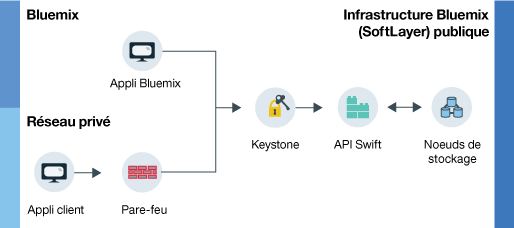

---

copyright:
  years: 2014, 2016

---

{:new_window: target="_blank"}

# A propos d'{{site.data.keyword.objectstorageshort}}  {: #about-object-storage} 

*Dernière mise à jour : 19 octobre 2016*
{: .last-updated}

{{site.data.keyword.objectstorageshort}} utilisent des métadonnées pour identifier les objets placés dans un espace de stockage de façon à faciliter leur recherche et à les rendre rapidement accessibles, même en cas de volumes de données très importants.
{: shortdesc}

## Comment fonctionne {{site.data.keyword.Bluemix_notm}} Public {{site.data.keyword.objectstorageshort}} ?{: #public}

Public {{site.data.keyword.objectstorageshort}} propose deux routes différentes qu'un utilisateur peut suivre lors de la mise à disposition d'un compte. Vous pouvez démarrer au sein de votre propre réseau privé ou accéder à {{site.data.keyword.objectstorageshort}} via une application {{site.data.keyword.Bluemix_notm}}. Les administrateurs comme les développeurs peuvent stocker des objets et y accéder, comme le montre le diagramme suivant.

<dl>
  <dt><dfn> Application client </dfn></dt>
  <dd> Vous pouvez accéder à {{site.data.keyword.objectstorageshort}} directement depuis votre application via un pare-feu sur un réseau privé. </dd>
  <dt><dfn> Application {{site.data.keyword.Bluemix_notm}} </dfn></dt>
  <dd> Vous pouvez lier le service {{site.data.keyword.objectstorageshort}}  à une application {{site.data.keyword.Bluemix_notm}}.  </dd>
  <dt><dfn> Keystone </dfn></dt>
  <dd> Vous utilisez les données d'identification fournies par le service {{site.data.keyword.objectstorageshort}} pour obtenir un jeton d'autorisation de la part de Keystone. </dd>
  <dt><dfn> API OpenStack Swift</dfn></dt>
  <dd> Une fois que vous avez authentifié votre instance, vous pouvez lire vos objets stockés et y écrire des informations en utilisant l'API Swift. </dd>
  <dt><dfn> Noeuds de stockage </dfn></dt>
  <dd> Le service conserve trois copies de vos données qu'il <a href="http://docs.openstack.org/developer/swift/overview_replication.html">réplique sur différents noeuds de stockage</a>. </dd>
</dl>

*Figure 1. Comment fonctionne {{site.data.keyword.Bluemix_notm}} Public {{site.data.keyword.objectstorageshort}} ?*

**Attention** : aucun chiffrement côté fournisseur n'est fourni. C'est la responsabilité de l'application client de chiffrer les données avant leur téléchargement. Le chiffrement de niveau disque n'est pas encore disponible pour {{site.data.keyword.Bluemix_notm}} Public {{site.data.keyword.objectstorageshort}}.
