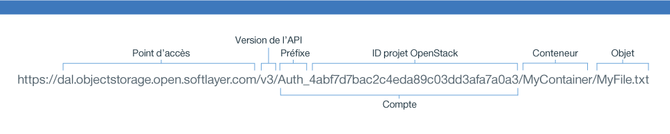

---

copyright:
  years: 2014, 2016

---
{:new_window: target="_blank"}
{:shortdesc: .shortdesc}
{:screen: .screen}
{:pre: .pre}

## Utilisation de l'API Swift REST pour accéder à {{site.data.keyword.objectstorageshort}} {: #using-swift-restapi}
*Dernière mise à jour : 19 octobre 2016*
{: .last-updated}

Vous pouvez vous servir de l'API Swift REST avec une interface client de ligne de commande, comme cURL, ou appeler l'API depuis votre application.
{: shortdesc}

### Construction de votre URL {{site.data.keyword.objectstorageshort}} {: #access-points}

Pour interagir avec l'API {{site.data.keyword.objectstorageshort}}, construisez l'URL {{site.data.keyword.objectstorageshort}} comme suit :
  ```
  https://<point d'accès>/<version d'API>/AUTH_<ID projet>/<espace de nom de conteneur>/<object namespace>
  ```
  {: pre}

<table>
  <tr>
    <th> Eléments de l'URL  </th>
    <th> Définition </th>
  </tr>
  <tr>
    <td> Version de l'API </td>
    <td> Version 1 : v1 </td>
  </tr>
  <tr>
    <td> Informations de compte </td>
    <td> Il s'agit de l'ID du projet associé au préfixe. Vous le trouverez dans l'interface utilisateur. </td>
  </tr>
  <tr>
    <td> Espace de nom du conteneur</td>
    <td> Nom de votre conteneur. Vous le trouverez dans l'interface utilisateur. </td>
  </tr>
  <tr>
    <td> Espace de nom d'objet</td>
    <td> Nom de votre fichier ou objet. Vous le trouverez dans l'interface utilisateur. </td>
  </tr>
  <tr>
    <td> Point d'accès</td>
    <td> Londres : https://lon.objectstorage.open.softlayer.com/
    <br> Dallas : https://dal.objectstorage.open.softlayer.com/ </br> </td>
  </tr>
</table>

*Tableau 1. {{site.data.keyword.objectstorageshort}} présentation des éléments composant l'URL*

Exemple :




### API {{site.data.keyword.objectstorageshort}} {: #openstack-reference}

Voir [Swift/API - OpenStack, dans le site openstack](http://developer.openstack.org/api-ref-objectstorage-v1.html) pour une liste complète des options d'API REST d'{{site.data.keyword.objectstorageshort}}.
