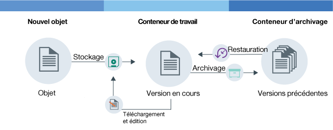

---

copyright:
  years: 2014, 2017
lastupdated: "2017-02-10"

---
{:new_window: target="_blank"}
{:shortdesc: .shortdesc}
{:codeblock: .codeblock}
{:screen: .screen}
{:pre: .pre}


# Configuration de la gestion des versions d'objets {: #setting-up-versioning}

Vous pouvez conserver automatiquement des versions plus anciennes de vos objets en configurant une gestion des versions d'objets. Via la gestion des versions
d'objets, vous pouvez éviter des écrasements fortuits de fichiers et extraire des versions antérieures de vos fichiers.
{: shortdesc}


#### Fonctionnement de la gestion des versions d'objets

La gestion des versions d'objets permet à l'utilisateur de stocker un objet susceptible d'être modifié. Via la gestion de versions d'objets; la version actuelle de
votre objet reste toujours disponible dans votre conteneur de travail, tandis que ses versions antérieures sont stockées dans votre conteneur d'archivage.

<dl>
  <dt>Magasin</dt>
    <dd>Un nouvel objet est un objet que vous stockez pour la première fois. Il peut s'agir d'un objet totalement neuf ou d'un objet modifié que vous téléchargez pour la
seconde fois.</dd>
  <dt>Archive</dt>
    <dd>Via la gestion de versions d'objets, lorsqu'un objet du même nom qu'un objet existant est enregistré dans le conteneur de travail, l'ancien objet est transféré
vers le conteneur d'archivage. Un horodatage est ajouté en suffixe au nom de l'objet.</dd>
  <dt>Restauration</dt>
    <dd>Si un objet est supprimé du conteneur de travail et qu'une version archivée de cet objet existe, la version archivée est restaurée.
Vous pouvez restaurer à n'importe quel moment un objet archivé.</dd>
</dl>



Figure 1. Présentation de la gestion de versions d'objets


#### Tutoriel

Pour vous familiariser avec la gestion de versions d'objets, suivez le tutoriel ci-après.

1. Créez un conteneur et donnez-lui un nom. Remplacez la variable *nom_conteneur* par le nom que vous voulez donner à votre conteneur.

    ```
    swift post <nom_conteneur>
    ```
    {: pre}

2. Créez un second conteneur qui vous servira de conteneur de stockage et donnez-lui un nom.

    ```
    swift post <nom_conteneur_archivage>
    ```
    {: pre}

3. Configurez la gestion des versions.

    Commande Swift :

    ```
    swift post <nom_conteneur> -H "X-Versions-Location: <nom_conteneur_archivage>"
    ```
    {: pre}

    Commande cURL :

    ```
    curl -i -X PUT -H "X-Auth-Token: <jeton>" -H "X-Versions-Location:<nom_conteneur_archivage>"
https://<URL_stockage_objets>/<nom_conteneur>
    ```
    {: pre}

4. Envovez par téléchargement un objet à votre conteneur de travail pour la première fois.

    ```
    swift upload <nom_conteneur> <object>
    ```
    {: pre}

5. Modifiez votre objet et envoyez par téléchargement la nouvelle version à votre conteneur de travail.

    ```
    swift upload <nom_conteneur> <object>
    ```
    {: pre}

6.  L'objet dans votre conteneur de travail reçoit automatiquement un nom au format suivant : `<Longueur><nom_objet>/<horodatage>`.
    <table>
    <caption> Tableau 1. Description des attributs de désignation </caption>
      <tr>
        <th> Attribut </th>
        <th> Description </th>
      </tr>
      <tr>
        <td> <i>Longueur</i> </td>
        <td> Longueur du nom de votre objet. Il s'agit d'un nombre hexadécimal de trois caractères remplis avec des zéros. </td>
      </tr>
      <tr>
        <td> <i>Nom_objet</i> </td>
        <td> Nom de votre objet. </td>
      </tr>
      <tr>
        <td> <i>horodatage</i> </td>
        <td> Horodatage indiquant quand la version de l'objet a été initialement envoyée par téléchargement. </td>
      </tr>
    </table>

7. Répertoriez les objets dans votre conteneur d'archivage pour examiner la nouvelle version de votre fichier.

    ```
    swift list --lh <nom_conteneur>
    ```
    {: pre}

8. Répertoriez les objets dans votre conteneur d'archivage pour examiner la version précédente de votre fichier à laquelle un horodatage a été ajouté.

    ```
    swift list --lh <nom_conteneur_sauvegarde>
    ```
    {: pre}

9. Supprimez l'objet de votre conteneur de travail. La version la plus récente dans votre conteneur d'archivage est automatiquement restaurée dans votre conteneur de
travail.

    **Remarque** : Vous devez supprimer toutes les versions de votre fichier pour que l'objet lui-même soit supprimé.

    ```
    swift delete <nom_conteneur> <object>
    ```
    {: pre}

10. (Facultatif) - désactivez la gestion des versions d'objets.

    Commande Swift :

    ```
    swift post <nom_conteneur> -H "X-Remove-Versions-Location:"
    ```
    {: pre}

    Commande cURL :

    ```
    cURL -i -X POST -H "X-Auth-Token: <jeton>" -H "X-Remove-Versions-Location: anyvalue" https://<url-stockage-objet>/<nom_conteneur>
    ```
    {: pre}
