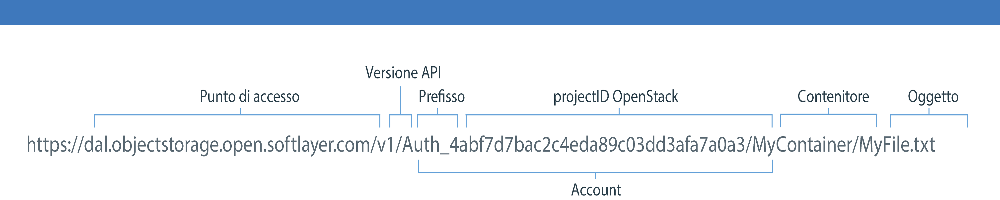

---

copyright:
  years: 2014, 2017
lastupdated: "2017-02-10"

---
{:new_window: target="_blank"}
{:shortdesc: .shortdesc}
{:codeblock: .codeblock}
{:screen: .screen}
{:pre: .pre}


# Creazione del tuo URL {{site.data.keyword.objectstorageshort}} per utilizzare l'API REST Swift

Puoi utilizzare l'API REST Swift con un'interfaccia client di riga di comando, come cURL, oppure richiamare l'API dalla tua applicazione.
{: shortdesc}


Per un elenco completo delle opzioni e degli esempi dell'API REST {{site.data.keyword.objectstorageshort}}, consulta la <a href="http://developer.openstack.org/api-ref-objectstorage-v1.html" target="_blank">guida di riferimento completa per l'API Swift OpenStack. </a>


Prima di poter comporre il tuo URL, devi [autenticare](/docs/services/ObjectStorage/os_authenticate.html) la tua istanza del servizio con Keystone. Assicurati di prendere nota della tua risposta del catalogo. Sarà simile al seguente esempio.

```
{
  "id" : "4207049680fa4effbecd044c7448a8cb",
  "region" : "dallas",
  "region_id" : "dallas",
  "url" : "https://dal.objectstorage.open.softlayer.com/v1/AUTH_4abf7d7bac2c4eda89c03dd3afa7a0a3",
  "interface" : "public"
},
```
{: codeblock}


Aggiungi lo spazio di nomi del tuo contenitore e oggetto alla fine del tuo URL {{site.data.keyword.objectstorageshort}} come illustrato nella seguente immagine.

Parti URL 

Figura 1. Esempio URL {{site.data.keyword.objectstorageshort}}
