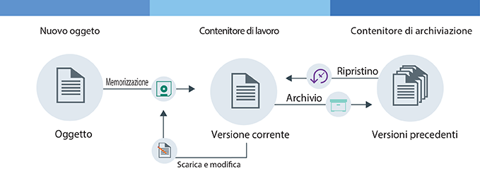

---

copyright:
  years: 2014, 2017
lastupdated: "2017-02-10"

---
{:new_window: target="_blank"}
{:shortdesc: .shortdesc}
{:codeblock: .codeblock}
{:screen: .screen}
{:pre: .pre}


# Configurazione delle versioni dell'oggetto {: #setting-up-versioning}

Puoi conservare le vecchie versioni dei tuoi oggetti in automatico impostando le versioni dell'oggetto.  Con le versioni dell'oggetto, puoi prevenire sovrascritture non intenzionali e richiamare le precedenti versioni dei tuoi file.
{: shortdesc}


#### Come funzionano le versioni dell'oggetto

Le versioni dell'oggetto sono un modo per un utente di archiviare un oggetto che potrebbe venire modificato. Con le versioni dell'oggetto, la versione corrente del tuo oggetto è sempre disponibile nel tuo contenitore di lavoro e viene eseguito il backup di tutte le versioni precedenti nel tuo contenitore di archiviazione.

<dl>
  <dt>Memorizzazione</dt>
    <dd>Un nuovo oggetto che stai utilizzando per l'archiviazione per la prima volta. Questo oggetto può essere un oggetto nuovo o un oggetto modificato che stai caricato per la seconda volta.</dd>
  <dt>Archivio</dt>
    <dd>Con le versioni dell'oggetto, quando un oggetto viene salvato con lo stesso nome di un oggetto esistente nel contenitore di lavoro, l'oggetto più vecchio viene spostato nel contenitore di archiviazione. Viene aggiunta una data/ora al nome dell'oggetto.</dd>
  <dt>Ripristino</dt>
    <dd>Se un oggetto viene eliminato dal contenitore di lavoro e ne esiste una versione archiviata, essa viene ripristinata.  Puoi ripristinare un oggetto archiviato in qualsiasi momento.</dd>
</dl>



Figura 1. Panoramica sulle versioni dell'oggetto


#### Esercitazione

Per comprendere le versioni dell'oggetto, completa la seguente esercitazione.

1. Crea un contenitore e forniscigli un nome. Sostituisci la variabile *container_name* con il nome che desideri fornire al tuo contenitore.

    ```
    swift post <container_name>
    ```
    {: pre}

2. Crea un secondo contenitore da utilizzare come archivio di backup e forniscigli un nome.

    ```
    swift post <archive_container_name>
    ```
    {: pre}

3. Configura le versioni.

    Comando Swift:

    ```
    swift post <container_name> -H "X-Versions-Location: <archive_container_name>"
    ```
    {: pre}

    Comando cURL:

    ```
    curl -i -X PUT -H "X-Auth-Token: <token>" -H "X-Versions-Location:<archive_container_name>" https://<object-storage_url>/<container_name>
    ```
    {: pre}

4. Carica un oggetto nel tuo contenitore di lavoro per la prima volta. 

    ```
    swift upload <container_name> <object>
    ```
    {: pre}

5. Modifica il tuo oggetto e carica la nuova versione nel tuo contenitore di lavoro.

    ```
    swift upload <container_name> <object>
    ```
    {: pre}

6.  L'oggetto nel tuo contenitore di archiviazione viene automaticamente denominato con il seguente formato: `<Length><Object_name>/<time stamp>`.
    <table>
    <caption> Tabella 1. Denominazione degli attributi descritti </caption>
      <tr>
        <th> Attributo </th>
        <th> Descrizione </th>
      </tr>
      <tr>
        <td> <i>Length</i> </td>
        <td> La lunghezza del nome del tuo oggetto. Questo è un numero esadecimale a 3 caratteri senza zeri. </td>
      </tr>
      <tr>
        <td> <i>Object_name</i> </td>
        <td> Il nome del tuo oggetto. </td>
      </tr>
      <tr>
        <td> <i> data/ora </i> </td>
        <td> La data/ora in cui questa versione dell'oggetto è stata caricata originalmente. </td>
      </tr>
    </table>

7. Elenca gli oggetti nel tuo contenitore di lavoro per visualizzare la nuova versione del tuo file. 

    ```
    swift list --lh <container_name>
    ```
    {: pre}

8. Elenca gli oggetti nel tuo contenitore di archiviazione per visualizzare la versione precedente dei tuoi file con una data/ora accodata. 

    ```
    swift list --lh <backup_container_name>
    ```
    {: pre}

9. Elimina l'oggetto dal tuo contenitore di lavoro. Viene automaticamente ripristinata la versione più recente dal tuo contenitore di archiviazione nel tuo contenitore di lavoro.

    **Nota**: devi eliminare tutte le versioni del tuo file per poter eliminare l'oggetto.

    ```
    swift delete <container_name> <object>
    ```
    {: pre}

10. Facoltativo: disabilita le versioni dell'oggetto.

    Comando Swift:

    ```
    swift post <container_name> -H "X-Remove-Versions-Location:"
    ```
    {: pre}

    Comando cURL:

    ```
    cURL -i -X POST -H "X-Auth-Token: <token>" -H "X-Remove-Versions-Location: anyvalue" https://<object-storage_url>/<container_name>
    ```
    {: pre}
