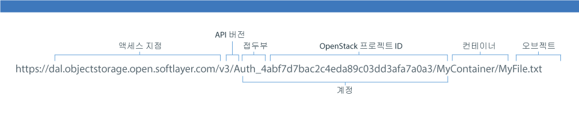

---

copyright:
  years: 2014, 2017
lastupdated: "2017-02-10"

---
{:new_window: target="_blank"}
{:shortdesc: .shortdesc}
{:codeblock: .codeblock}
{:screen: .screen}
{:pre: .pre}


# Swift REST API를 사용하는 {{site.data.keyword.objectstorageshort}} URL 생성

명령행 클라이언트 인터페이스(예: cURL)에서 Swift REST API를 사용하거나 애플리케이션에서 API를 호출할 수 있습니다.
{: shortdesc}


{{site.data.keyword.objectstorageshort}} REST API 옵션 및 예제의 종합적인 목록은 <a href="http://developer.openstack.org/api-ref-objectstorage-v1.html" target="_blank">OpenStack Swift API 전체 참조를 확인하십시오. </a>


URL을 작성하려면 우선 Keystone으로 서비스를 [인증](/docs/services/ObjectStorage/os_authenticate.html)해야 합니다. 반드시 카탈로그 응답을 기록해 놓으십시오. 이는 다음 예제와 유사합니다. 

```
{
  "id" : "4207049680fa4effbecd044c7448a8cb",
  "region" : "dallas",
  "region_id" : "dallas",
  "url" : "https://dal.objectstorage.open.softlayer.com/v1/AUTH_4abf7d7bac2c4eda89c03dd3afa7a0a3",
  "interface" : "public"
},
```
{: codeblock}


다음 이미지와 같이 컨테이너와 오브젝트의 네임스페이스를 {{site.data.keyword.objectstorageshort}} URL의 끝에 추가하십시오. 



그림 1. {{site.data.keyword.objectstorageshort}} URL 예제
