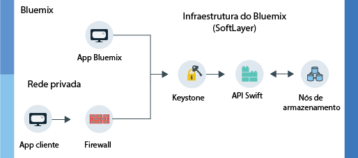

---

copyright:
  years: 2014, 2017
lastupdated: "2017-01-17"

---
{:new_window: target="_blank"}
{:shortdesc: .shortdesc}

# Sobre o {{site.data.keyword.objectstorageshort}}  {: #about-object-storage}

O {{site.data.keyword.objectstorageshort}} usa metadados para identificar
objetos colocados no armazenamento para que eles sejam facilmente pesquisáveis e
rapidamente acessíveis mesmo entre grandes quantidades de dados.
{: shortdesc}

## Como o {{site.data.keyword.Bluemix_notm}} Public {{site.data.keyword.objectstorageshort}} funciona {: #public}

O {{site.data.keyword.objectstorageshort}} público tem duas rotas separadas
que um usuário pode seguir ao provisionar uma conta. É possível iniciar dentro de sua própria rede privada ou acessar o {{site.data.keyword.objectstorageshort}} por meio de um app {{site.data.keyword.Bluemix_notm}}. Os administradores e os desenvolvedores podem armazenar e acessar objetos conforme mostrado no diagrama a seguir.

<dl>
  <dt><dfn> App {{site.data.keyword.Bluemix_notm}} </dfn></dt>
    <dd> É possível ligar o serviço {{site.data.keyword.objectstorageshort}} a um app {{site.data.keyword.Bluemix_notm}}.  </dd>
  <dt><dfn> App cliente </dfn></dt>
    <dd> É possível acessar o {{site.data.keyword.objectstorageshort}} diretamente de seu aplicativo através de um firewall em uma rede privada. </dd>
  <dt><dfn> Keystone </dfn></dt>
    <dd> Use as credenciais fornecidas pelo serviço {{site.data.keyword.objectstorageshort}} para obter um token de autorização do Keystone. </dd>
  <dt><dfn> API Swift OpenStack </dfn></dt>
    <dd> Quando você tiver autenticado sua instância, será possível ler e gravar em seus objetos armazenados usando a API Swift. </dd>
  <dt><dfn> Nós de armazenamento</dfn></dt>
    <dd> O serviço mantém três cópias de seus dados que ele <a href="http://docs.openstack.org/developer/swift/overview_replication.html">replica entre diversos nós de armazenamento</a>. </dd>
</dl>

Figura 1. Como o {{site.data.keyword.Bluemix_notm}} Public {{site.data.keyword.objectstorageshort}} funciona

**Nota:** a criptografia do lado do provedor não é fornecida. É responsabilidade do aplicativo cliente criptografar dados antes de fazer upload. A
criptografia de nível de disco não está disponível atualmente para o {{site.data.keyword.Bluemix_notm}} Public {{site.data.keyword.objectstorageshort}}.
